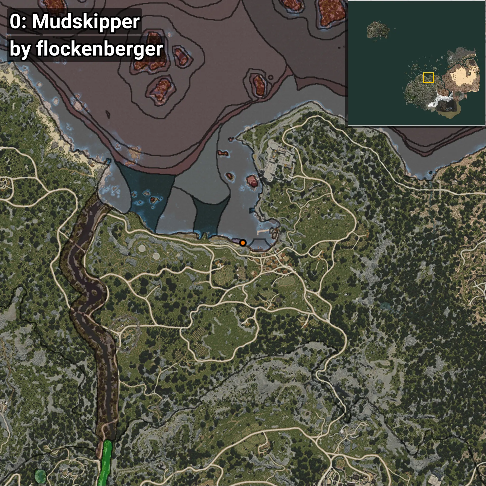
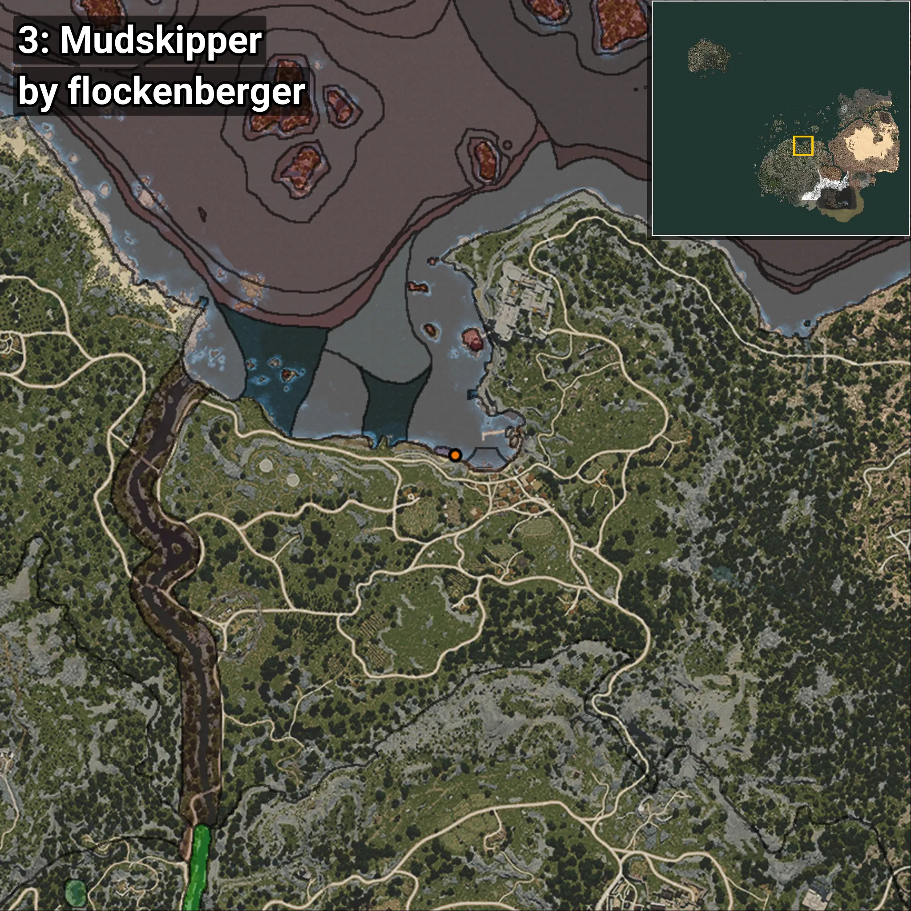
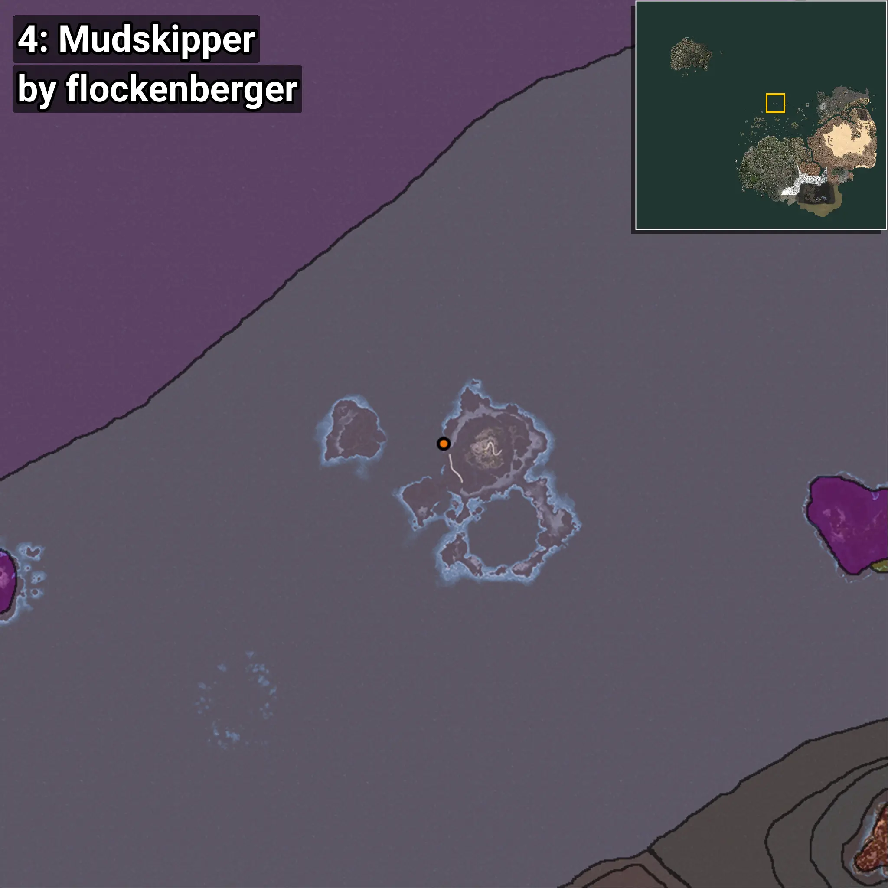

# Mudskipper
```xml
<!--
    Waypoints for: Mudskipper
    Created by: flockenberger
-->
<WorldmapBookMark>
    <BookMark BookMarkName="0: Mudskipper" PosX="-968.47906" PosY="-8204.966" PosZ="87560.586" />
    <BookMark BookMarkName="1: Mudskipper" PosX="-1011.4834" PosY="-8188.3423" PosZ="87518.82" />
    <BookMark BookMarkName="2: Mudskipper" PosX="-2515.0" PosY="-8231.0" PosZ="88128.0" />
    <BookMark BookMarkName="3: Mudskipper" PosX="-919.0" PosY="-8190.0" PosZ="87478.0" />
    <BookMark BookMarkName="4: Mudskipper" PosX="-106304.0" PosY="-7951.0" PosZ="626790.0" />
</WorldmapBookMark>
```

## ⚠️ Disclaimer
Waypoints are generated based on the __**character’s position**__ — __not__ where the fishing float landed.
Fish are determined by where your **float** lands!
In ocean spots especially, the direction you cast your rod can place your float in a **different fishing zone**, which may result in catching the wrong type of fish.
Please pay attention to the preview images showing where each location is in relation to the outlined zones.

- You can verify your float’s position using the guide [**HERE**](https://flockenberger.github.io/bdo-fish-position/)
- Or watch the video guide [**HERE**](https://youtu.be/t-VXcRoNojk)

## Previews
      