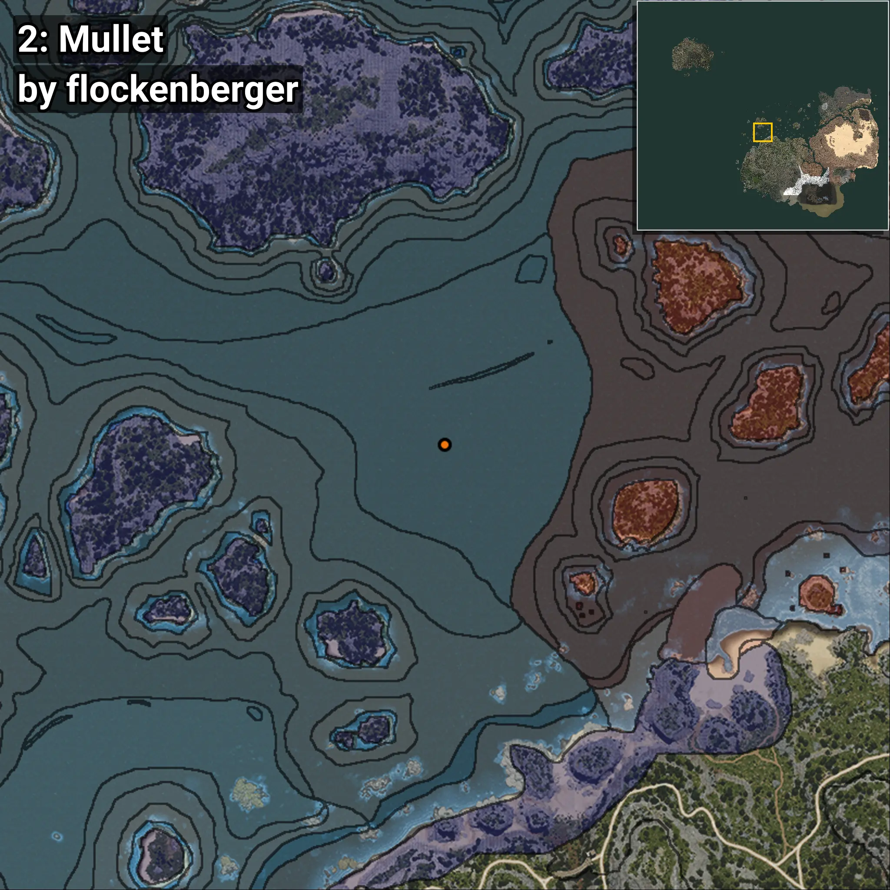
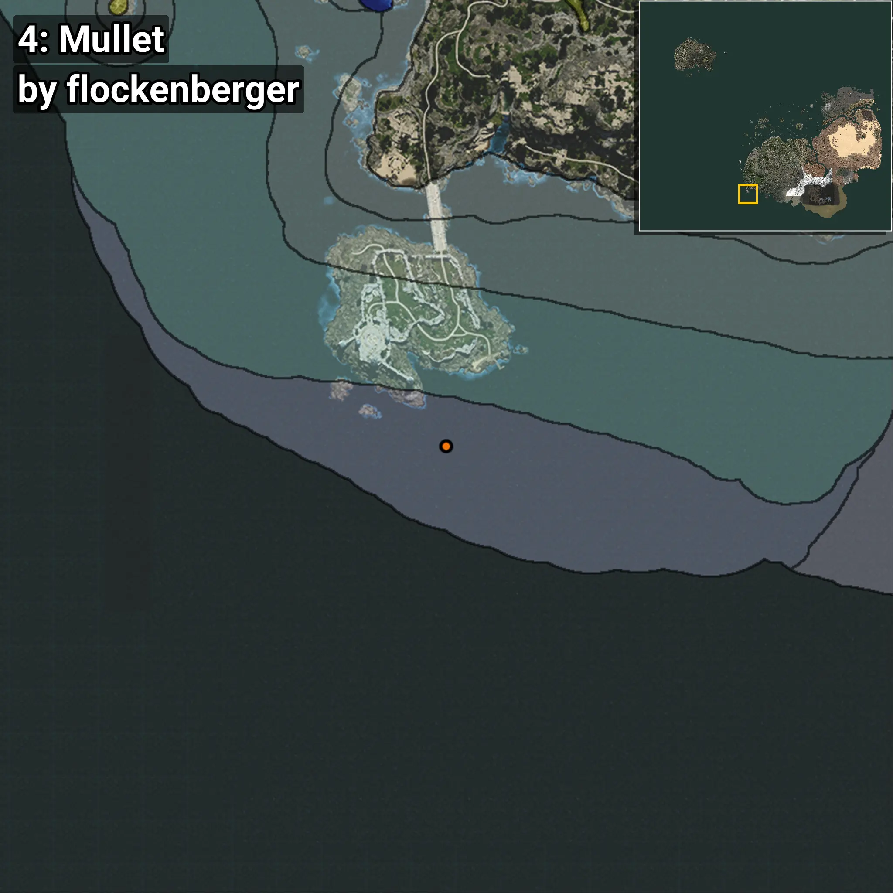
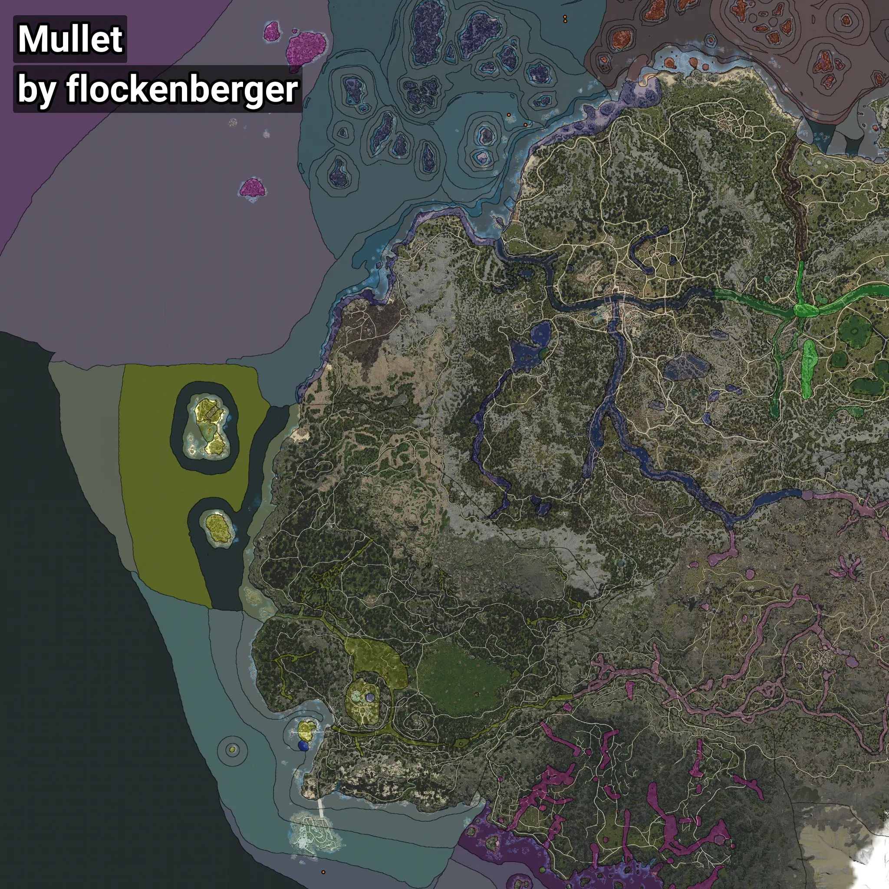

# Mullet
```xml
<!--
    Waypoints for: Mullet
    Created by: flockenberger
-->
<WorldmapBookMark>
    <BookMark BookMarkName="0: Mullet" PosX="-360068.0" PosY="-8061.0" PosZ="131706.0" />
    <BookMark BookMarkName="1: Mullet" PosX="-343459.84" PosY="-8035.418" PosZ="121783.555" />
    <BookMark BookMarkName="2: Mullet" PosX="-303935.34" PosY="-7584.9097" PosZ="224901.78" />
    <BookMark BookMarkName="3: Mullet" PosX="-304344.0" PosY="-7914.0" PosZ="228963.0" />
    <BookMark BookMarkName="4: Mullet" PosX="-544038.9" PosY="-7819.9233" PosZ="-619782.6" />
</WorldmapBookMark>
```

## ⚠️ Disclaimer
Waypoints are generated based on the __**character’s position**__ — __not__ where the fishing float landed.
Fish are determined by where your **float** lands!
In ocean spots especially, the direction you cast your rod can place your float in a **different fishing zone**, which may result in catching the wrong type of fish.
Please pay attention to the preview images showing where each location is in relation to the outlined zones.

- You can verify your float’s position using the guide [**HERE**](https://flockenberger.github.io/bdo-fish-position/)
- Or watch the video guide [**HERE**](https://youtu.be/t-VXcRoNojk)

## Previews
      