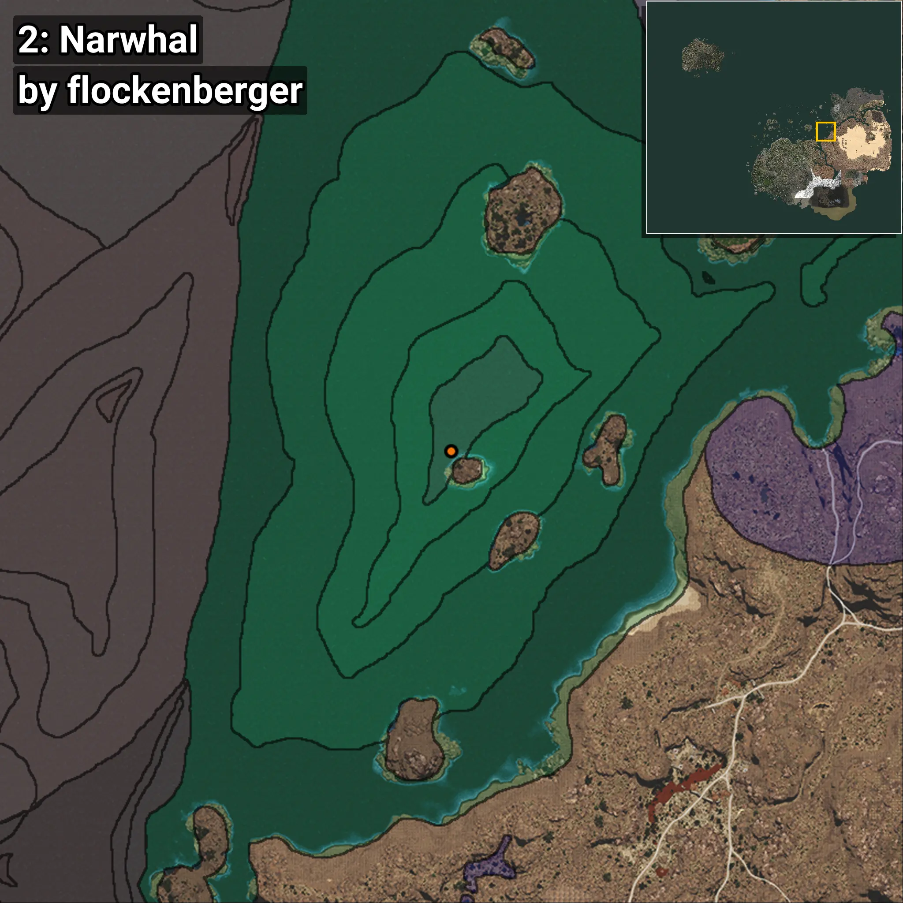
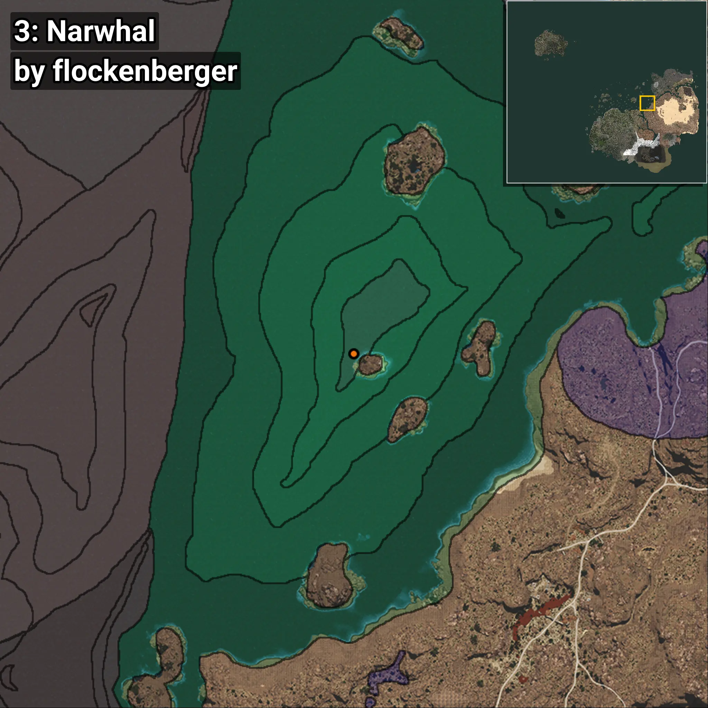
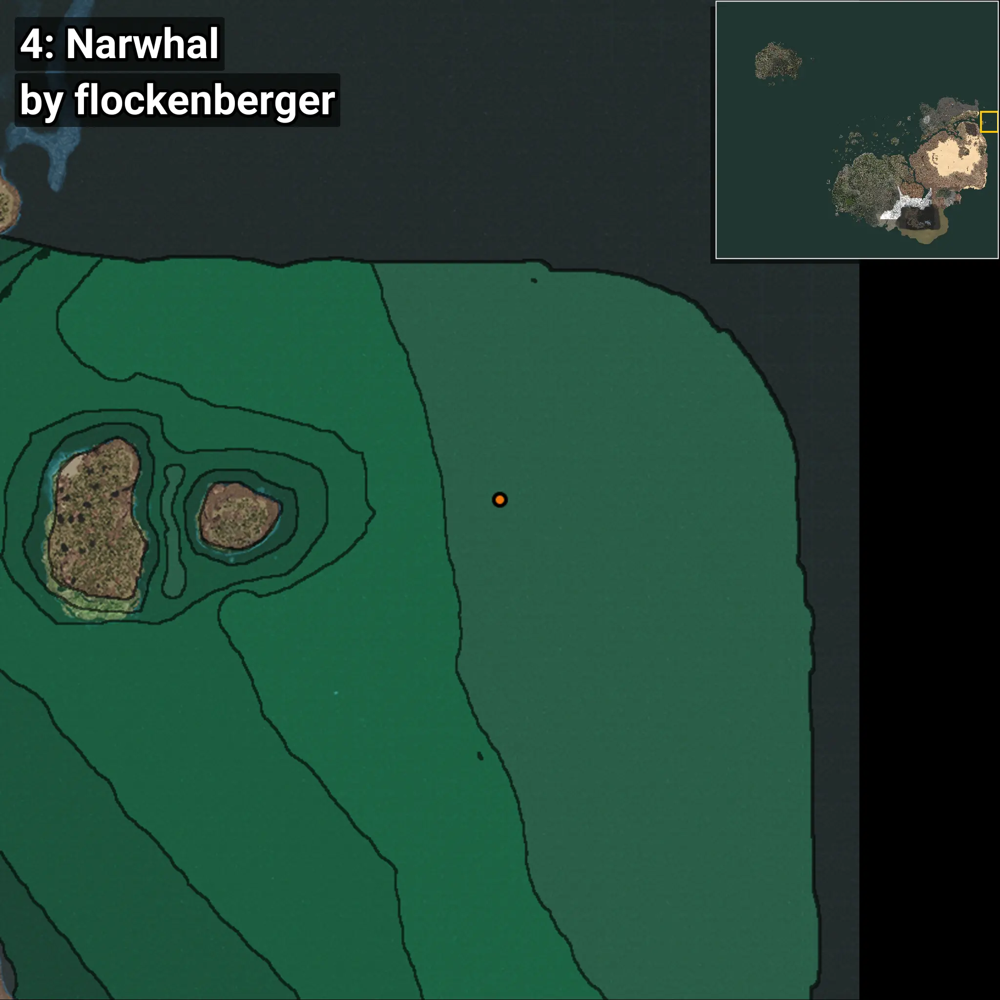
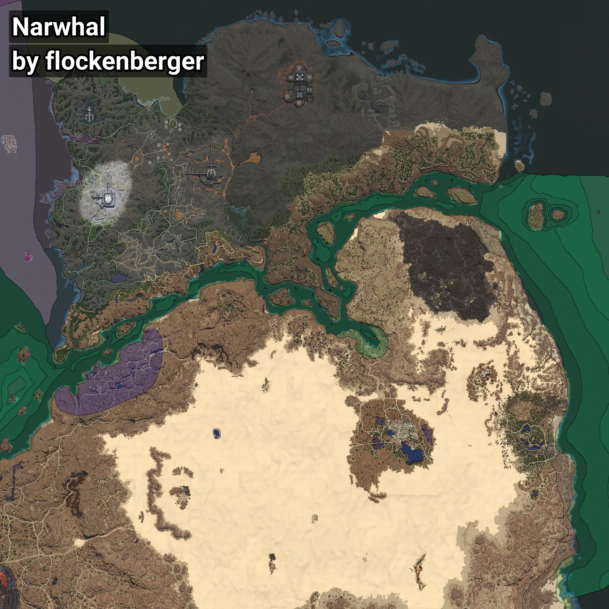

# Narwhal
```xml
<!--
    Waypoints for: Narwhal
    Created by: flockenberger
-->
<WorldmapBookMark>
    <BookMark BookMarkName="0: Narwhal" PosX="980418.0" PosY="-8188.0" PosZ="354199.0" />
    <BookMark BookMarkName="1: Narwhal" PosX="987252.0" PosY="-8196.0" PosZ="354795.0" />
    <BookMark BookMarkName="2: Narwhal" PosX="403518.0" PosY="-7893.0" PosZ="262092.0" />
    <BookMark BookMarkName="3: Narwhal" PosX="401938.75" PosY="-8010.8926" PosZ="260632.69" />
    <BookMark BookMarkName="4: Narwhal" PosX="1344802.0" PosY="-8112.0" PosZ="556771.0" />
</WorldmapBookMark>
```

## ⚠️ Disclaimer
Waypoints are generated based on the __**character’s position**__ — __not__ where the fishing float landed.
Fish are determined by where your **float** lands!
In ocean spots especially, the direction you cast your rod can place your float in a **different fishing zone**, which may result in catching the wrong type of fish.
Please pay attention to the preview images showing where each location is in relation to the outlined zones.

- You can verify your float’s position using the guide [**HERE**](https://flockenberger.github.io/bdo-fish-position/)
- Or watch the video guide [**HERE**](https://youtu.be/t-VXcRoNojk)

## Previews
      