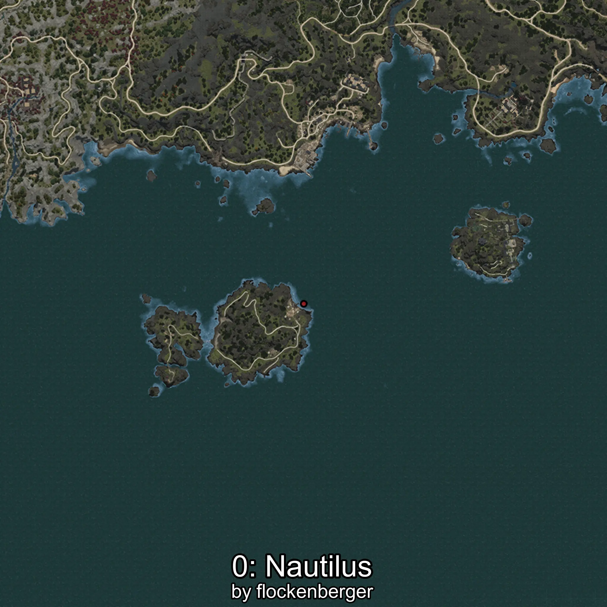
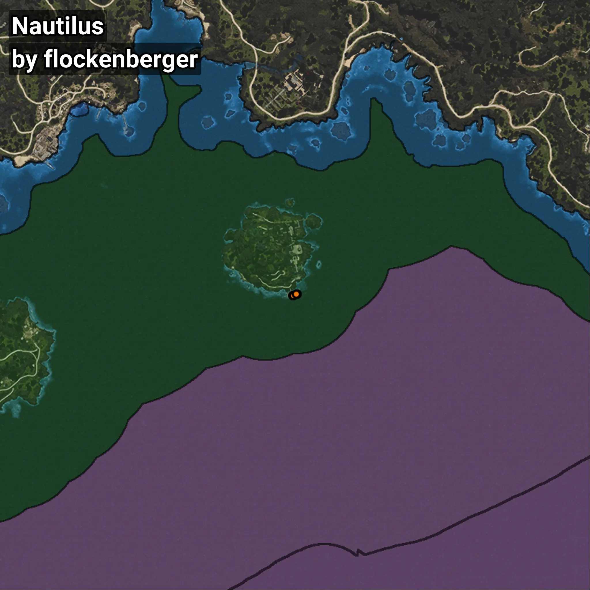

# Nautilus
```xml
<!--
    Waypoints for: Nautilus
    Created by: flockenberger
-->
<WorldmapBookMark>
    <BookMark BookMarkName="0: Nautilus" PosX="-1215274.4" PosY="-7759.0156" PosZ="1052570.0" />
    <BookMark BookMarkName="1: Nautilus" PosX="-1215208.0" PosY="-7758.9844" PosZ="1052595.8" />
    <BookMark BookMarkName="2: Nautilus" PosX="-1213707.8" PosY="-7759.5107" PosZ="1052985.2" />
    <BookMark BookMarkName="3: Nautilus" PosX="-1213694.9" PosY="-7759.5093" PosZ="1052961.4" />
    <BookMark BookMarkName="4: Nautilus" PosX="-1213784.0" PosY="-7730.0" PosZ="1053106.0" />
</WorldmapBookMark>
```

## ⚠️ Disclaimer
Waypoints are generated based on the __**character’s position**__ — __not__ where the fishing float landed.
Fish are determined by where your **float** lands!
In ocean spots especially, the direction you cast your rod can place your float in a **different fishing zone**, which may result in catching the wrong type of fish.
Please pay attention to the preview images showing where each location is in relation to the outlined zones.

- You can verify your float’s position using the guide [**HERE**](https://flockenberger.github.io/bdo-fish-position/)
- Or watch the video guide [**HERE**](https://youtu.be/t-VXcRoNojk)

## Previews
      