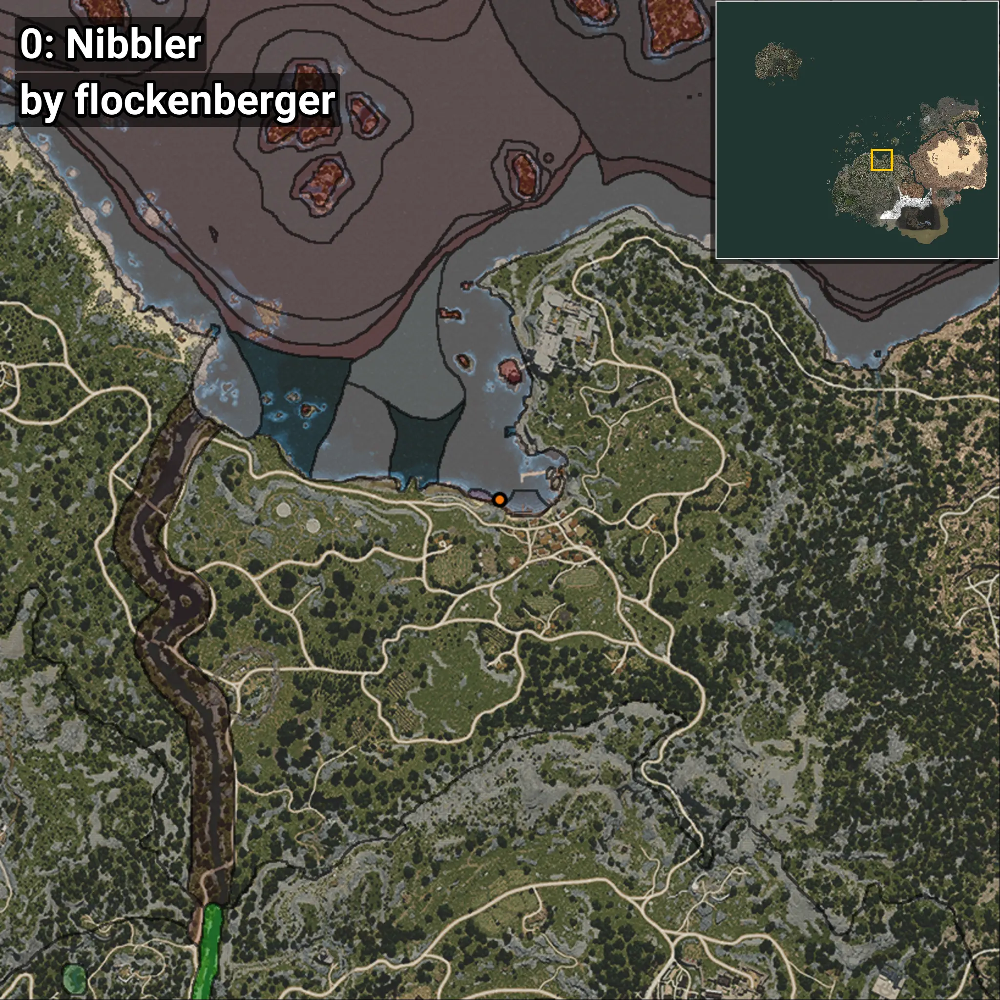
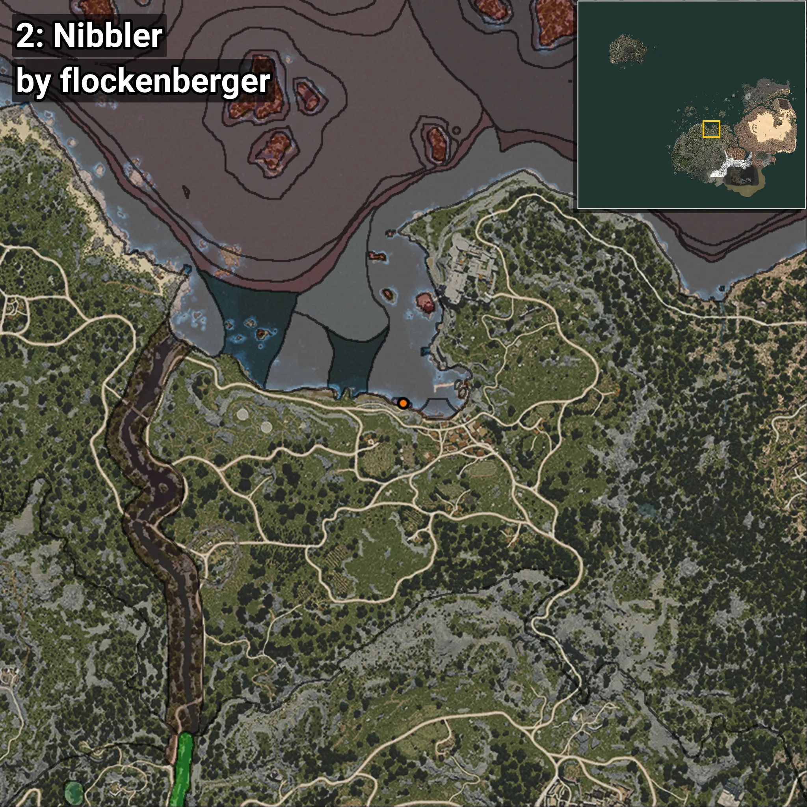

# Nibbler
```xml
<!--
    Waypoints for: Nibbler
    Created by: flockenberger
-->
<WorldmapBookMark>
    <BookMark BookMarkName="0: Nibbler" PosX="1020.94916" PosY="-8075.86" PosZ="87218.445" />
    <BookMark BookMarkName="1: Nibbler" PosX="1018.0" PosY="-8099.0" PosZ="87136.0" />
    <BookMark BookMarkName="2: Nibbler" PosX="-3086.0" PosY="-8234.0" PosZ="88153.0" />
    <BookMark BookMarkName="3: Nibbler" PosX="1009.0" PosY="-8104.0" PosZ="87128.0" />
    <BookMark BookMarkName="4: Nibbler" PosX="-4732.0" PosY="-8264.0" PosZ="88568.0" />
</WorldmapBookMark>
```

## ⚠️ Disclaimer
Waypoints are generated based on the __**character’s position**__ — __not__ where the fishing float landed.
Fish are determined by where your **float** lands!
In ocean spots especially, the direction you cast your rod can place your float in a **different fishing zone**, which may result in catching the wrong type of fish.
Please pay attention to the preview images showing where each location is in relation to the outlined zones.

- You can verify your float’s position using the guide [**HERE**](https://flockenberger.github.io/bdo-fish-position/)
- Or watch the video guide [**HERE**](https://youtu.be/t-VXcRoNojk)

## Previews
      