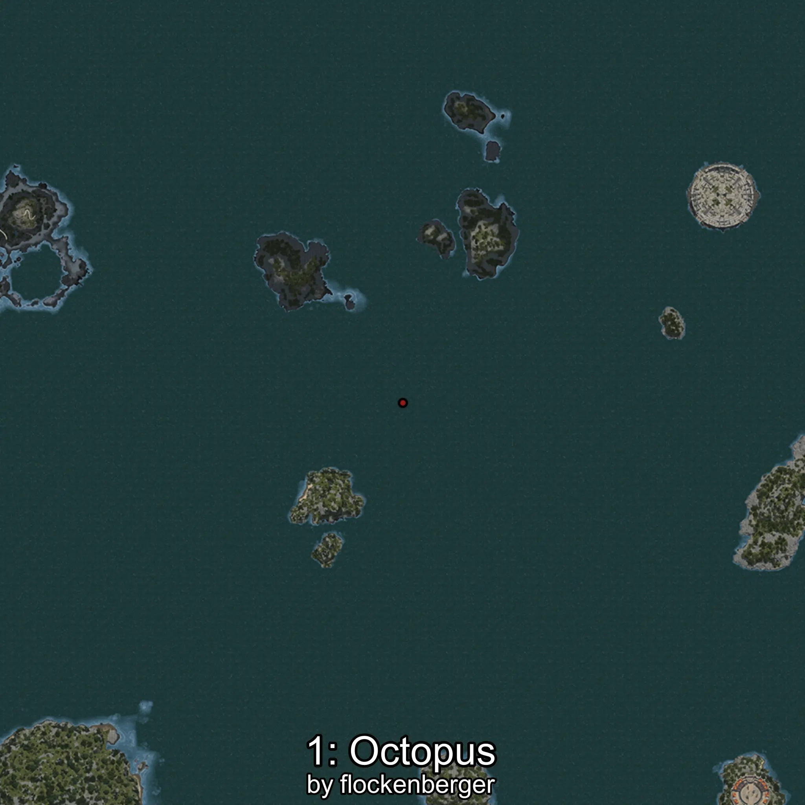
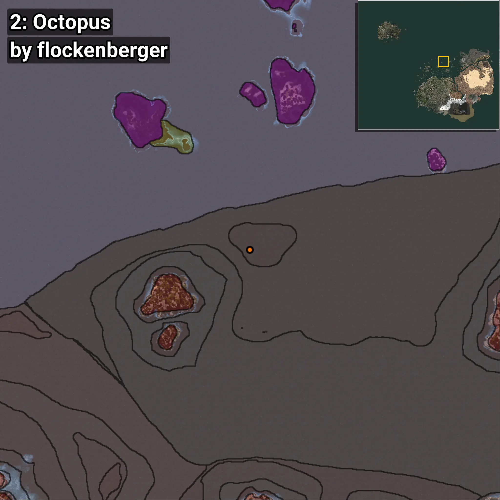
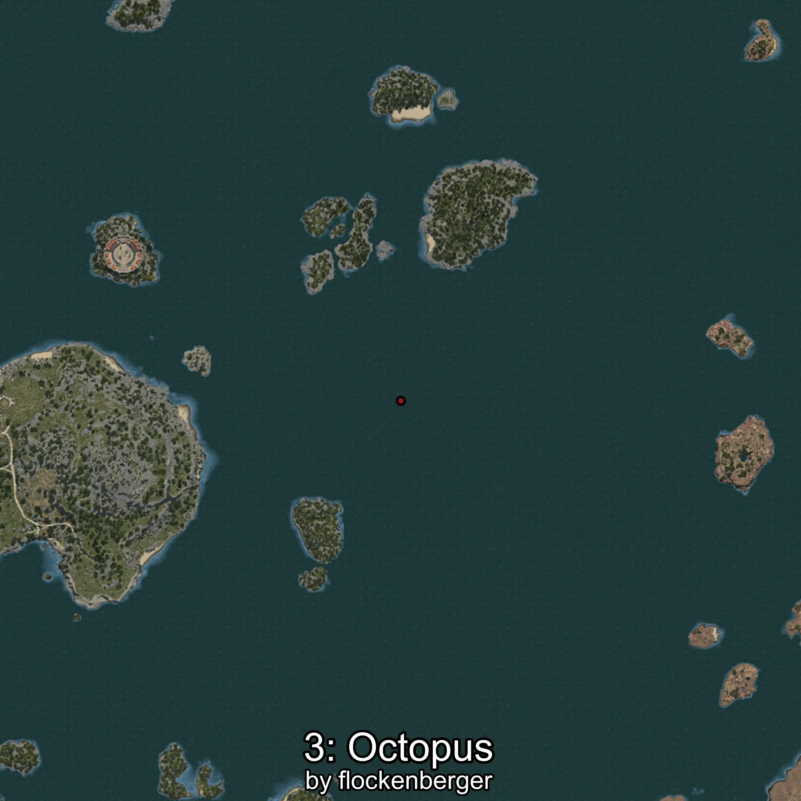
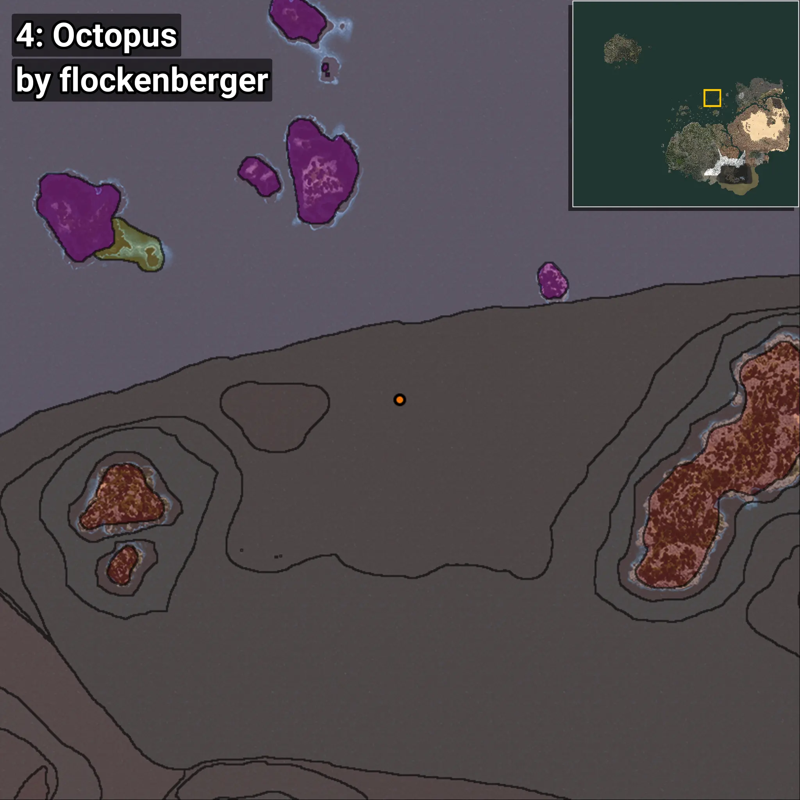
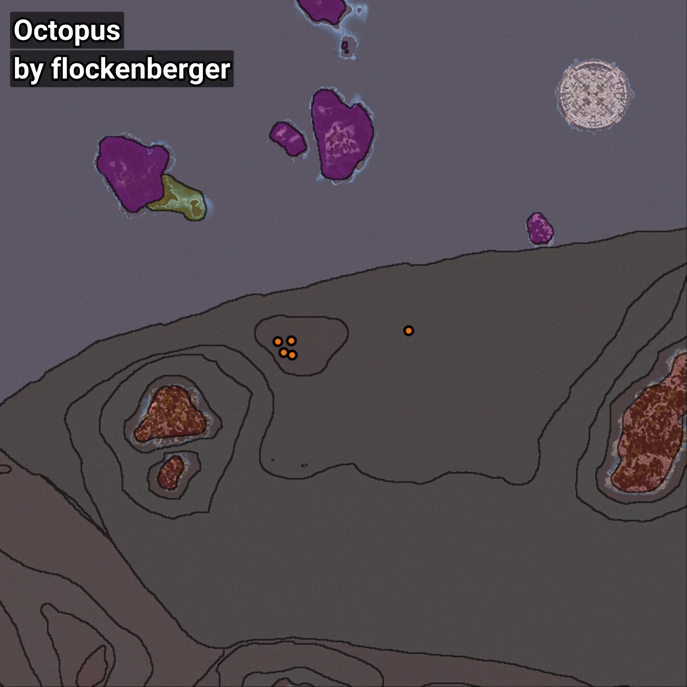

# Octopus
```xml
<!--
    Waypoints for: Octopus
    Created by: flockenberger
-->
<WorldmapBookMark>
    <BookMark BookMarkName="0: Octopus" PosX="64539.0" PosY="-7555.0" PosZ="544443.0" />
    <BookMark BookMarkName="1: Octopus" PosX="59639.0" PosY="-7769.0" PosZ="544116.0" />
    <BookMark BookMarkName="2: Octopus" PosX="61824.0" PosY="-7754.0" PosZ="540171.0" />
    <BookMark BookMarkName="3: Octopus" PosX="64974.0" PosY="-7571.0" PosZ="539352.0" />
    <BookMark BookMarkName="4: Octopus" PosX="106847.92" PosY="-7869.811" PosZ="548035.2" />
</WorldmapBookMark>
```

## ⚠️ Disclaimer
Waypoints are generated based on the __**character’s position**__ — __not__ where the fishing float landed.
Fish are determined by where your **float** lands!
In ocean spots especially, the direction you cast your rod can place your float in a **different fishing zone**, which may result in catching the wrong type of fish.
Please pay attention to the preview images showing where each location is in relation to the outlined zones.

- You can verify your float’s position using the guide [**HERE**](https://flockenberger.github.io/bdo-fish-position/)
- Or watch the video guide [**HERE**](https://youtu.be/t-VXcRoNojk)

## Previews
      