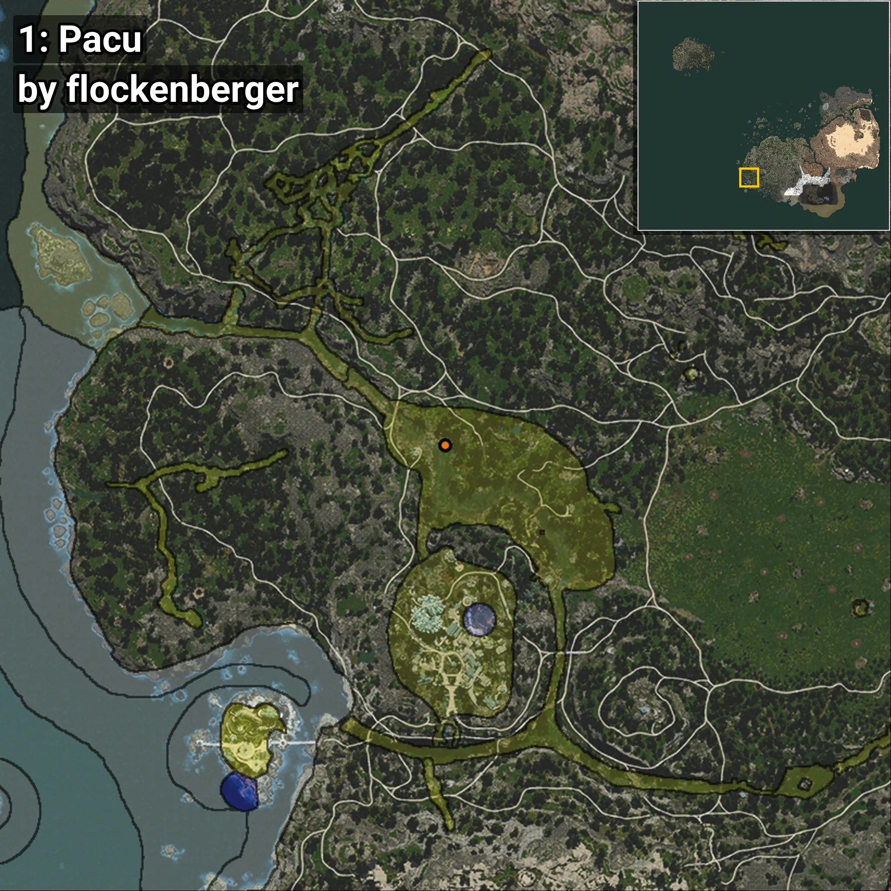
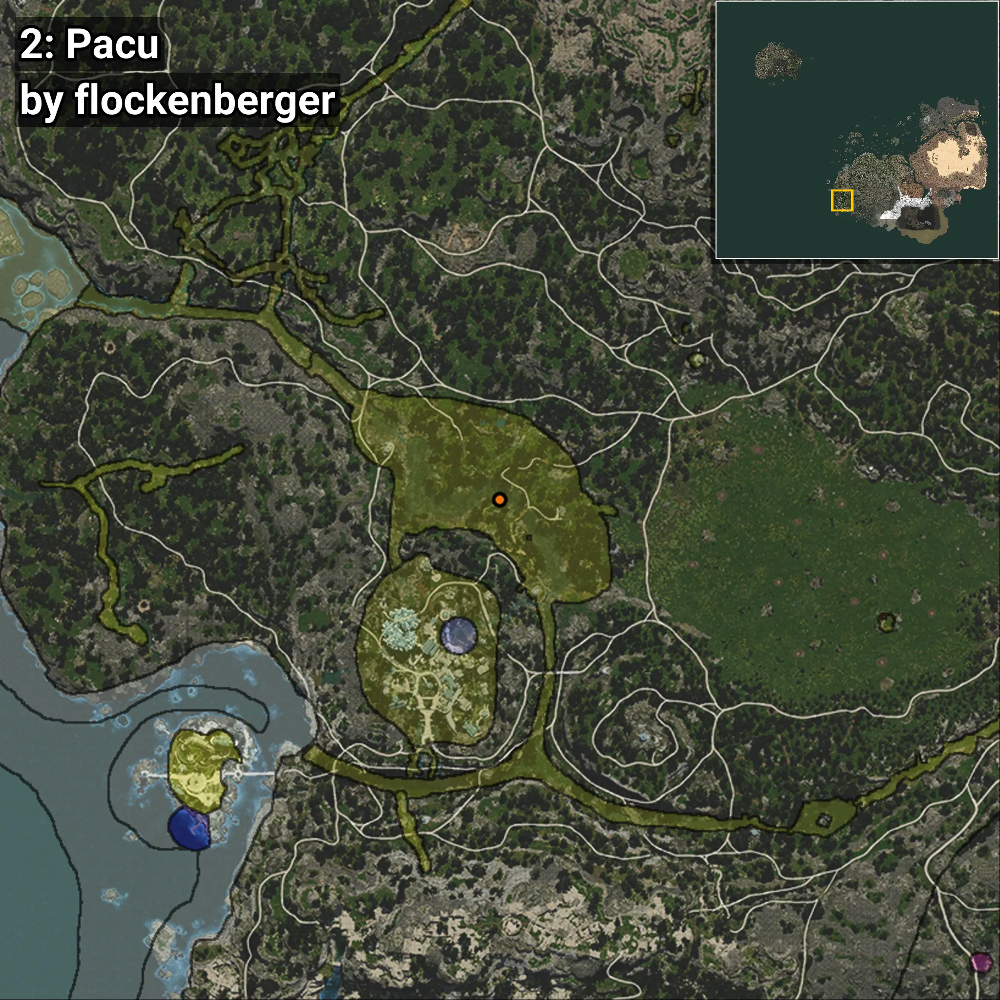
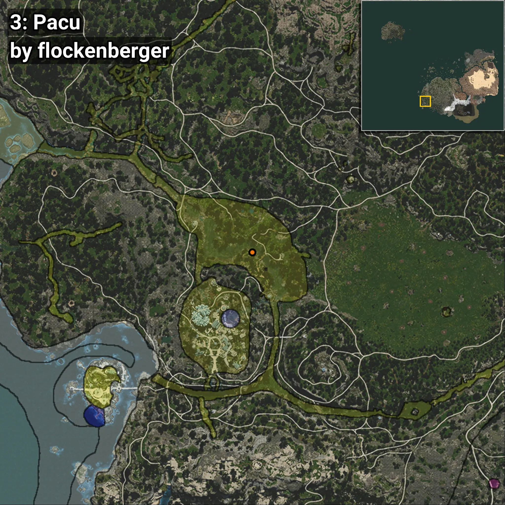
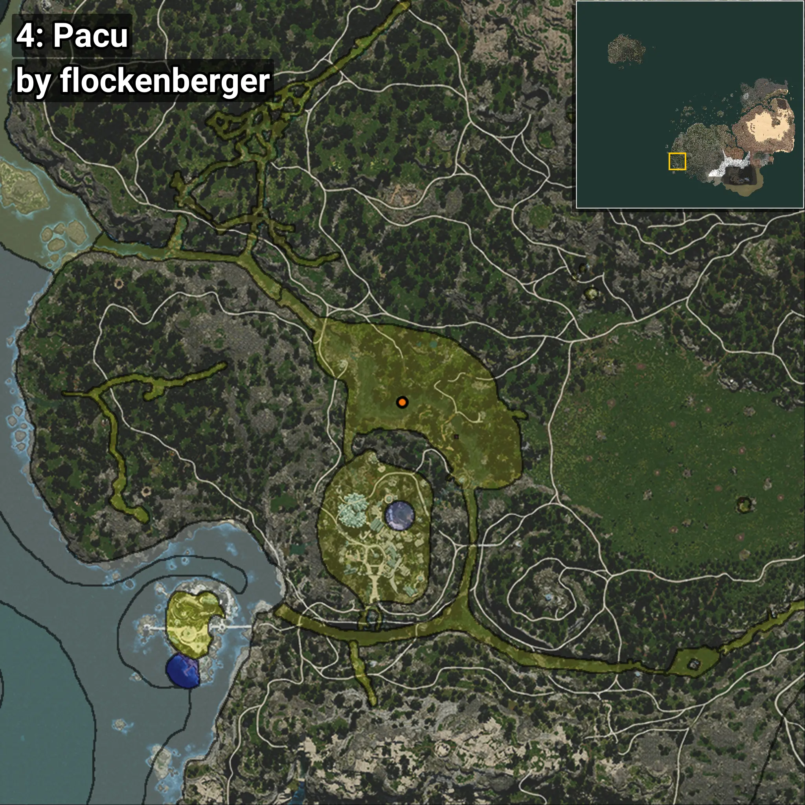

# Pacu
```xml
<!--
    Waypoints for: Pacu
    Created by: flockenberger
-->
<WorldmapBookMark>
    <BookMark BookMarkName="0: Pacu" PosX="-511579.0" PosY="-4911.0" PosZ="-399218.0" />
    <BookMark BookMarkName="1: Pacu" PosX="-507003.0" PosY="-4894.0" PosZ="-398235.0" />
    <BookMark BookMarkName="2: Pacu" PosX="-487525.0" PosY="-4777.0" PosZ="-413067.0" />
    <BookMark BookMarkName="3: Pacu" PosX="-486790.0" PosY="-4733.0" PosZ="-414298.0" />
    <BookMark BookMarkName="4: Pacu" PosX="-496879.0" PosY="-4824.0" PosZ="-411865.0" />
</WorldmapBookMark>
```

## ⚠️ Disclaimer
Waypoints are generated based on the __**character’s position**__ — __not__ where the fishing float landed.
Fish are determined by where your **float** lands!
In ocean spots especially, the direction you cast your rod can place your float in a **different fishing zone**, which may result in catching the wrong type of fish.
Please pay attention to the preview images showing where each location is in relation to the outlined zones.

- You can verify your float’s position using the guide [**HERE**](https://flockenberger.github.io/bdo-fish-position/)
- Or watch the video guide [**HERE**](https://youtu.be/t-VXcRoNojk)

## Previews
      