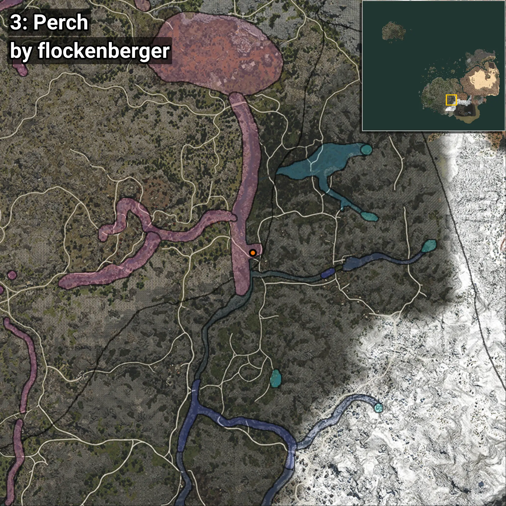
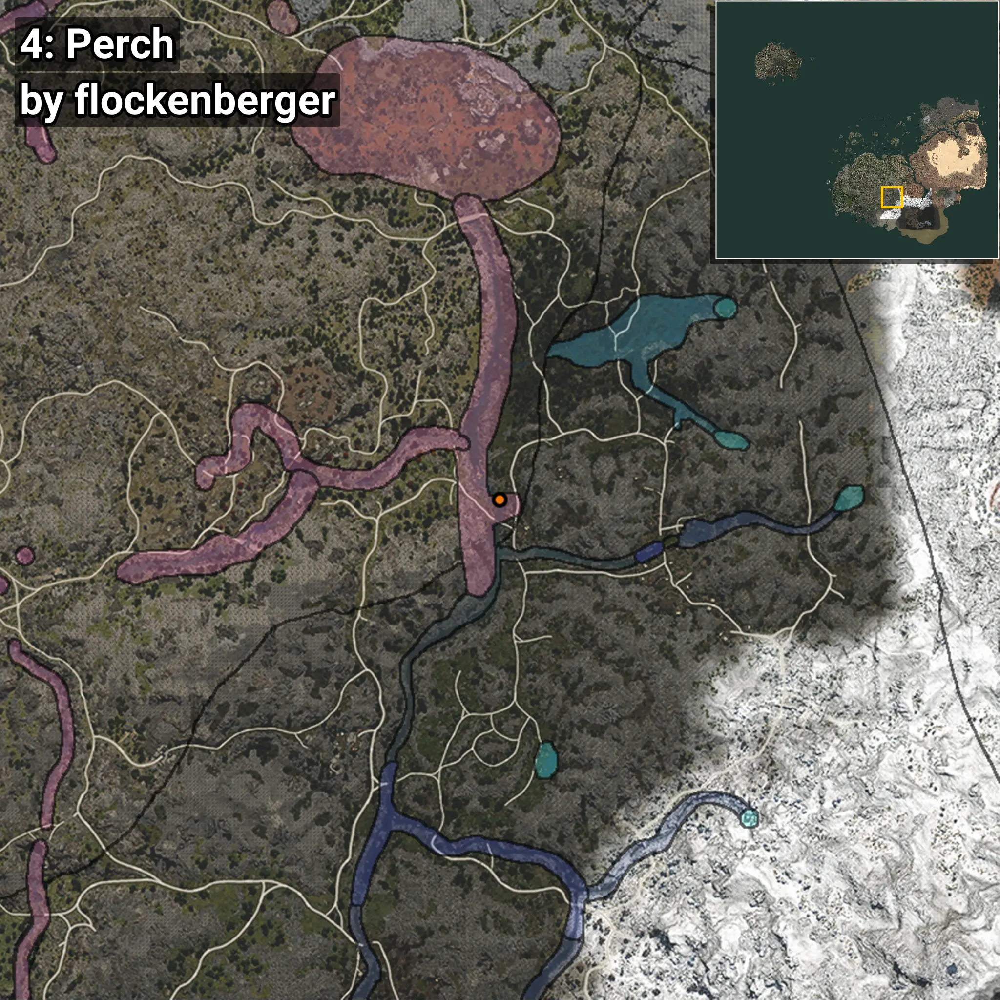
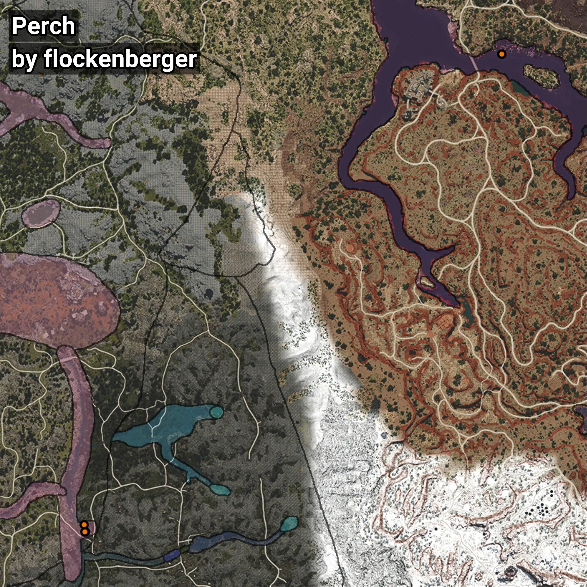

# Perch
```xml
<!--
    Waypoints for: Perch
    Created by: flockenberger
-->
<WorldmapBookMark>
    <BookMark BookMarkName="0: Perch" PosX="302777.22" PosY="-7156.569" PosZ="-176461.12" />
    <BookMark BookMarkName="1: Perch" PosX="302761.0" PosY="-7156.0" PosZ="-176436.0" />
    <BookMark BookMarkName="2: Perch" PosX="127771.0" PosY="12475.0" PosZ="-377087.0" />
    <BookMark BookMarkName="3: Perch" PosX="127645.0" PosY="12475.0" PosZ="-377084.0" />
    <BookMark BookMarkName="4: Perch" PosX="127189.0" PosY="12346.0" PosZ="-374227.0" />
</WorldmapBookMark>
```

## ⚠️ Disclaimer
Waypoints are generated based on the __**character’s position**__ — __not__ where the fishing float landed.
Fish are determined by where your **float** lands!
In ocean spots especially, the direction you cast your rod can place your float in a **different fishing zone**, which may result in catching the wrong type of fish.
Please pay attention to the preview images showing where each location is in relation to the outlined zones.

- You can verify your float’s position using the guide [**HERE**](https://flockenberger.github.io/bdo-fish-position/)
- Or watch the video guide [**HERE**](https://youtu.be/t-VXcRoNojk)

## Previews
      