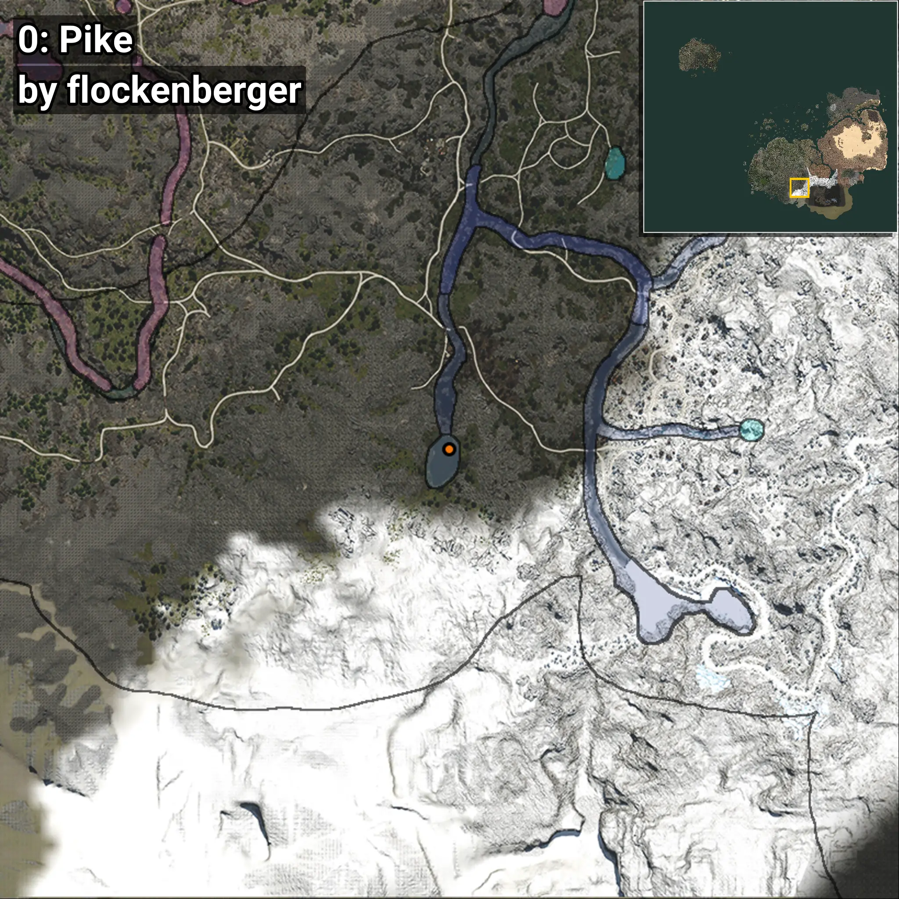
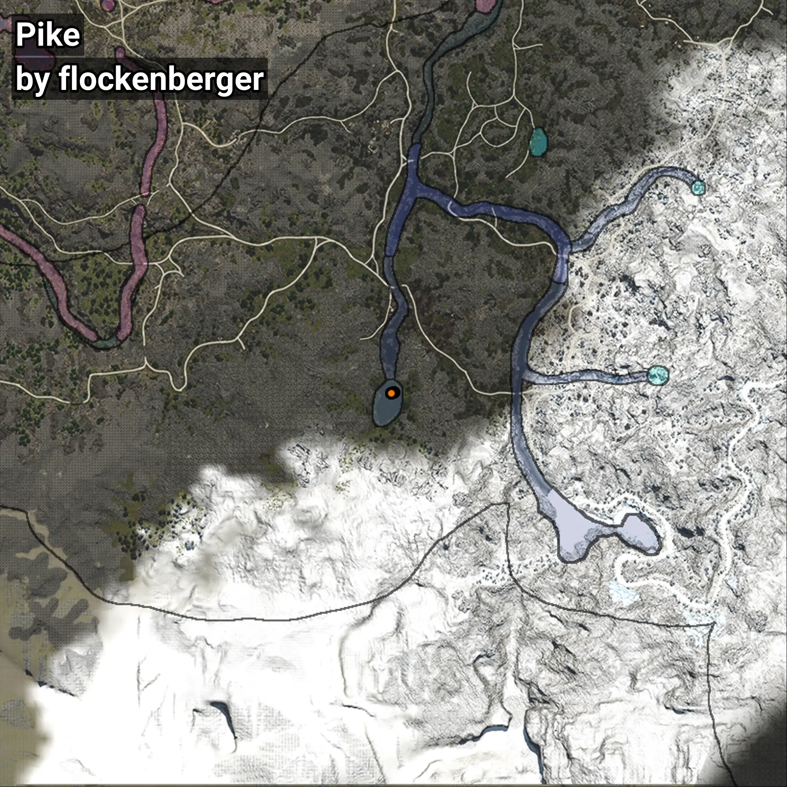

# Pike
```xml
<!--
    Waypoints for: Pike
    Created by: flockenberger
-->
<WorldmapBookMark>
    <BookMark BookMarkName="0: Pike" PosX="93336.0" PosY="21933.0" PosZ="-517090.0" />
    <BookMark BookMarkName="1: Pike" PosX="93394.0" PosY="21941.0" PosZ="-517112.0" />
    <BookMark BookMarkName="2: Pike" PosX="92572.0" PosY="21781.0" PosZ="-517147.0" />
    <BookMark BookMarkName="3: Pike" PosX="92581.64" PosY="21780.13" PosZ="-517175.0" />
    <BookMark BookMarkName="4: Pike" PosX="92674.0" PosY="21821.0" PosZ="-517144.0" />
</WorldmapBookMark>
```

## ⚠️ Disclaimer
Waypoints are generated based on the __**character’s position**__ — __not__ where the fishing float landed.
Fish are determined by where your **float** lands!
In ocean spots especially, the direction you cast your rod can place your float in a **different fishing zone**, which may result in catching the wrong type of fish.
Please pay attention to the preview images showing where each location is in relation to the outlined zones.

- You can verify your float’s position using the guide [**HERE**](https://flockenberger.github.io/bdo-fish-position/)
- Or watch the video guide [**HERE**](https://youtu.be/t-VXcRoNojk)

## Previews
      