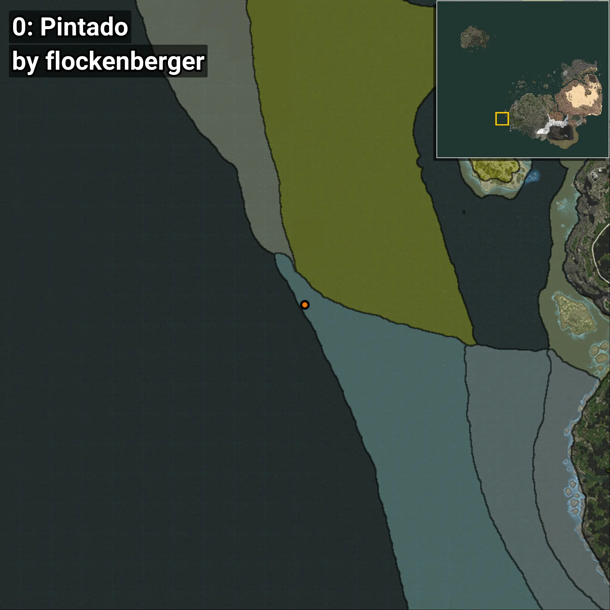
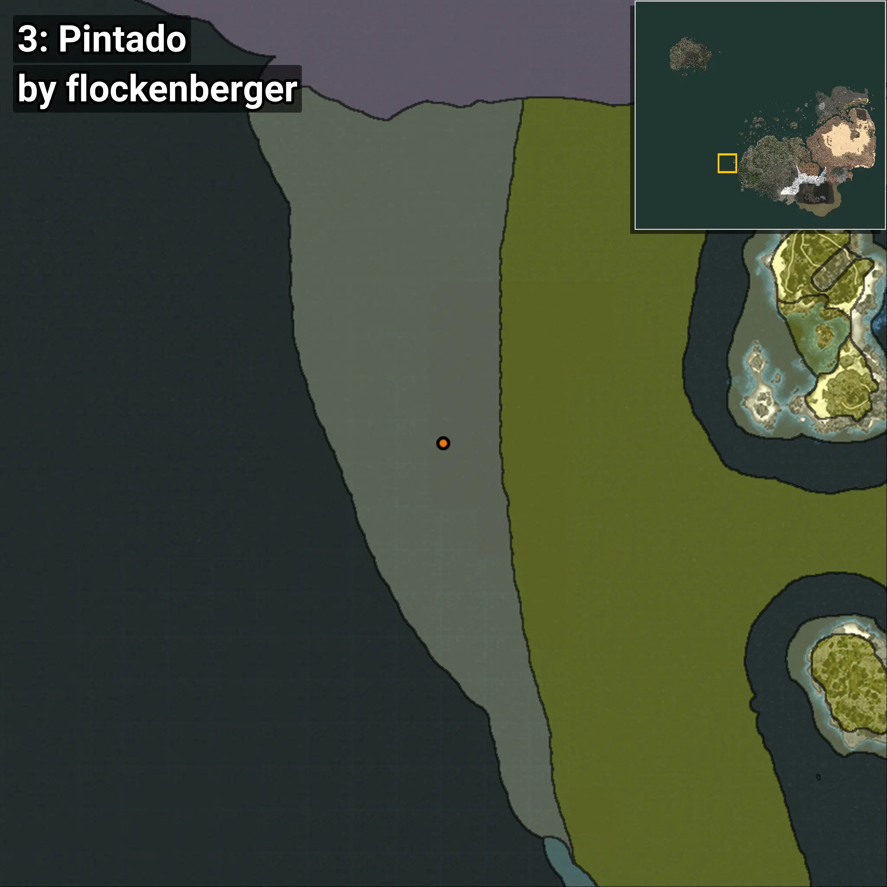
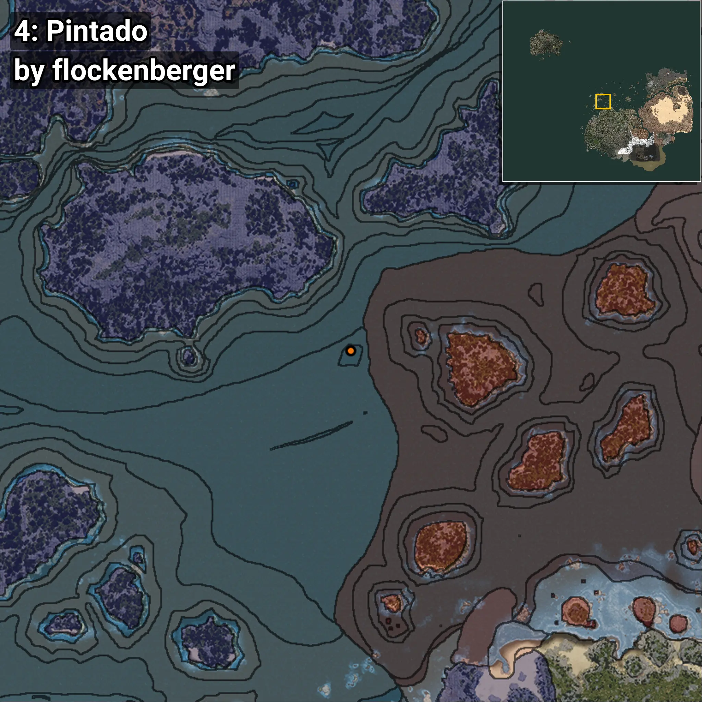

# Pintado
```xml
<!--
    Waypoints for: Pintado
    Created by: flockenberger
-->
<WorldmapBookMark>
    <BookMark BookMarkName="0: Pintado" PosX="-722915.3" PosY="-7921.3145" PosZ="-341918.88" />
    <BookMark BookMarkName="1: Pintado" PosX="-761349.0" PosY="-7784.0" PosZ="-216012.0" />
    <BookMark BookMarkName="2: Pintado" PosX="-503371.44" PosY="-8172.264" PosZ="67645.3" />
    <BookMark BookMarkName="3: Pintado" PosX="-762931.94" PosY="-7361.2466" PosZ="-211627.22" />
    <BookMark BookMarkName="4: Pintado" PosX="-280076.2" PosY="-7562.855" PosZ="275232.88" />
</WorldmapBookMark>
```

## ⚠️ Disclaimer
Waypoints are generated based on the __**character’s position**__ — __not__ where the fishing float landed.
Fish are determined by where your **float** lands!
In ocean spots especially, the direction you cast your rod can place your float in a **different fishing zone**, which may result in catching the wrong type of fish.
Please pay attention to the preview images showing where each location is in relation to the outlined zones.

- You can verify your float’s position using the guide [**HERE**](https://flockenberger.github.io/bdo-fish-position/)
- Or watch the video guide [**HERE**](https://youtu.be/t-VXcRoNojk)

## Previews
      