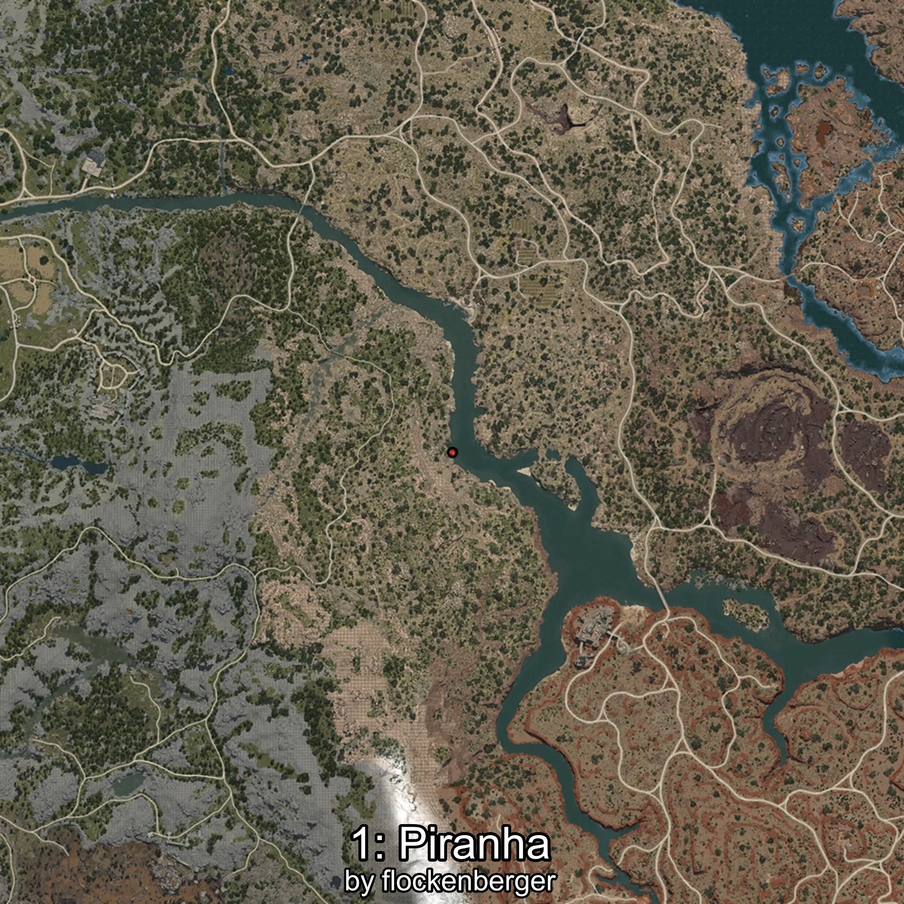
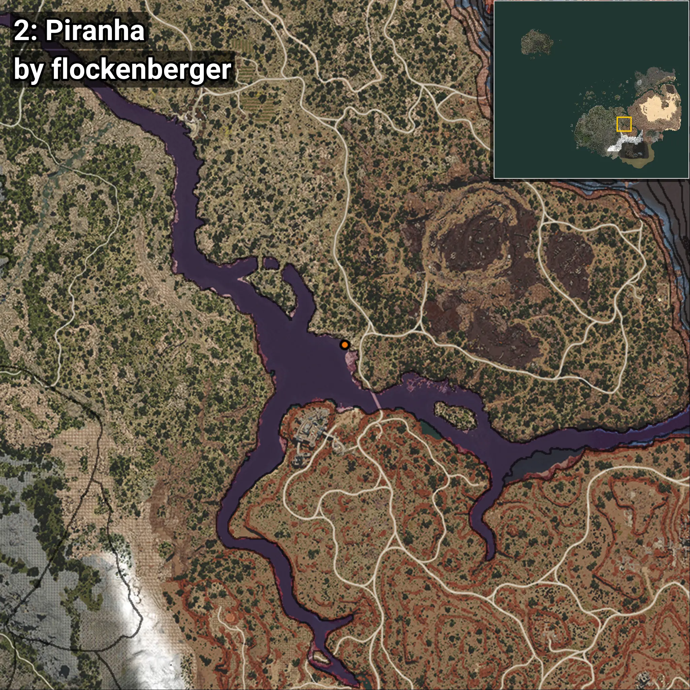
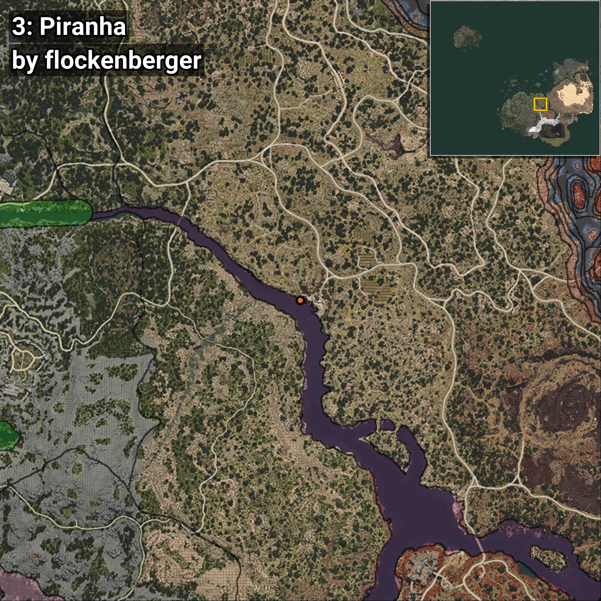
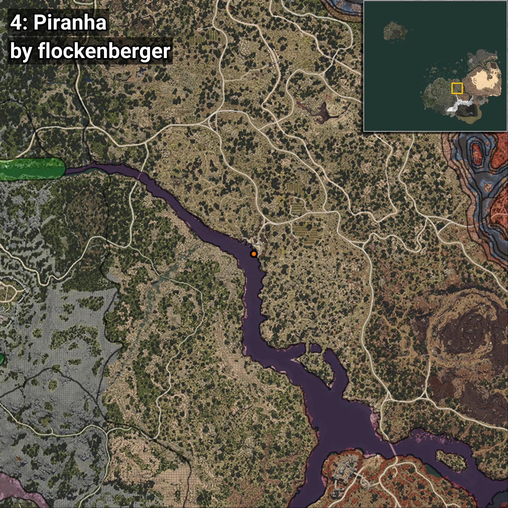

# Piranha
```xml
<!--
    Waypoints for: Piranha
    Created by: flockenberger
-->
<WorldmapBookMark>
    <BookMark BookMarkName="0: Piranha" PosX="181183.0" PosY="-4541.0" PosZ="-54908.0" />
    <BookMark BookMarkName="1: Piranha" PosX="216155.0" PosY="-5079.0" PosZ="-79712.0" />
    <BookMark BookMarkName="2: Piranha" PosX="279919.0" PosY="-7271.0" PosZ="-160480.0" />
    <BookMark BookMarkName="3: Piranha" PosX="217475.0" PosY="-5093.0" PosZ="-79954.0" />
    <BookMark BookMarkName="4: Piranha" PosX="223623.27" PosY="-5090.926" PosZ="-85495.266" />
</WorldmapBookMark>
```

## ⚠️ Disclaimer
Waypoints are generated based on the __**character’s position**__ — __not__ where the fishing float landed.
Fish are determined by where your **float** lands!
In ocean spots especially, the direction you cast your rod can place your float in a **different fishing zone**, which may result in catching the wrong type of fish.
Please pay attention to the preview images showing where each location is in relation to the outlined zones.

- You can verify your float’s position using the guide [**HERE**](https://flockenberger.github.io/bdo-fish-position/)
- Or watch the video guide [**HERE**](https://youtu.be/t-VXcRoNojk)

## Previews
      