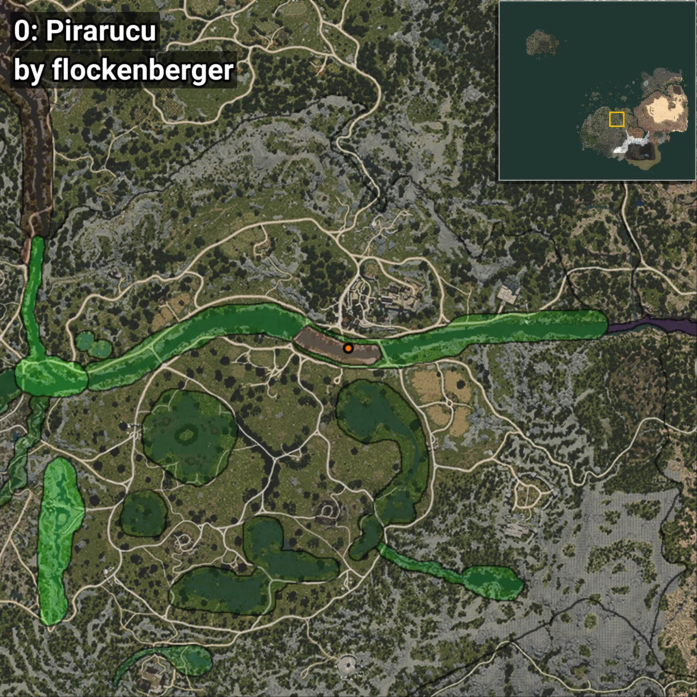
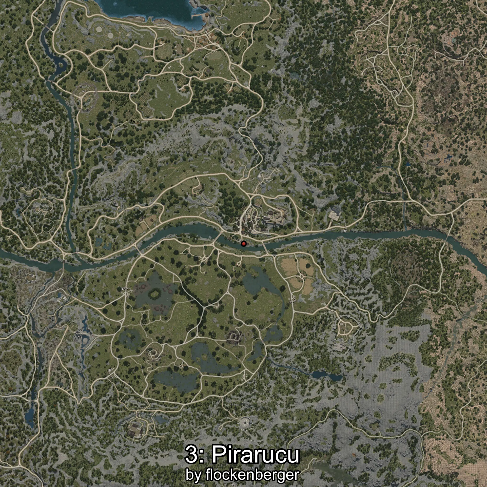
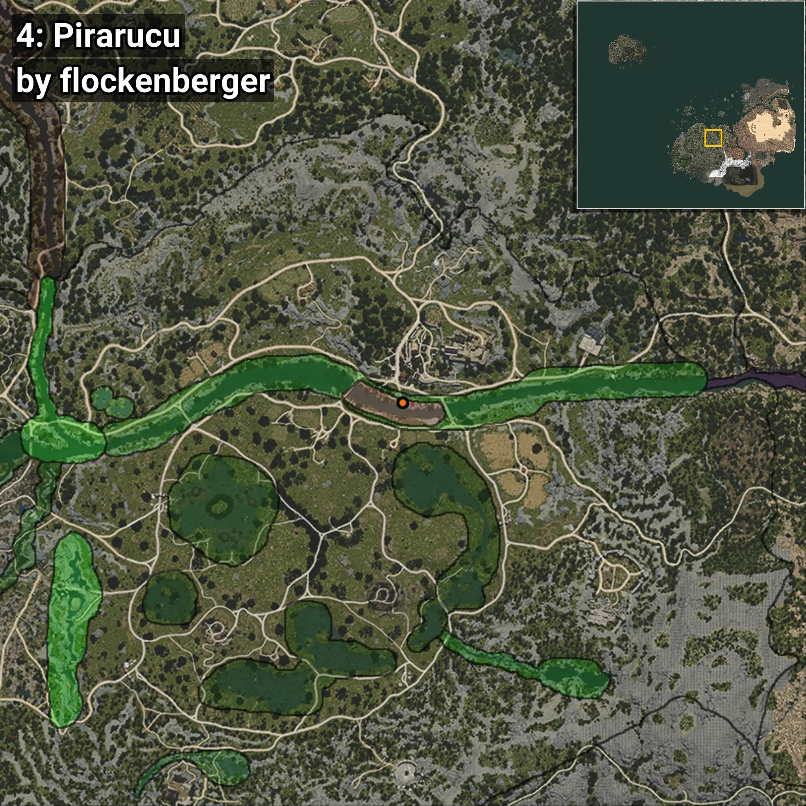
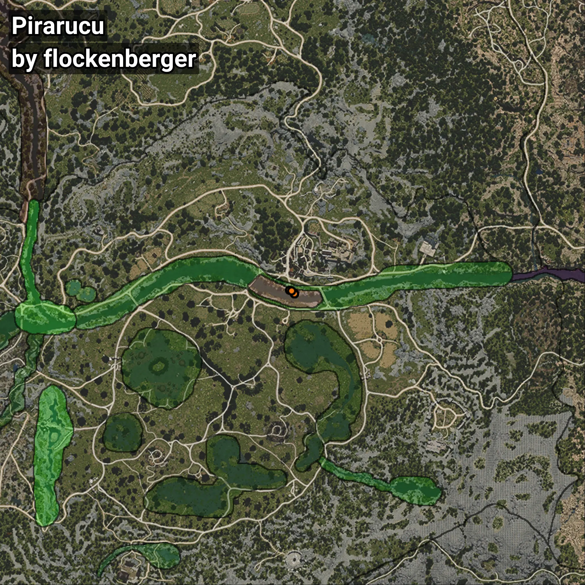

# Pirarucu
```xml
<!--
    Waypoints for: Pirarucu
    Created by: flockenberger
-->
<WorldmapBookMark>
    <BookMark BookMarkName="0: Pirarucu" PosX="40291.0" PosY="-3822.0" PosZ="-52373.0" />
    <BookMark BookMarkName="1: Pirarucu" PosX="40302.0" PosY="-3821.0" PosZ="-52382.0" />
    <BookMark BookMarkName="2: Pirarucu" PosX="38239.0" PosY="-3997.0" PosZ="-50669.0" />
    <BookMark BookMarkName="3: Pirarucu" PosX="40306.0" PosY="-3824.0" PosZ="-52356.0" />
    <BookMark BookMarkName="4: Pirarucu" PosX="38911.0" PosY="-4059.0" PosZ="-51044.0" />
</WorldmapBookMark>
```

## ⚠️ Disclaimer
Waypoints are generated based on the __**character’s position**__ — __not__ where the fishing float landed.
Fish are determined by where your **float** lands!
In ocean spots especially, the direction you cast your rod can place your float in a **different fishing zone**, which may result in catching the wrong type of fish.
Please pay attention to the preview images showing where each location is in relation to the outlined zones.

- You can verify your float’s position using the guide [**HERE**](https://flockenberger.github.io/bdo-fish-position/)
- Or watch the video guide [**HERE**](https://youtu.be/t-VXcRoNojk)

## Previews
      