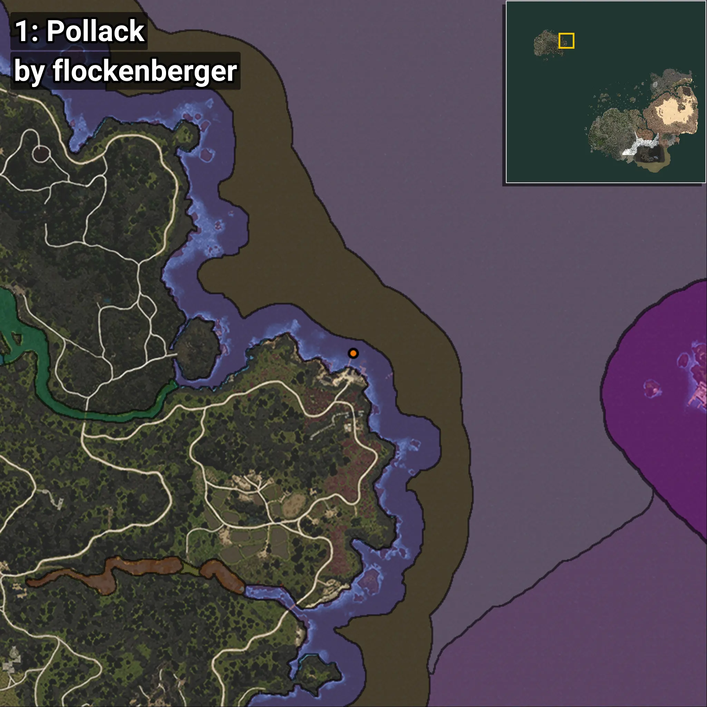
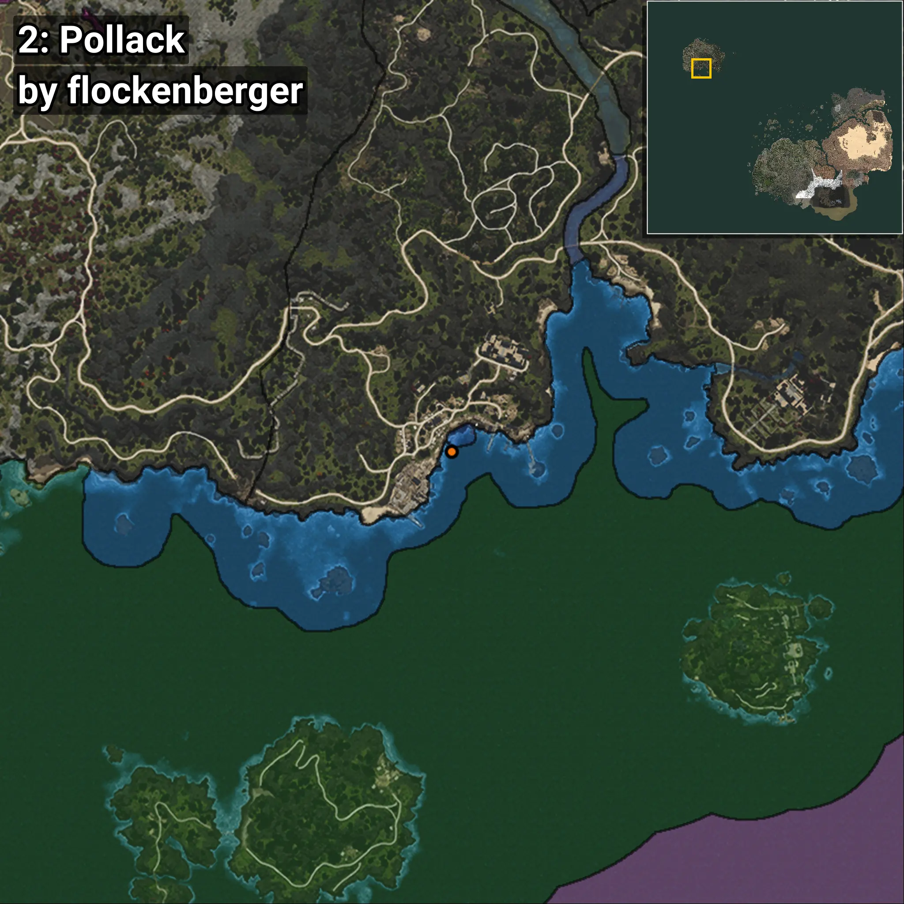
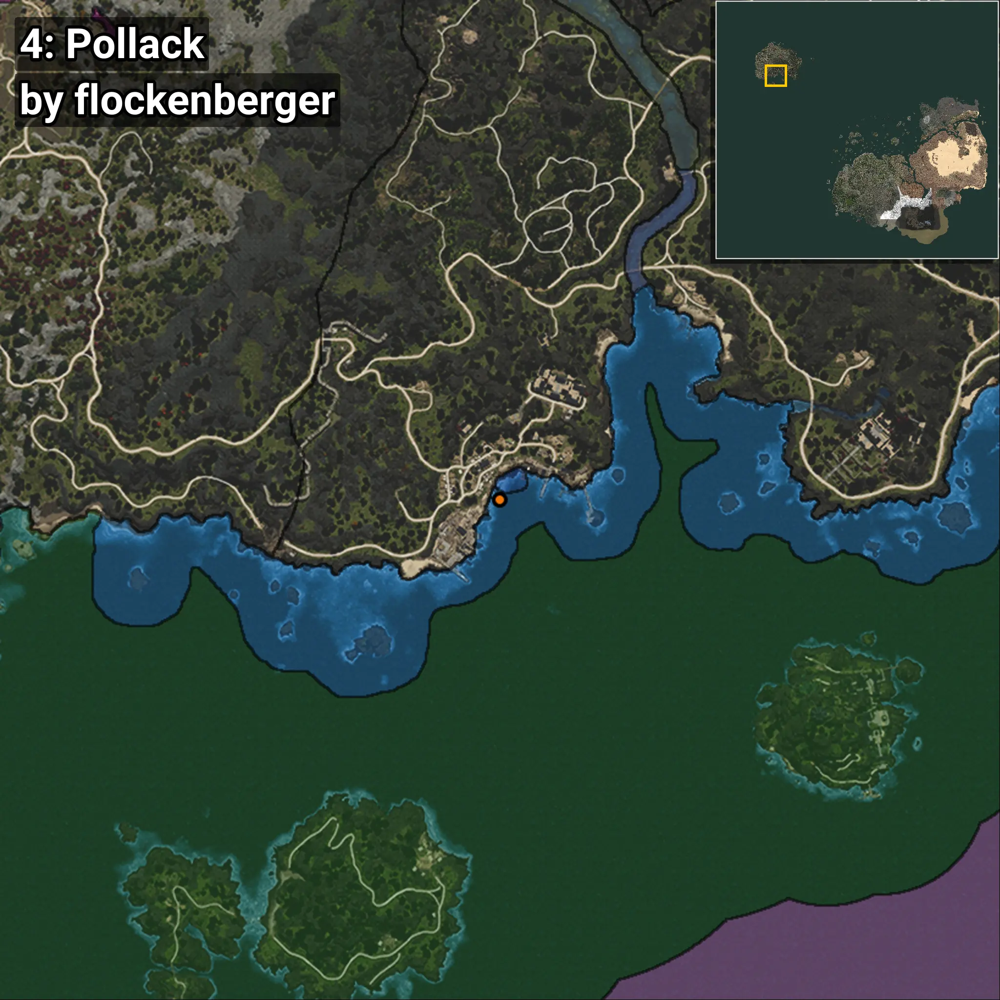
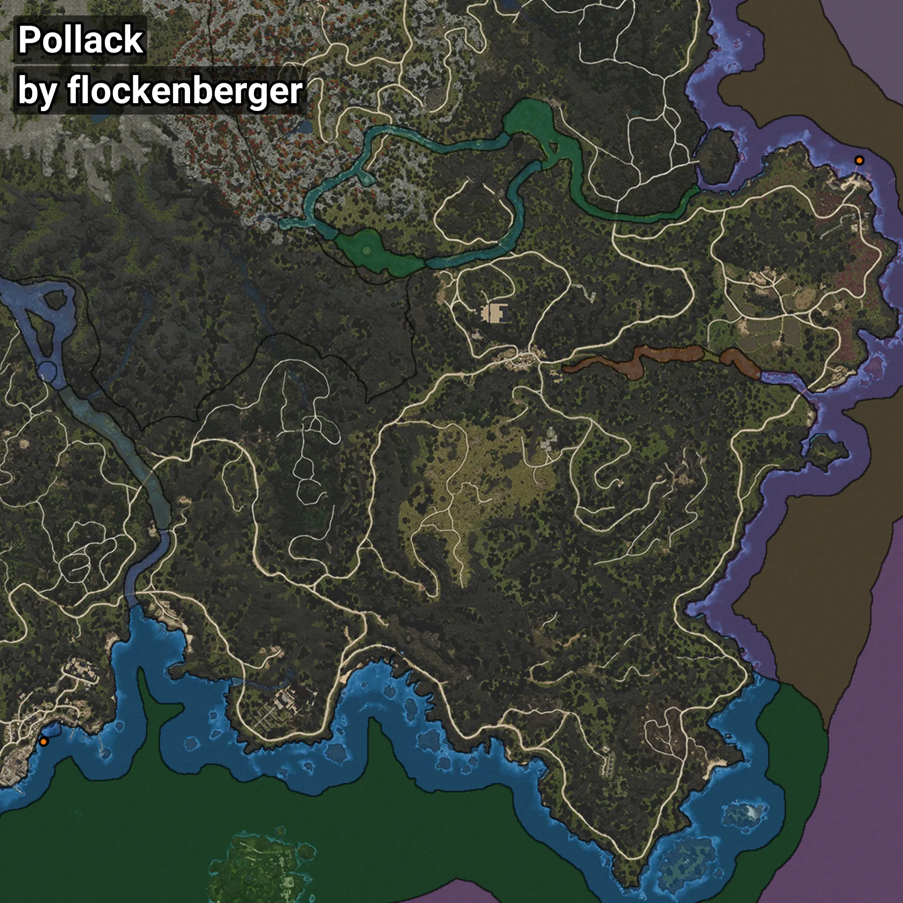

# Pollack
```xml
<!--
    Waypoints for: Pollack
    Created by: flockenberger
-->
<WorldmapBookMark>
    <BookMark BookMarkName="0: Pollack" PosX="-994380.0" PosY="-7883.0" PosZ="1348935.0" />
    <BookMark BookMarkName="1: Pollack" PosX="-994373.0" PosY="-7864.0" PosZ="1348969.0" />
    <BookMark BookMarkName="2: Pollack" PosX="-1307376.0" PosY="-8138.0" PosZ="1126052.0" />
    <BookMark BookMarkName="3: Pollack" PosX="-994424.0" PosY="-7883.0" PosZ="1348935.0" />
    <BookMark BookMarkName="4: Pollack" PosX="-1307607.0" PosY="-8141.0" PosZ="1125777.0" />
</WorldmapBookMark>
```

## ⚠️ Disclaimer
Waypoints are generated based on the __**character’s position**__ — __not__ where the fishing float landed.
Fish are determined by where your **float** lands!
In ocean spots especially, the direction you cast your rod can place your float in a **different fishing zone**, which may result in catching the wrong type of fish.
Please pay attention to the preview images showing where each location is in relation to the outlined zones.

- You can verify your float’s position using the guide [**HERE**](https://flockenberger.github.io/bdo-fish-position/)
- Or watch the video guide [**HERE**](https://youtu.be/t-VXcRoNojk)

## Previews
      