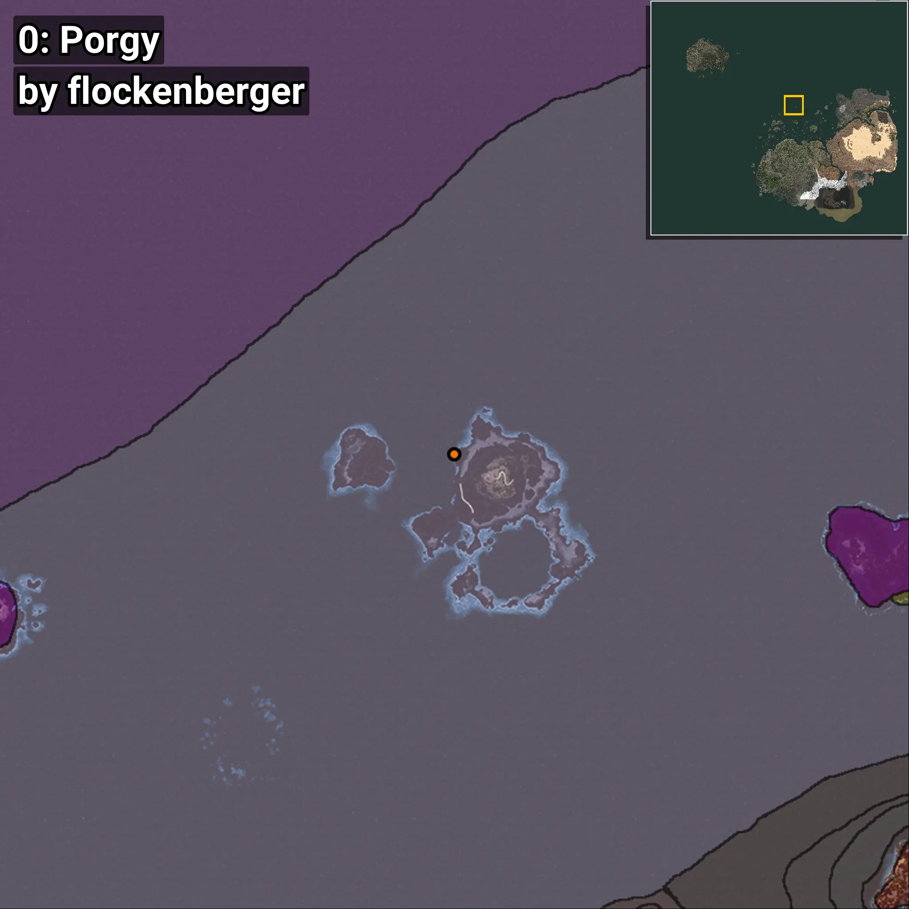
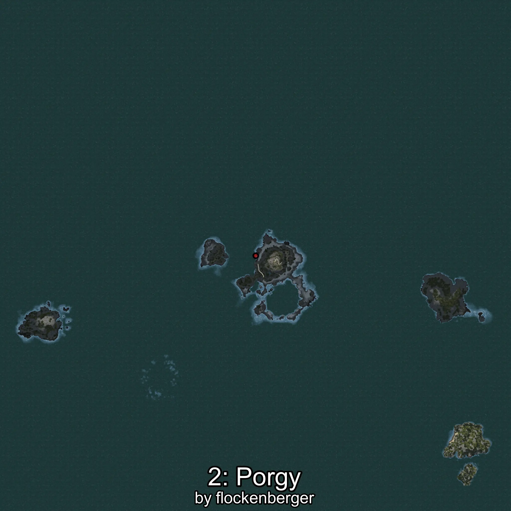
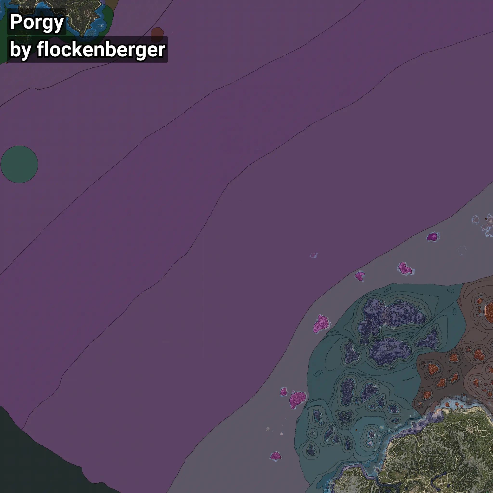

# Porgy
```xml
<!--
    Waypoints for: Porgy
    Created by: flockenberger
-->
<WorldmapBookMark>
    <BookMark BookMarkName="0: Porgy" PosX="-106109.0" PosY="-8133.0" PosZ="631999.0" />
    <BookMark BookMarkName="1: Porgy" PosX="-106059.0" PosY="-8128.0" PosZ="632063.0" />
    <BookMark BookMarkName="2: Porgy" PosX="-419542.0" PosY="-7923.0" PosZ="121650.0" />
    <BookMark BookMarkName="3: Porgy" PosX="-106292.0" PosY="-8224.0" PosZ="632234.0" />
    <BookMark BookMarkName="4: Porgy" PosX="-1264033.6" PosY="-8063.63" PosZ="1008967.0" />
</WorldmapBookMark>
```

## ⚠️ Disclaimer
Waypoints are generated based on the __**character’s position**__ — __not__ where the fishing float landed.
Fish are determined by where your **float** lands!
In ocean spots especially, the direction you cast your rod can place your float in a **different fishing zone**, which may result in catching the wrong type of fish.
Please pay attention to the preview images showing where each location is in relation to the outlined zones.

- You can verify your float’s position using the guide [**HERE**](https://flockenberger.github.io/bdo-fish-position/)
- Or watch the video guide [**HERE**](https://youtu.be/t-VXcRoNojk)

## Previews
      