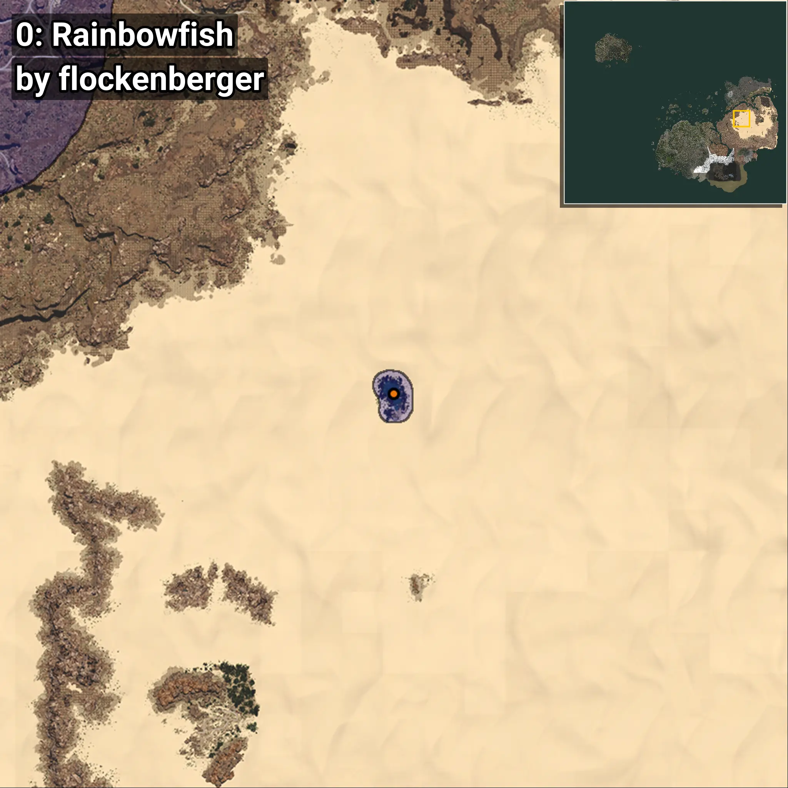
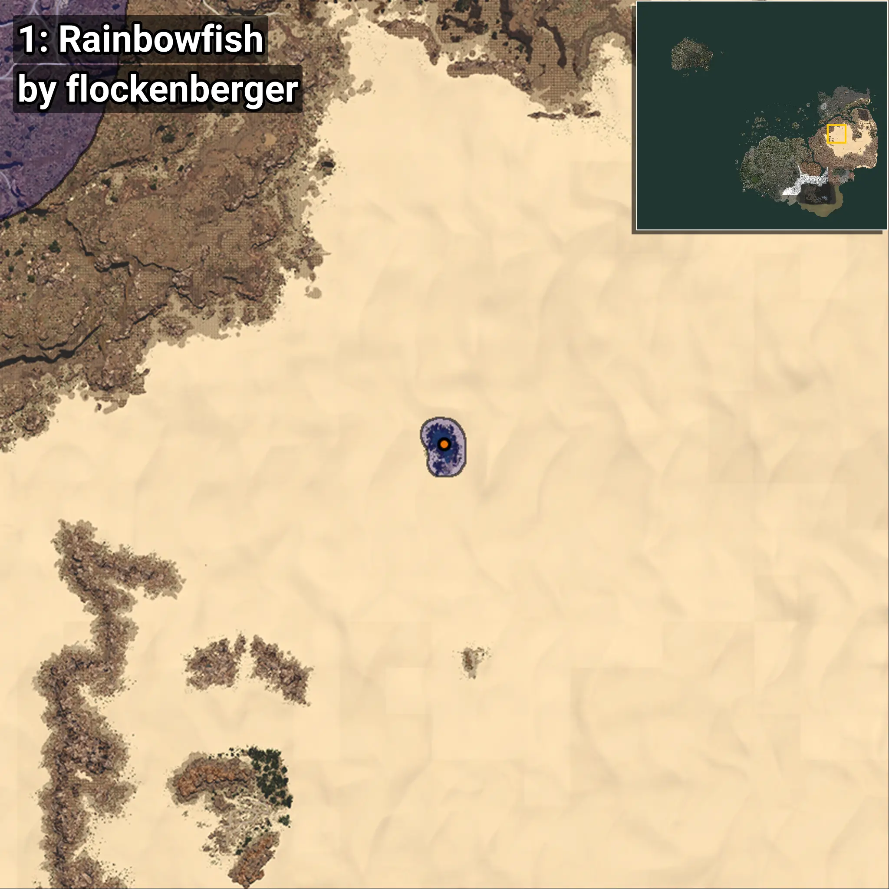
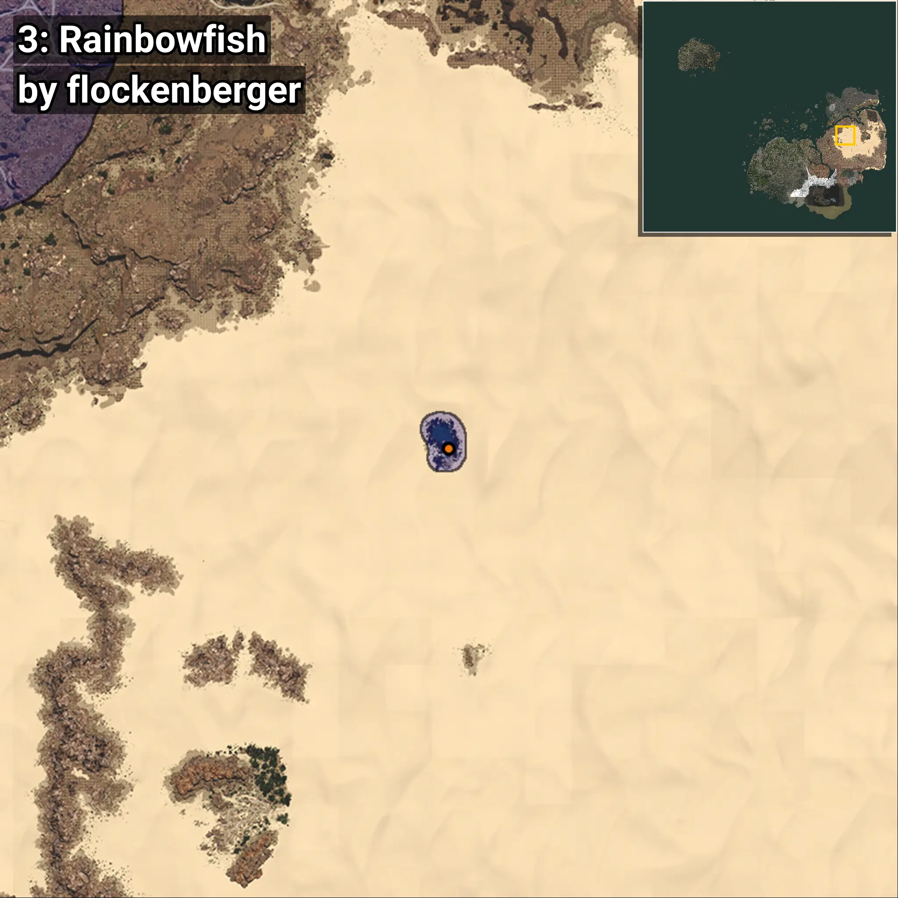
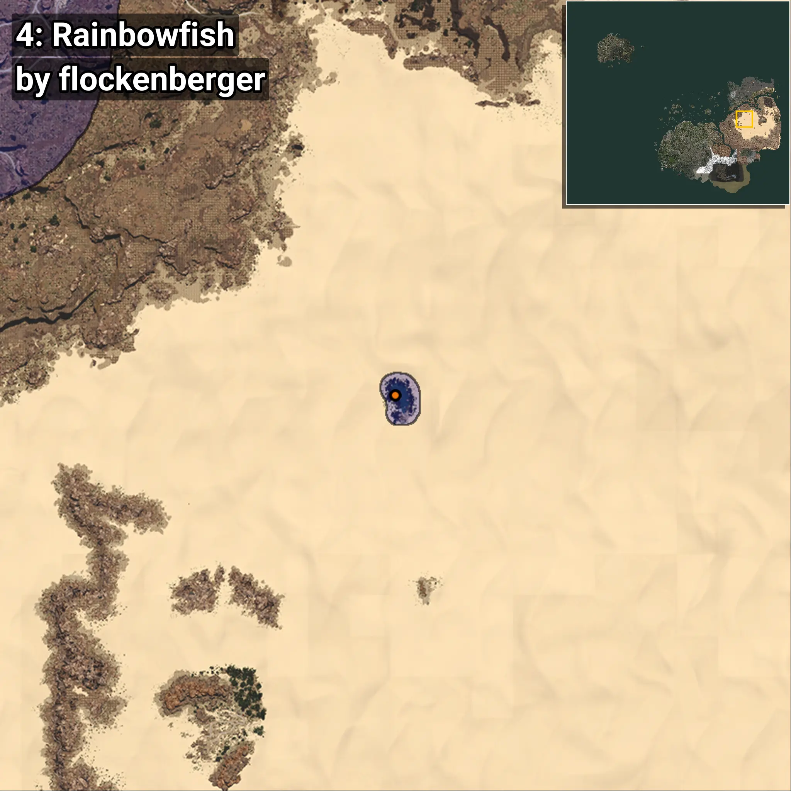
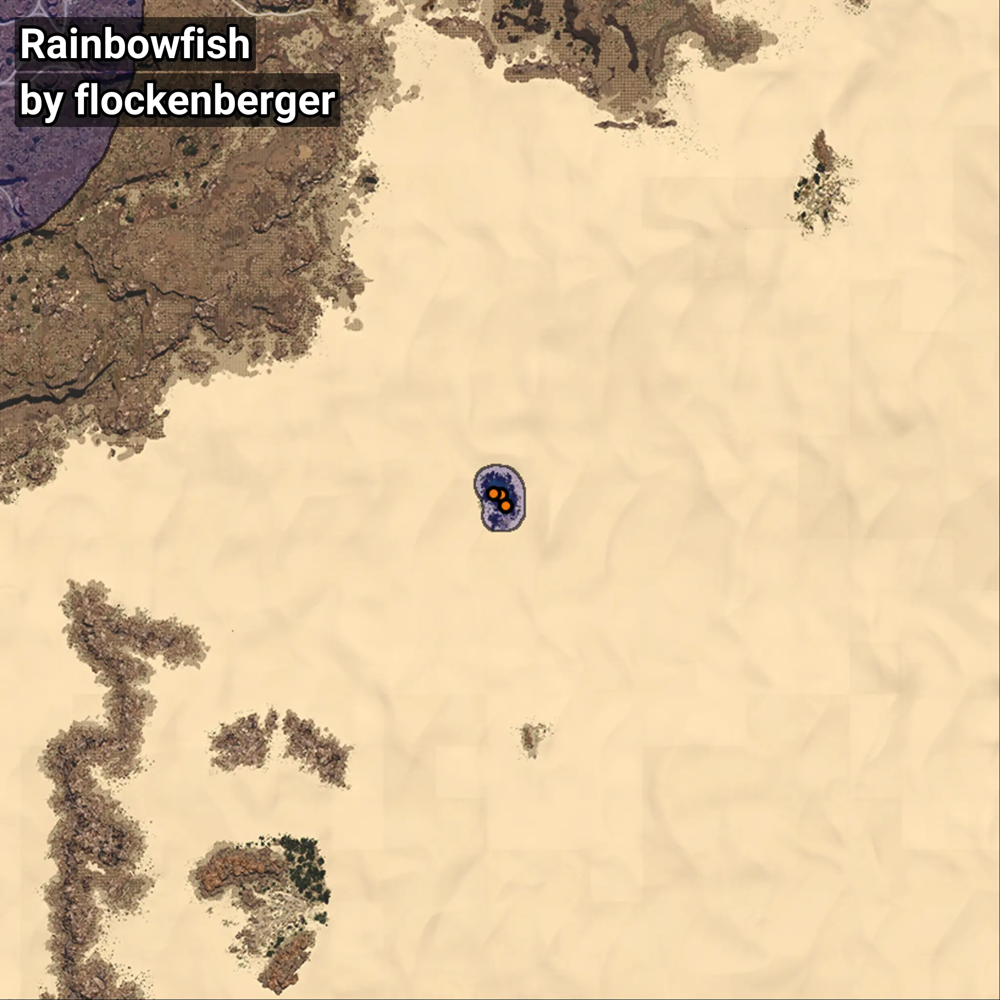

# Rainbowfish
```xml
<!--
    Waypoints for: Rainbowfish
    Created by: flockenberger
-->
<WorldmapBookMark>
    <BookMark BookMarkName="0: Rainbowfish" PosX="732954.1" PosY="3391.329" PosZ="202325.84" />
    <BookMark BookMarkName="1: Rainbowfish" PosX="732942.0" PosY="3392.0" PosZ="202333.0" />
    <BookMark BookMarkName="2: Rainbowfish" PosX="734110.0" PosY="3446.0" PosZ="199524.0" />
    <BookMark BookMarkName="3: Rainbowfish" PosX="734108.0" PosY="3444.0" PosZ="199509.0" />
    <BookMark BookMarkName="4: Rainbowfish" PosX="730998.0" PosY="3300.0" PosZ="202408.0" />
</WorldmapBookMark>
```

## ⚠️ Disclaimer
Waypoints are generated based on the __**character’s position**__ — __not__ where the fishing float landed.
Fish are determined by where your **float** lands!
In ocean spots especially, the direction you cast your rod can place your float in a **different fishing zone**, which may result in catching the wrong type of fish.
Please pay attention to the preview images showing where each location is in relation to the outlined zones.

- You can verify your float’s position using the guide [**HERE**](https://flockenberger.github.io/bdo-fish-position/)
- Or watch the video guide [**HERE**](https://youtu.be/t-VXcRoNojk)

## Previews
      