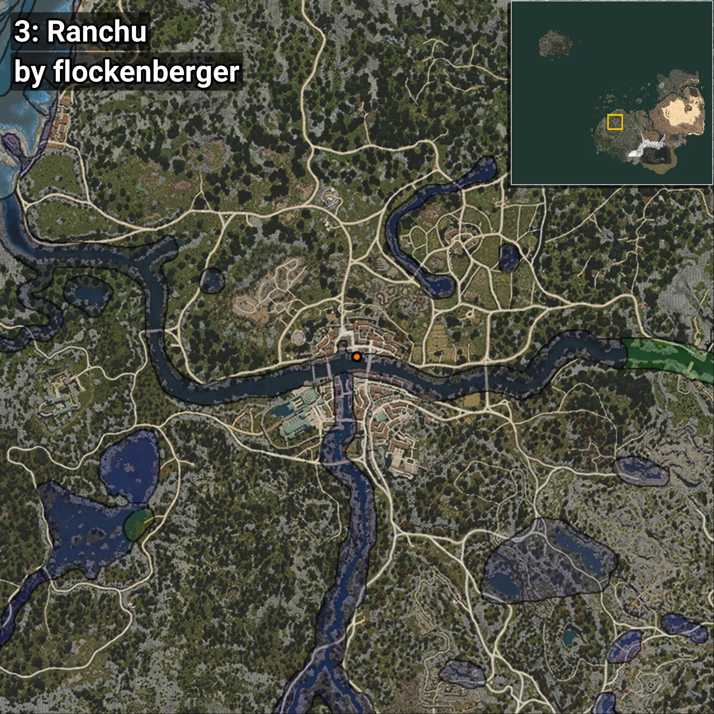

# Ranchu
```xml
<!--
    Waypoints for: Ranchu
    Created by: flockenberger
-->
<WorldmapBookMark>
    <BookMark BookMarkName="0: Ranchu" PosX="-249814.0" PosY="-4059.0" PosZ="-47074.0" />
    <BookMark BookMarkName="1: Ranchu" PosX="-249872.0" PosY="-4059.0" PosZ="-47119.0" />
    <BookMark BookMarkName="2: Ranchu" PosX="-327644.0" PosY="-1850.0" PosZ="-100326.0" />
    <BookMark BookMarkName="3: Ranchu" PosX="-249859.94" PosY="-4059.836" PosZ="-47135.54" />
    <BookMark BookMarkName="4: Ranchu" PosX="-235337.0" PosY="-3830.0" PosZ="-50219.0" />
</WorldmapBookMark>
```

## ⚠️ Disclaimer
Waypoints are generated based on the __**character’s position**__ — __not__ where the fishing float landed.
Fish are determined by where your **float** lands!
In ocean spots especially, the direction you cast your rod can place your float in a **different fishing zone**, which may result in catching the wrong type of fish.
Please pay attention to the preview images showing where each location is in relation to the outlined zones.

- You can verify your float’s position using the guide [**HERE**](https://flockenberger.github.io/bdo-fish-position/)
- Or watch the video guide [**HERE**](https://youtu.be/t-VXcRoNojk)

## Previews
      