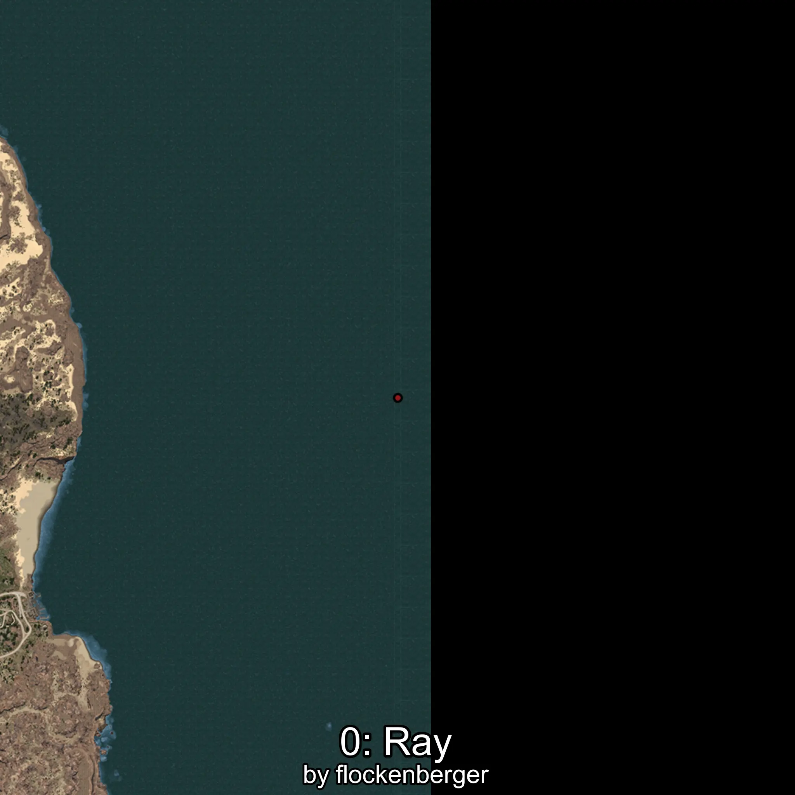
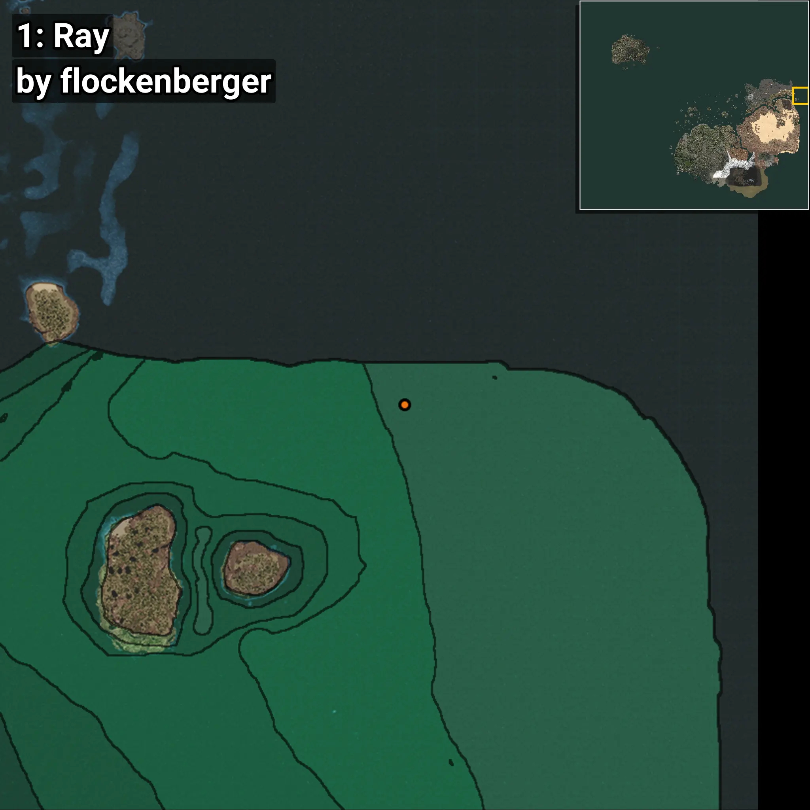
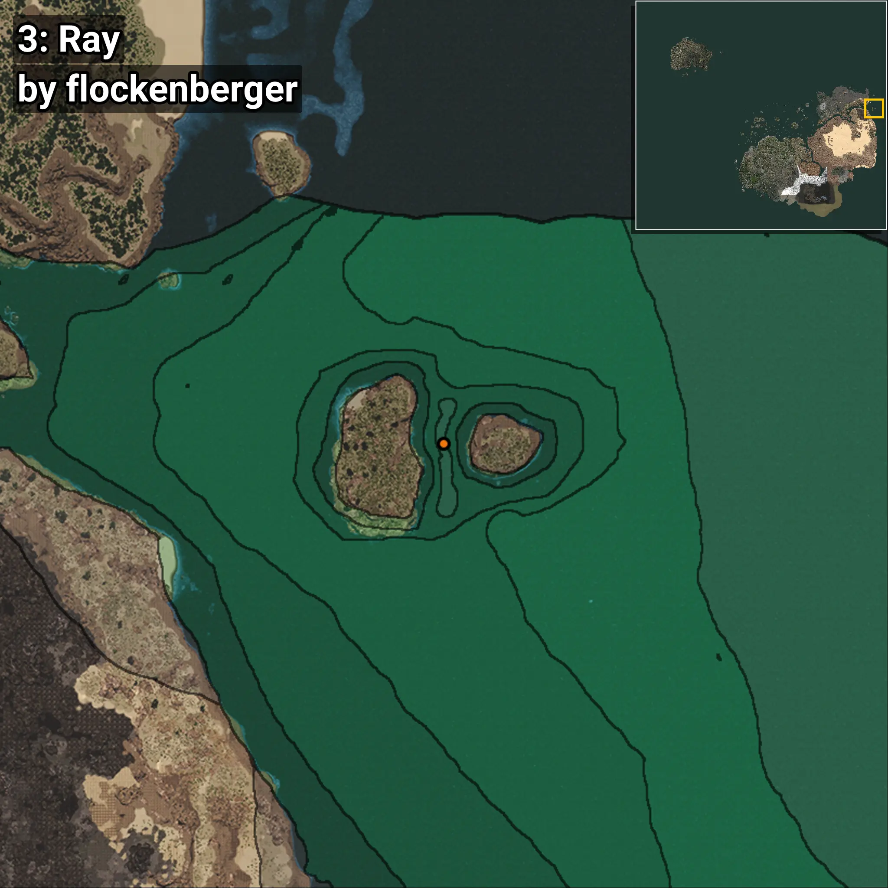
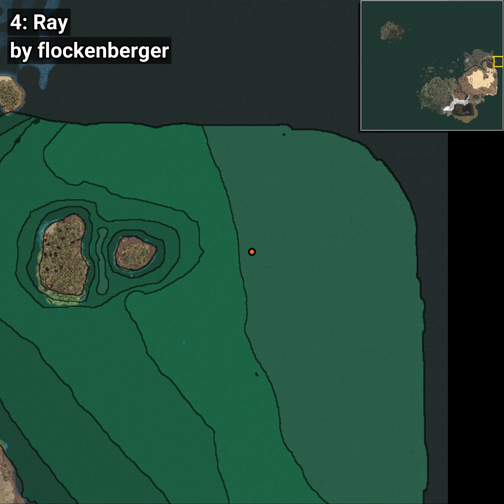
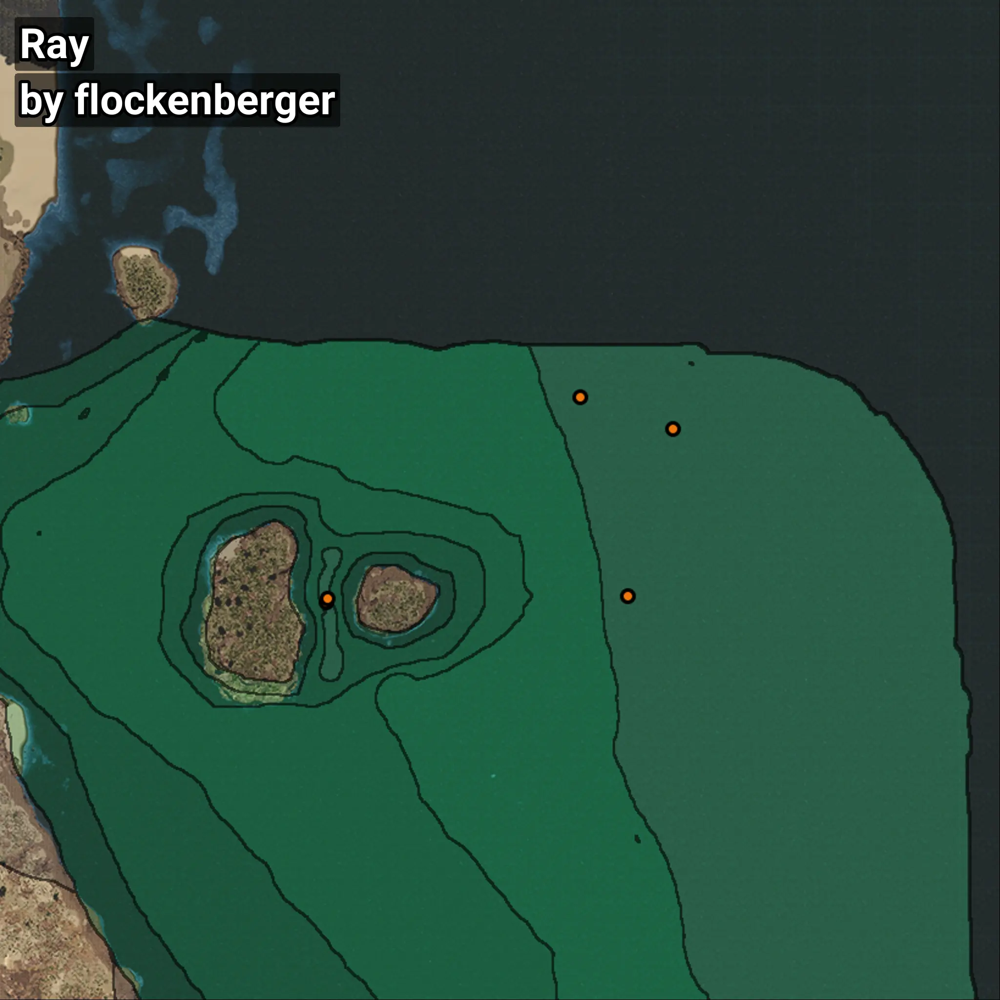

# Ray
```xml
<!--
    Waypoints for: Ray
    Created by: flockenberger
-->
<WorldmapBookMark>
    <BookMark BookMarkName="0: Ray" PosX="1348867.9" PosY="-7477.4346" PosZ="594756.94" />
    <BookMark BookMarkName="1: Ray" PosX="1325856.5" PosY="-7912.295" PosZ="602542.94" />
    <BookMark BookMarkName="2: Ray" PosX="1263193.0" PosY="-7926.0" PosZ="551898.0" />
    <BookMark BookMarkName="3: Ray" PosX="1263726.9" PosY="-7926.4937" PosZ="552808.06" />
    <BookMark BookMarkName="4: Ray" PosX="1337792.0" PosY="-7903.0" PosZ="553325.0" />
</WorldmapBookMark>
```

## ⚠️ Disclaimer
Waypoints are generated based on the __**character’s position**__ — __not__ where the fishing float landed.
Fish are determined by where your **float** lands!
In ocean spots especially, the direction you cast your rod can place your float in a **different fishing zone**, which may result in catching the wrong type of fish.
Please pay attention to the preview images showing where each location is in relation to the outlined zones.

- You can verify your float’s position using the guide [**HERE**](https://flockenberger.github.io/bdo-fish-position/)
- Or watch the video guide [**HERE**](https://youtu.be/t-VXcRoNojk)

## Previews
      