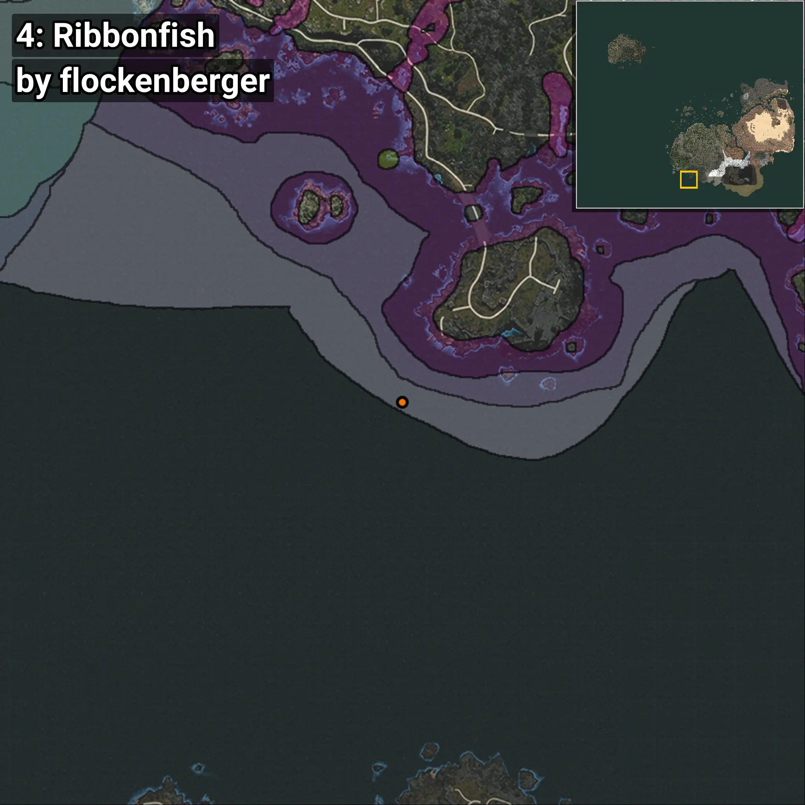
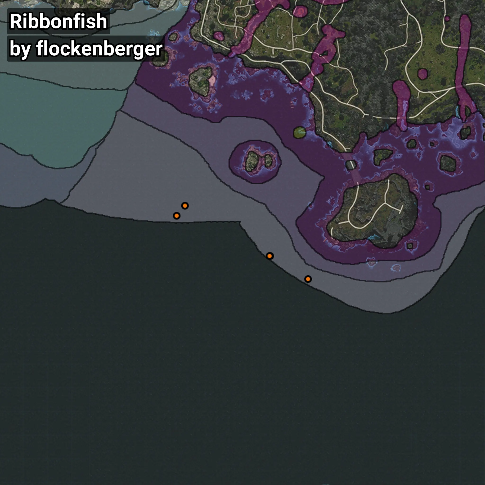

# Ribbonfish
```xml
<!--
    Waypoints for: Ribbonfish
    Created by: flockenberger
-->
<WorldmapBookMark>
    <BookMark BookMarkName="0: Ribbonfish" PosX="-341558.0" PosY="-8035.0" PosZ="-680256.0" />
    <BookMark BookMarkName="1: Ribbonfish" PosX="-341995.0" PosY="-7846.0" PosZ="-680178.0" />
    <BookMark BookMarkName="2: Ribbonfish" PosX="-385161.53" PosY="-8052.751" PosZ="-654679.7" />
    <BookMark BookMarkName="3: Ribbonfish" PosX="-389315.0" PosY="-7901.0" PosZ="-659585.0" />
    <BookMark BookMarkName="4: Ribbonfish" PosX="-322531.0" PosY="-7673.0" PosZ="-691917.0" />
</WorldmapBookMark>
```

## ⚠️ Disclaimer
Waypoints are generated based on the __**character’s position**__ — __not__ where the fishing float landed.
Fish are determined by where your **float** lands!
In ocean spots especially, the direction you cast your rod can place your float in a **different fishing zone**, which may result in catching the wrong type of fish.
Please pay attention to the preview images showing where each location is in relation to the outlined zones.

- You can verify your float’s position using the guide [**HERE**](https://flockenberger.github.io/bdo-fish-position/)
- Or watch the video guide [**HERE**](https://youtu.be/t-VXcRoNojk)

## Previews
      