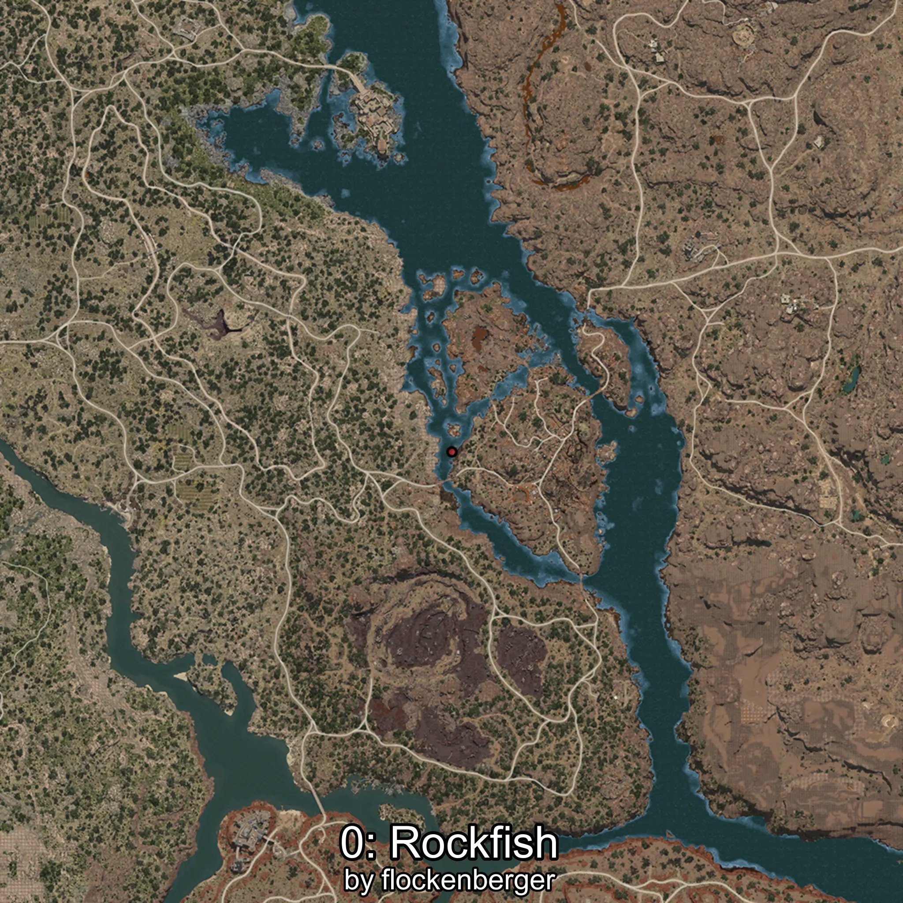
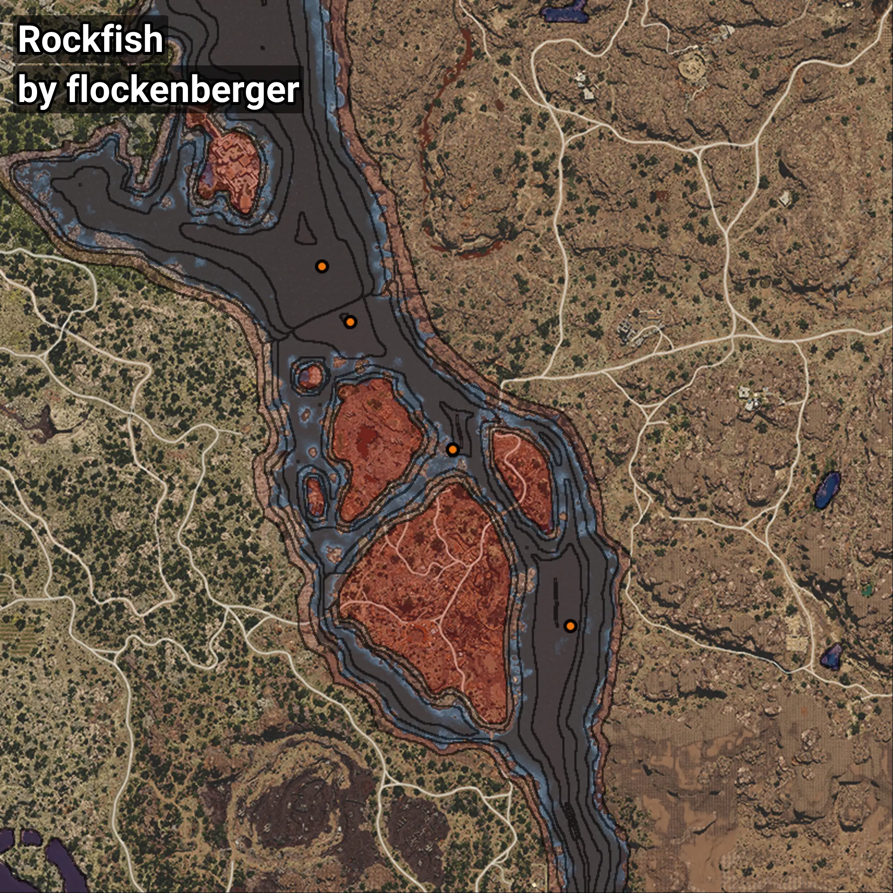

# Rockfish
```xml
<!--
    Waypoints for: Rockfish
    Created by: flockenberger
-->
<WorldmapBookMark>
    <BookMark BookMarkName="0: Rockfish" PosX="341678.0" PosY="-7735.0" PosZ="11263.0" />
    <BookMark BookMarkName="1: Rockfish" PosX="333719.0" PosY="-8193.033" PosZ="26597.086" />
    <BookMark BookMarkName="2: Rockfish" PosX="369899.0" PosY="-8231.0" PosZ="-23901.0" />
    <BookMark BookMarkName="3: Rockfish" PosX="369896.0" PosY="-8234.0" PosZ="-23845.0" />
    <BookMark BookMarkName="4: Rockfish" PosX="402555.2" PosY="-7918.6514" PosZ="-72799.47" />
</WorldmapBookMark>
```

## ⚠️ Disclaimer
Waypoints are generated based on the __**character’s position**__ — __not__ where the fishing float landed.
Fish are determined by where your **float** lands!
In ocean spots especially, the direction you cast your rod can place your float in a **different fishing zone**, which may result in catching the wrong type of fish.
Please pay attention to the preview images showing where each location is in relation to the outlined zones.

- You can verify your float’s position using the guide [**HERE**](https://flockenberger.github.io/bdo-fish-position/)
- Or watch the video guide [**HERE**](https://youtu.be/t-VXcRoNojk)

## Previews
      