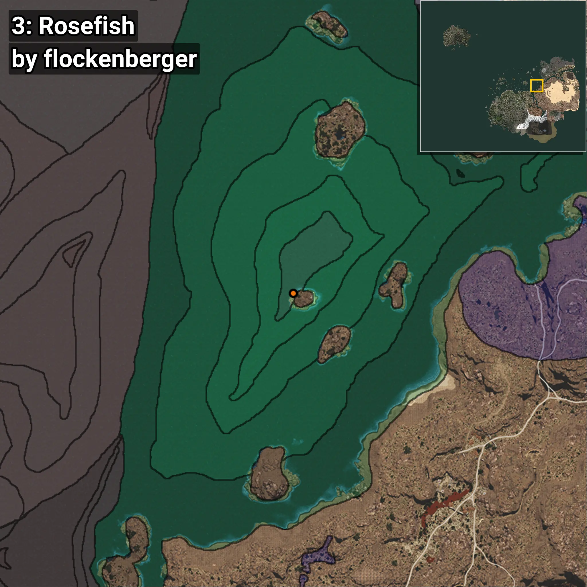
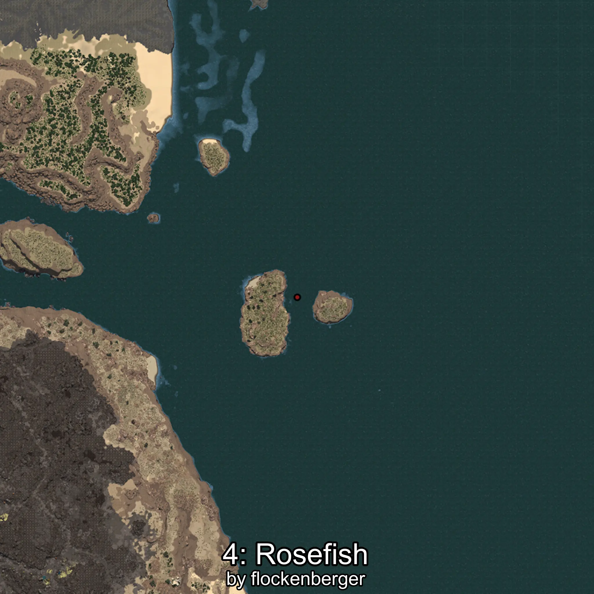

# Rosefish
```xml
<!--
    Waypoints for: Rosefish
    Created by: flockenberger
-->
<WorldmapBookMark>
    <BookMark BookMarkName="0: Rosefish" PosX="403740.0" PosY="-7946.0" PosZ="259397.0" />
    <BookMark BookMarkName="1: Rosefish" PosX="403660.1" PosY="-7917.3013" PosZ="259267.44" />
    <BookMark BookMarkName="2: Rosefish" PosX="403566.0" PosY="-7875.0" PosZ="259061.0" />
    <BookMark BookMarkName="3: Rosefish" PosX="403544.22" PosY="-7894.9966" PosZ="259088.33" />
    <BookMark BookMarkName="4: Rosefish" PosX="1406575.0" PosY="-7727.0" PosZ="581241.0" />
</WorldmapBookMark>
```

## ⚠️ Disclaimer
Waypoints are generated based on the __**character’s position**__ — __not__ where the fishing float landed.
Fish are determined by where your **float** lands!
In ocean spots especially, the direction you cast your rod can place your float in a **different fishing zone**, which may result in catching the wrong type of fish.
Please pay attention to the preview images showing where each location is in relation to the outlined zones.

- You can verify your float’s position using the guide [**HERE**](https://flockenberger.github.io/bdo-fish-position/)
- Or watch the video guide [**HERE**](https://youtu.be/t-VXcRoNojk)

## Previews
      