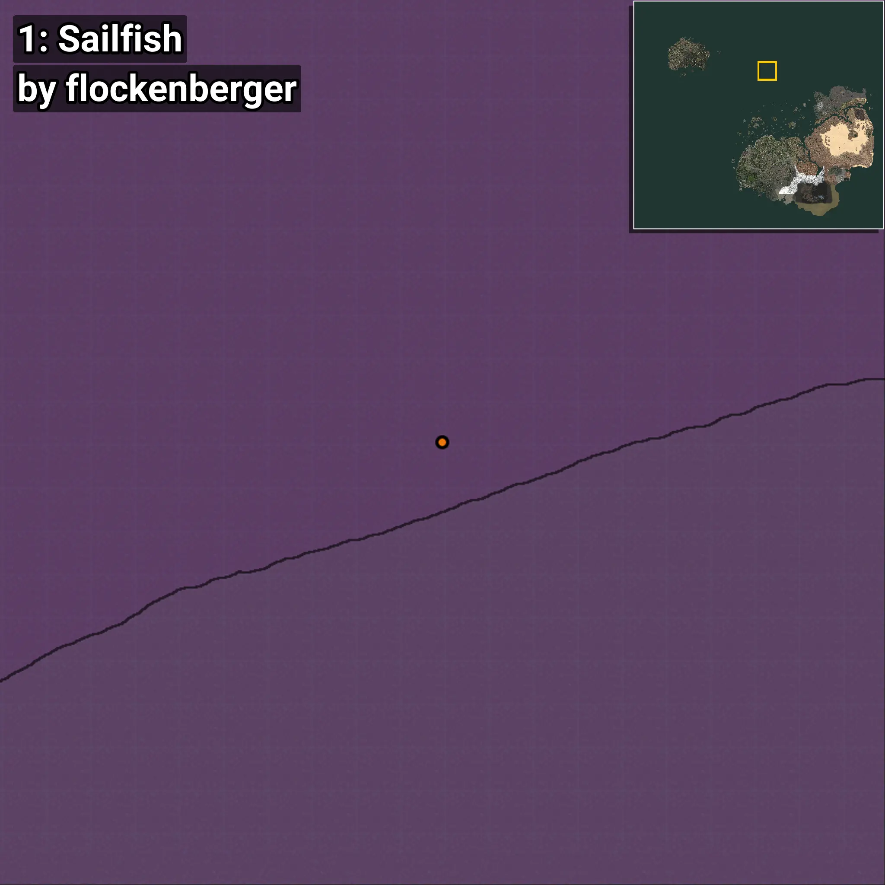
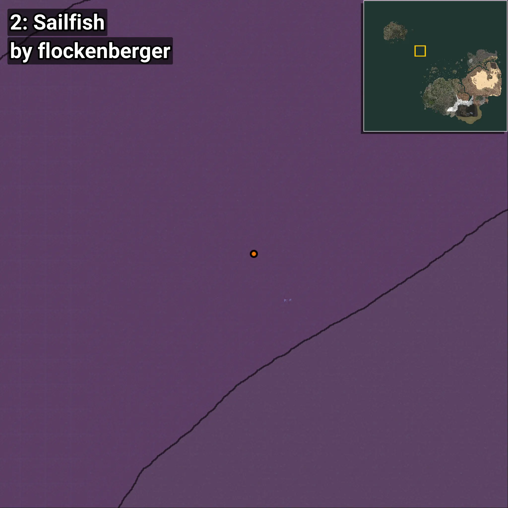
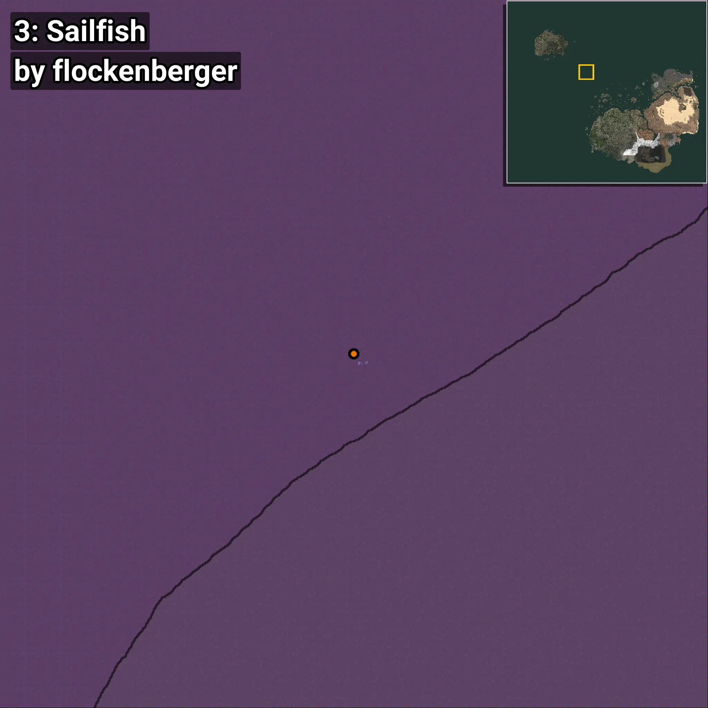
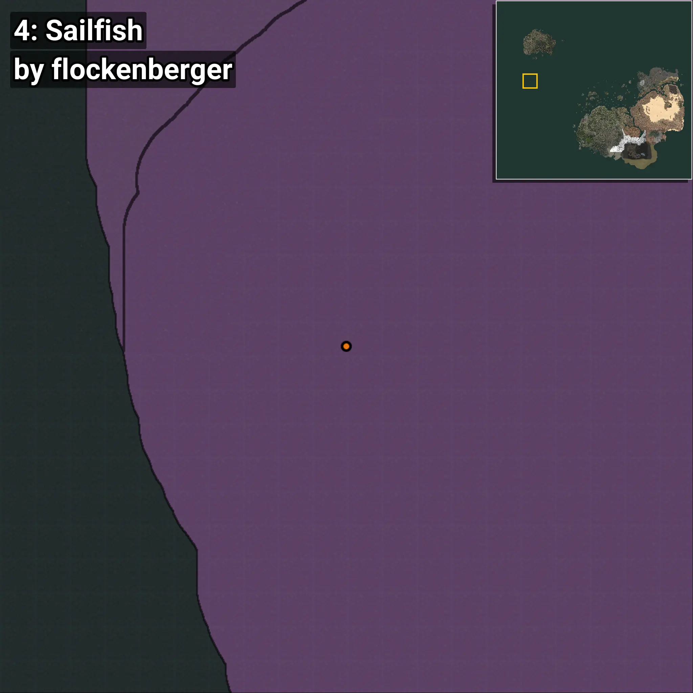
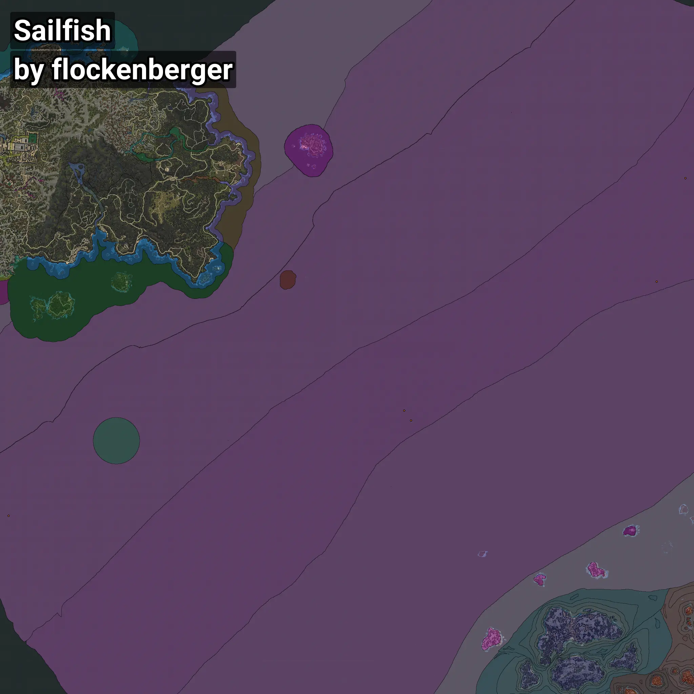

# Sailfish
```xml
<!--
    Waypoints for: Sailfish
    Created by: flockenberger
-->
<WorldmapBookMark>
    <BookMark BookMarkName="0: Sailfish" PosX="-128531.984" PosY="-7482.7773" PosZ="1273579.5" />
    <BookMark BookMarkName="1: Sailfish" PosX="-184103.0" PosY="-7647.0" PosZ="1072671.0" />
    <BookMark BookMarkName="2: Sailfish" PosX="-674727.0" PosY="-8208.0" PosZ="821944.0" />
    <BookMark BookMarkName="3: Sailfish" PosX="-661472.1" PosY="-7682.2065" PosZ="802754.56" />
    <BookMark BookMarkName="4: Sailfish" PosX="-1443240.0" PosY="-7879.0" PosZ="617616.0" />
</WorldmapBookMark>
```

## ⚠️ Disclaimer
Waypoints are generated based on the __**character’s position**__ — __not__ where the fishing float landed.
Fish are determined by where your **float** lands!
In ocean spots especially, the direction you cast your rod can place your float in a **different fishing zone**, which may result in catching the wrong type of fish.
Please pay attention to the preview images showing where each location is in relation to the outlined zones.

- You can verify your float’s position using the guide [**HERE**](https://flockenberger.github.io/bdo-fish-position/)
- Or watch the video guide [**HERE**](https://youtu.be/t-VXcRoNojk)

## Previews
      