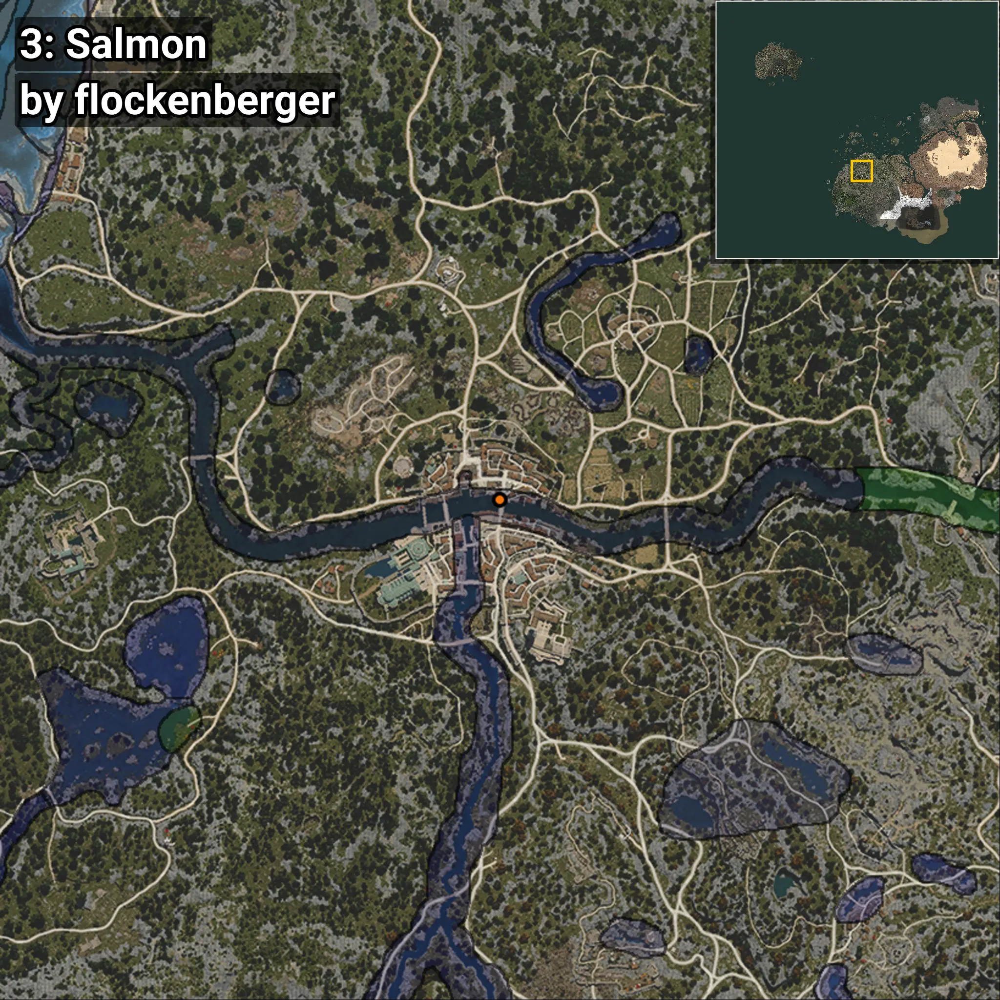
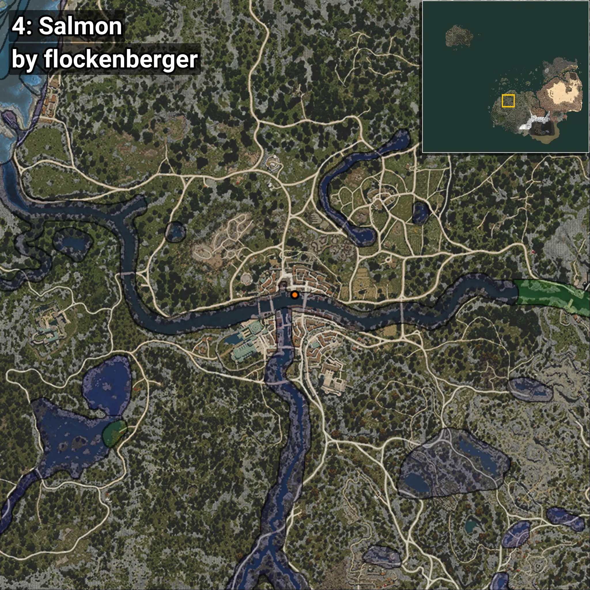
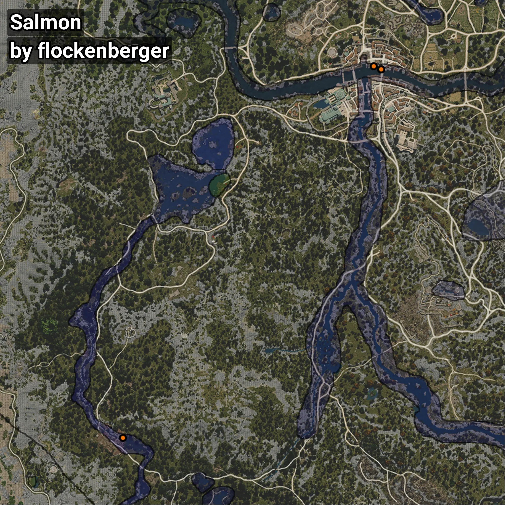

# Salmon
```xml
<!--
    Waypoints for: Salmon
    Created by: flockenberger
-->
<WorldmapBookMark>
    <BookMark BookMarkName="0: Salmon" PosX="-246071.8" PosY="-3814.816" PosZ="-48676.1" />
    <BookMark BookMarkName="1: Salmon" PosX="-246095.0" PosY="-3814.0" PosZ="-48668.0" />
    <BookMark BookMarkName="2: Salmon" PosX="-372321.03" PosY="11000.338" PosZ="-228620.14" />
    <BookMark BookMarkName="3: Salmon" PosX="-246109.77" PosY="-3814.7612" PosZ="-48657.8" />
    <BookMark BookMarkName="4: Salmon" PosX="-249851.7" PosY="-4059.836" PosZ="-47171.22" />
</WorldmapBookMark>
```

## ⚠️ Disclaimer
Waypoints are generated based on the __**character’s position**__ — __not__ where the fishing float landed.
Fish are determined by where your **float** lands!
In ocean spots especially, the direction you cast your rod can place your float in a **different fishing zone**, which may result in catching the wrong type of fish.
Please pay attention to the preview images showing where each location is in relation to the outlined zones.

- You can verify your float’s position using the guide [**HERE**](https://flockenberger.github.io/bdo-fish-position/)
- Or watch the video guide [**HERE**](https://youtu.be/t-VXcRoNojk)

## Previews
      