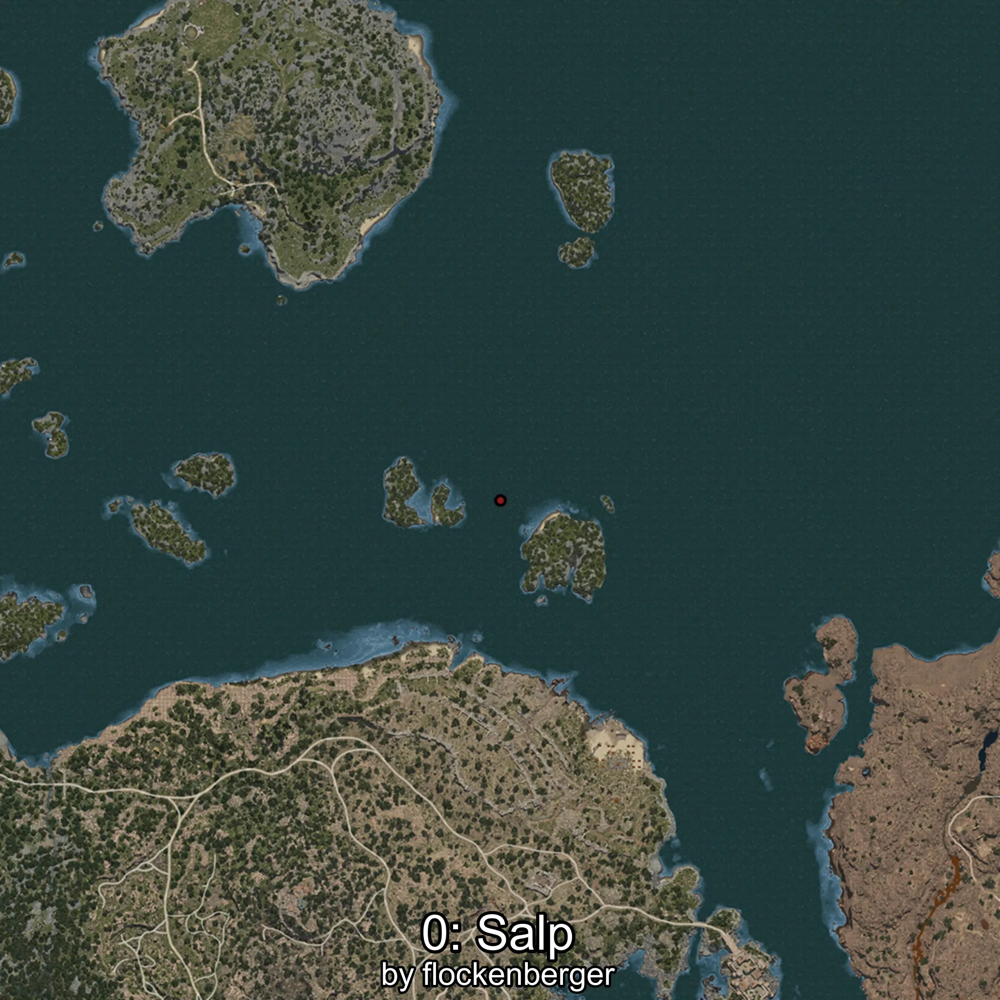
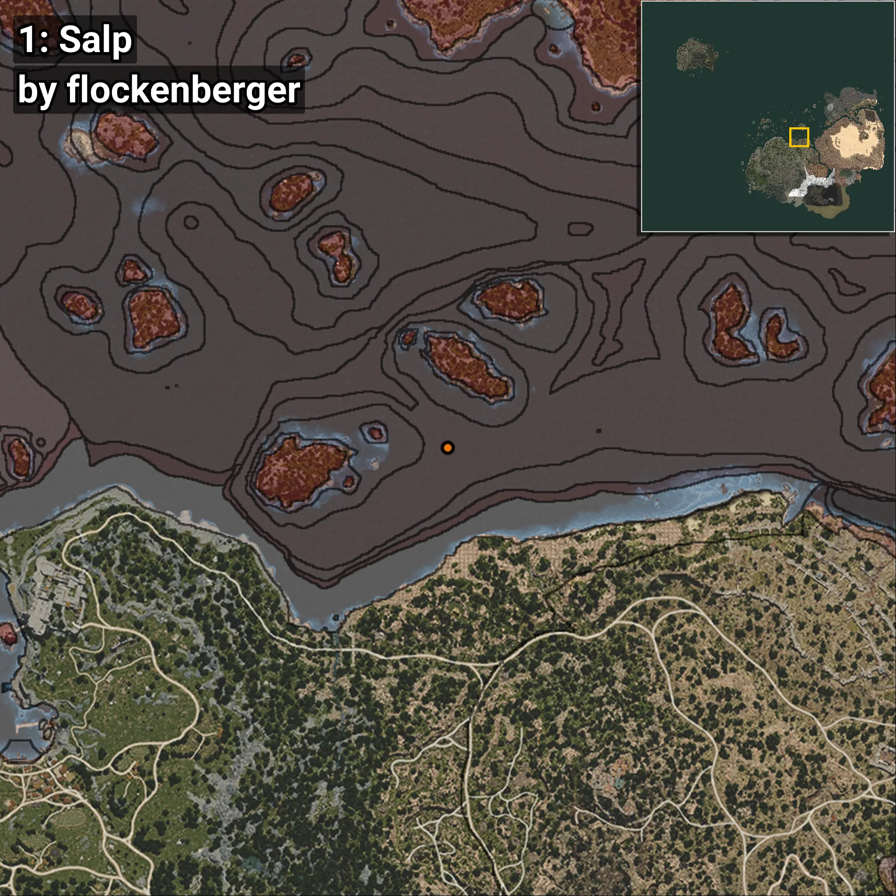
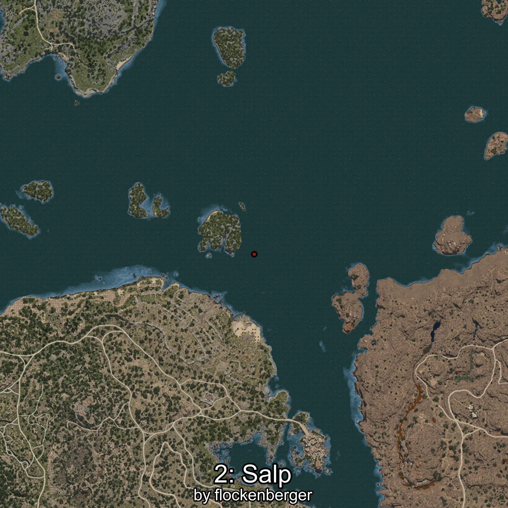
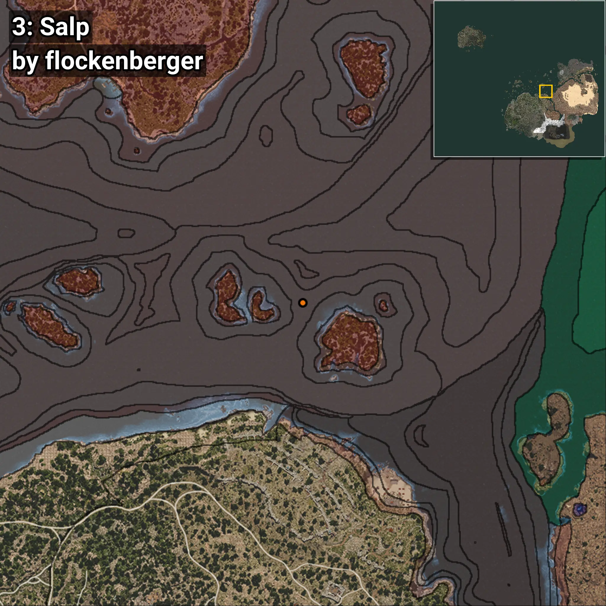
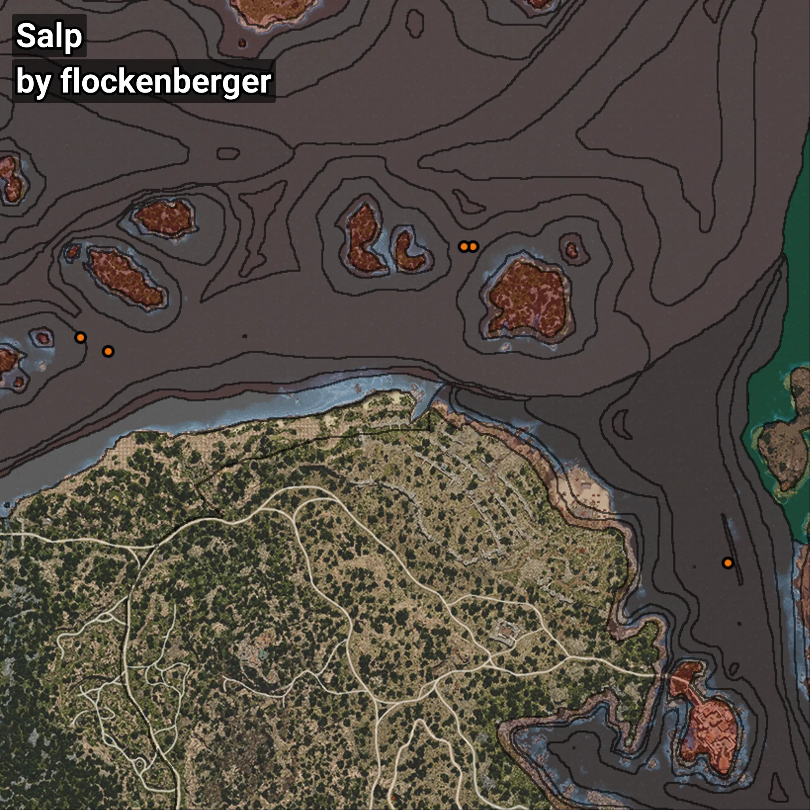

# Salp
```xml
<!--
    Waypoints for: Salp
    Created by: flockenberger
-->
<WorldmapBookMark>
    <BookMark BookMarkName="0: Salp" PosX="116737.82" PosY="-8173.4575" PosZ="174269.06" />
    <BookMark BookMarkName="1: Salp" PosX="125000.0" PosY="-7885.0" PosZ="169911.0" />
    <BookMark BookMarkName="2: Salp" PosX="236283.0" PosY="-8208.0" PosZ="202003.0" />
    <BookMark BookMarkName="3: Salp" PosX="233463.0" PosY="-7913.0" PosZ="202065.0" />
    <BookMark BookMarkName="4: Salp" PosX="314012.44" PosY="-7841.1797" PosZ="105474.67" />
</WorldmapBookMark>
```

## ⚠️ Disclaimer
Waypoints are generated based on the __**character’s position**__ — __not__ where the fishing float landed.
Fish are determined by where your **float** lands!
In ocean spots especially, the direction you cast your rod can place your float in a **different fishing zone**, which may result in catching the wrong type of fish.
Please pay attention to the preview images showing where each location is in relation to the outlined zones.

- You can verify your float’s position using the guide [**HERE**](https://flockenberger.github.io/bdo-fish-position/)
- Or watch the video guide [**HERE**](https://youtu.be/t-VXcRoNojk)

## Previews
      