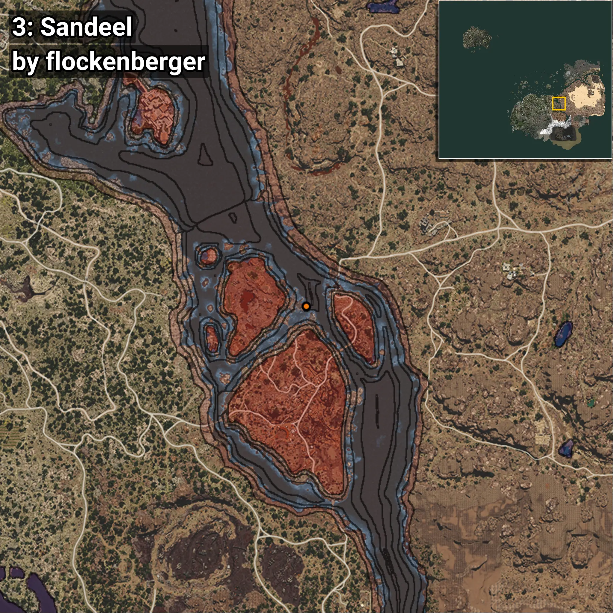

# Sandeel
```xml
<!--
    Waypoints for: Sandeel
    Created by: flockenberger
-->
<WorldmapBookMark>
    <BookMark BookMarkName="0: Sandeel" PosX="369800.06" PosY="-8211.419" PosZ="-23892.178" />
    <BookMark BookMarkName="1: Sandeel" PosX="369873.0" PosY="-8231.0" PosZ="-23865.0" />
    <BookMark BookMarkName="2: Sandeel" PosX="173785.0" PosY="-7732.0" PosZ="205862.0" />
    <BookMark BookMarkName="3: Sandeel" PosX="369902.0" PosY="-8236.0" PosZ="-23831.0" />
    <BookMark BookMarkName="4: Sandeel" PosX="328790.0" PosY="-7749.9365" PosZ="32874.52" />
</WorldmapBookMark>
```

## ⚠️ Disclaimer
Waypoints are generated based on the __**character’s position**__ — __not__ where the fishing float landed.
Fish are determined by where your **float** lands!
In ocean spots especially, the direction you cast your rod can place your float in a **different fishing zone**, which may result in catching the wrong type of fish.
Please pay attention to the preview images showing where each location is in relation to the outlined zones.

- You can verify your float’s position using the guide [**HERE**](https://flockenberger.github.io/bdo-fish-position/)
- Or watch the video guide [**HERE**](https://youtu.be/t-VXcRoNojk)

## Previews
      