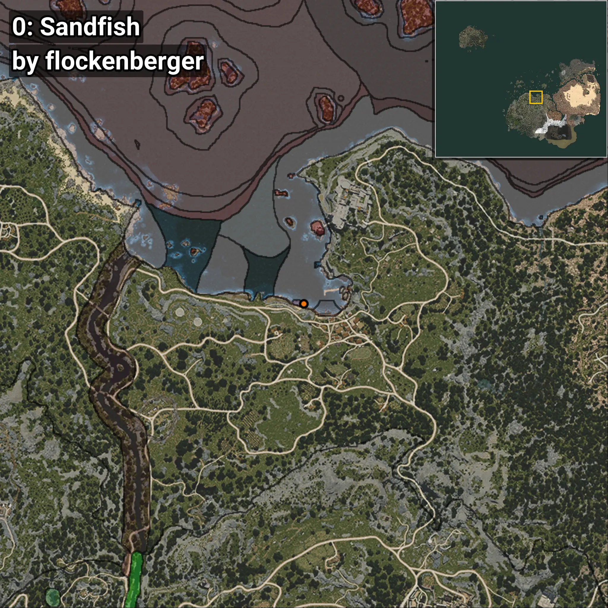
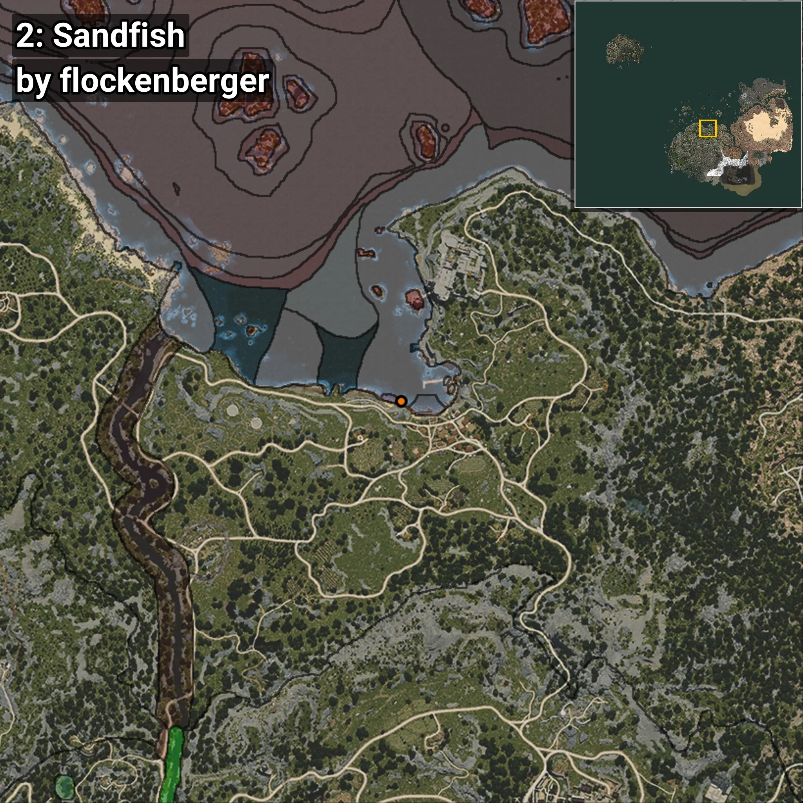
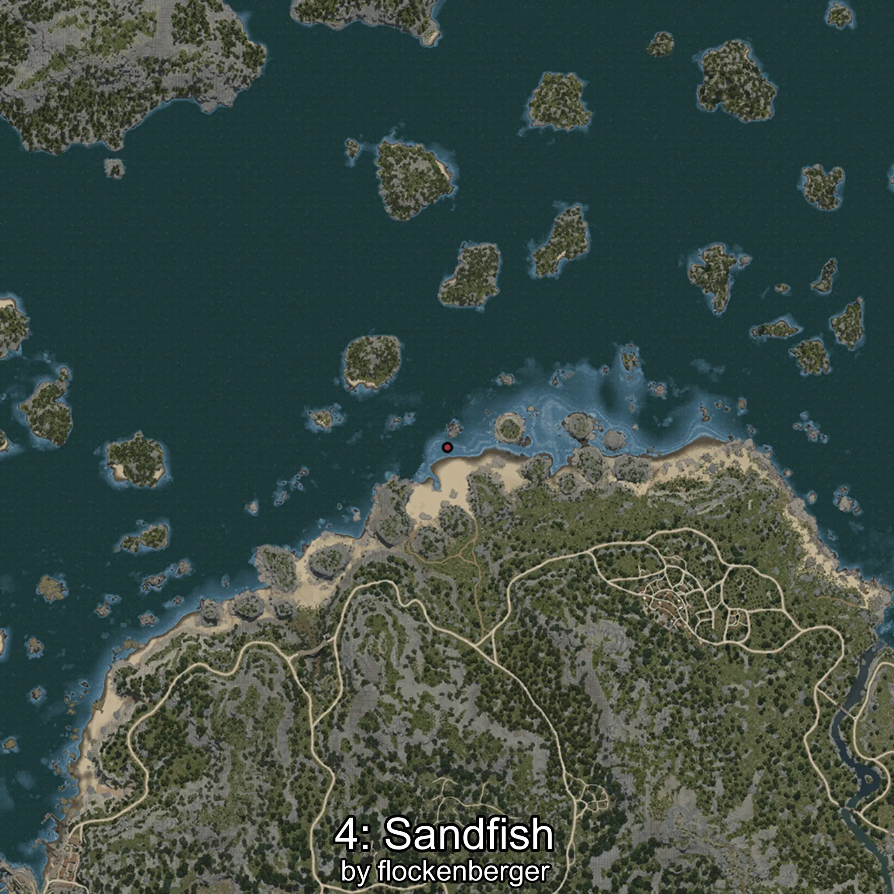

# Sandfish
```xml
<!--
    Waypoints for: Sandfish
    Created by: flockenberger
-->
<WorldmapBookMark>
    <BookMark BookMarkName="0: Sandfish" PosX="-2008.0" PosY="-8212.0" PosZ="88045.0" />
    <BookMark BookMarkName="1: Sandfish" PosX="-1992.0" PosY="-8186.0" PosZ="87941.0" />
    <BookMark BookMarkName="2: Sandfish" PosX="-404.0" PosY="-8236.0" PosZ="87451.0" />
    <BookMark BookMarkName="3: Sandfish" PosX="-423.0" PosY="-8223.0" PosZ="87409.0" />
    <BookMark BookMarkName="4: Sandfish" PosX="-3662.0" PosY="-8203.0" PosZ="88090.0" />
</WorldmapBookMark>
```

## ⚠️ Disclaimer
Waypoints are generated based on the __**character’s position**__ — __not__ where the fishing float landed.
Fish are determined by where your **float** lands!
In ocean spots especially, the direction you cast your rod can place your float in a **different fishing zone**, which may result in catching the wrong type of fish.
Please pay attention to the preview images showing where each location is in relation to the outlined zones.

- You can verify your float’s position using the guide [**HERE**](https://flockenberger.github.io/bdo-fish-position/)
- Or watch the video guide [**HERE**](https://youtu.be/t-VXcRoNojk)

## Previews
      