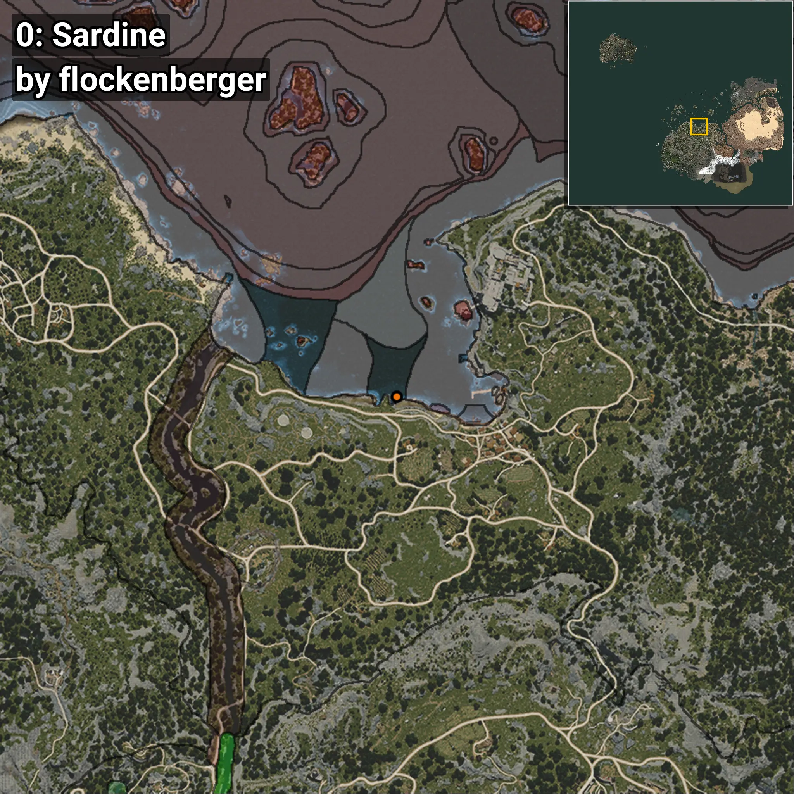
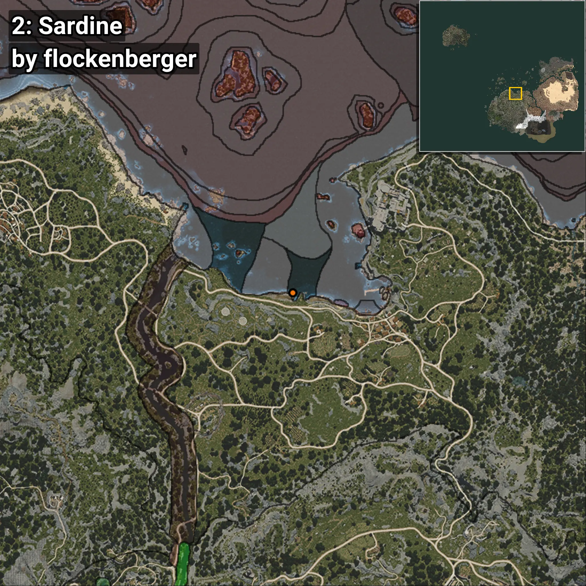

# Sardine
```xml
<!--
    Waypoints for: Sardine
    Created by: flockenberger
-->
<WorldmapBookMark>
    <BookMark BookMarkName="0: Sardine" PosX="-16918.484" PosY="-8167.174" PosZ="91998.62" />
    <BookMark BookMarkName="1: Sardine" PosX="-16795.014" PosY="-7966.482" PosZ="91708.96" />
    <BookMark BookMarkName="2: Sardine" PosX="-23932.0" PosY="-8207.0" PosZ="92543.0" />
    <BookMark BookMarkName="3: Sardine" PosX="-17043.0" PosY="-7962.0" PosZ="91646.0" />
    <BookMark BookMarkName="4: Sardine" PosX="-14953.0" PosY="-7761.0" PosZ="104156.0" />
</WorldmapBookMark>
```

## ⚠️ Disclaimer
Waypoints are generated based on the __**character’s position**__ — __not__ where the fishing float landed.
Fish are determined by where your **float** lands!
In ocean spots especially, the direction you cast your rod can place your float in a **different fishing zone**, which may result in catching the wrong type of fish.
Please pay attention to the preview images showing where each location is in relation to the outlined zones.

- You can verify your float’s position using the guide [**HERE**](https://flockenberger.github.io/bdo-fish-position/)
- Or watch the video guide [**HERE**](https://youtu.be/t-VXcRoNojk)

## Previews
      