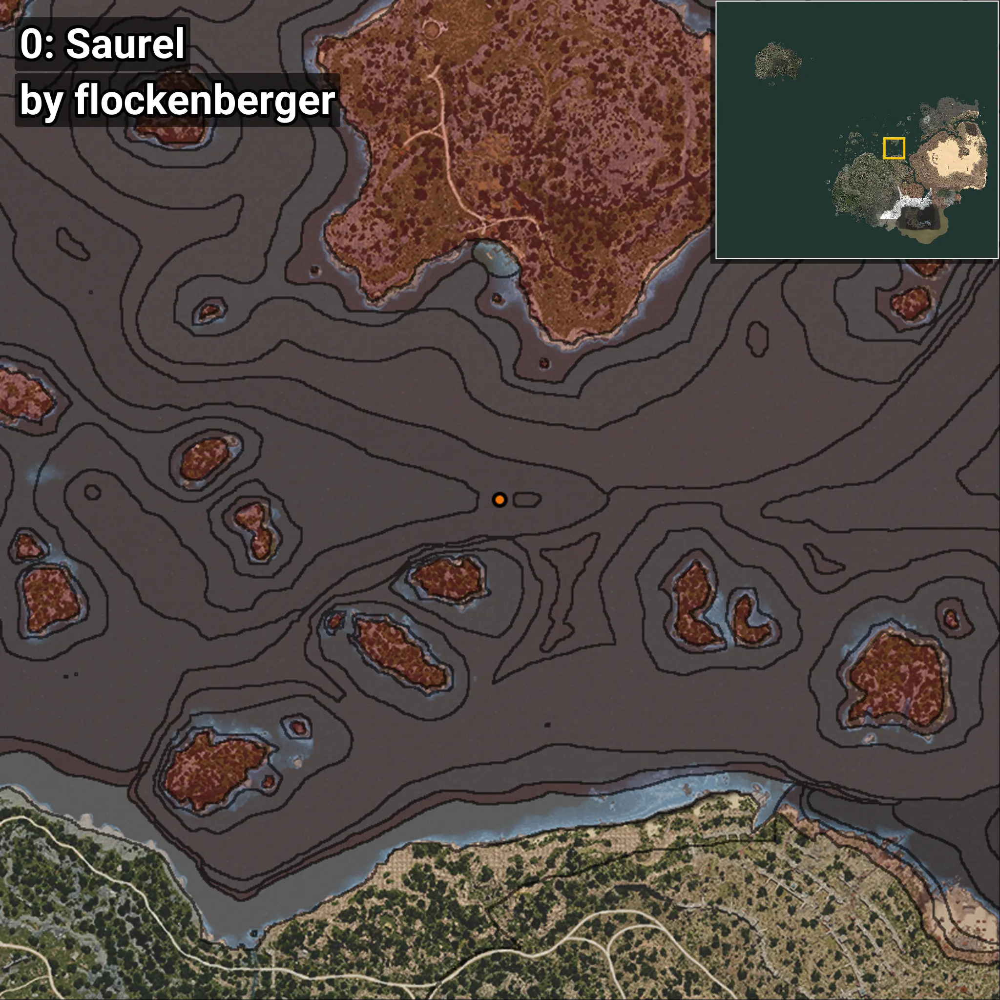
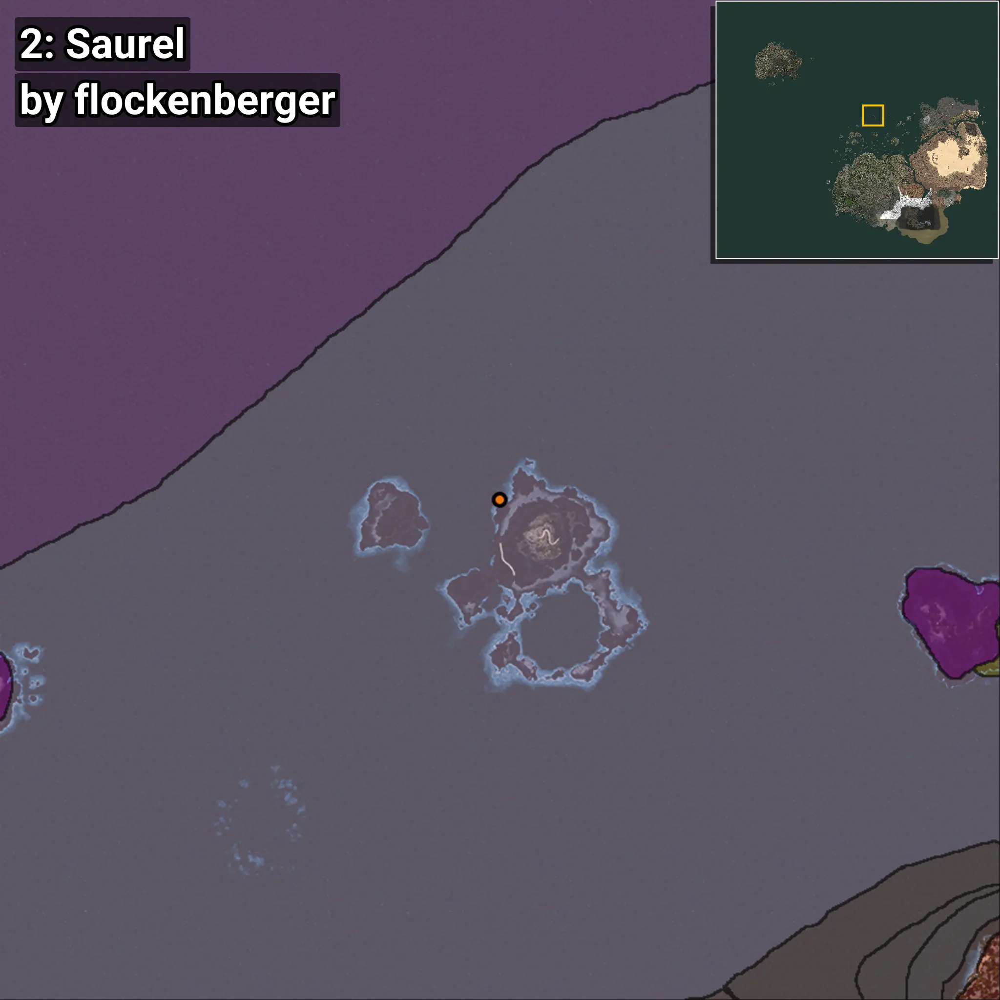
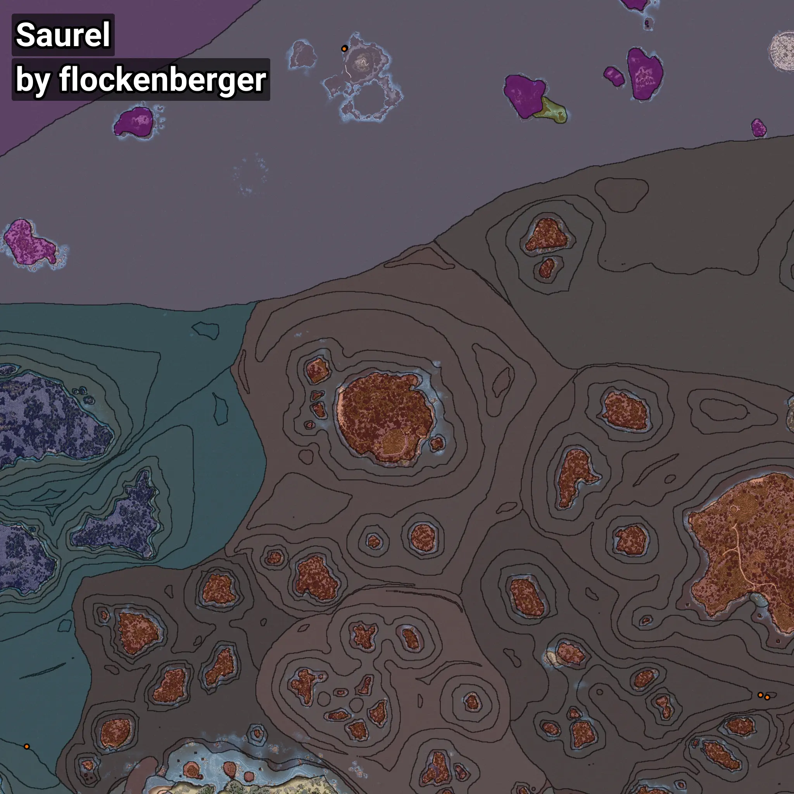

# Saurel
```xml
<!--
    Waypoints for: Saurel
    Created by: flockenberger
-->
<WorldmapBookMark>
    <BookMark BookMarkName="0: Saurel" PosX="154840.0" PosY="-7895.0" PosZ="230229.0" />
    <BookMark BookMarkName="1: Saurel" PosX="159113.0" PosY="-7652.0" PosZ="228810.0" />
    <BookMark BookMarkName="2: Saurel" PosX="-104772.0" PosY="-7965.0" PosZ="634711.0" />
    <BookMark BookMarkName="3: Saurel" PosX="-105291.0" PosY="-7974.0" PosZ="634253.0" />
    <BookMark BookMarkName="4: Saurel" PosX="-303780.0" PosY="-7686.0" PosZ="198049.0" />
</WorldmapBookMark>
```

## ⚠️ Disclaimer
Waypoints are generated based on the __**character’s position**__ — __not__ where the fishing float landed.
Fish are determined by where your **float** lands!
In ocean spots especially, the direction you cast your rod can place your float in a **different fishing zone**, which may result in catching the wrong type of fish.
Please pay attention to the preview images showing where each location is in relation to the outlined zones.

- You can verify your float’s position using the guide [**HERE**](https://flockenberger.github.io/bdo-fish-position/)
- Or watch the video guide [**HERE**](https://youtu.be/t-VXcRoNojk)

## Previews
      