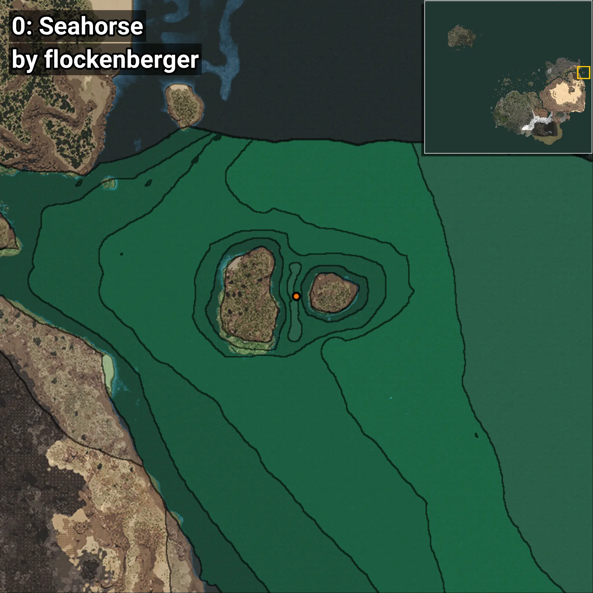
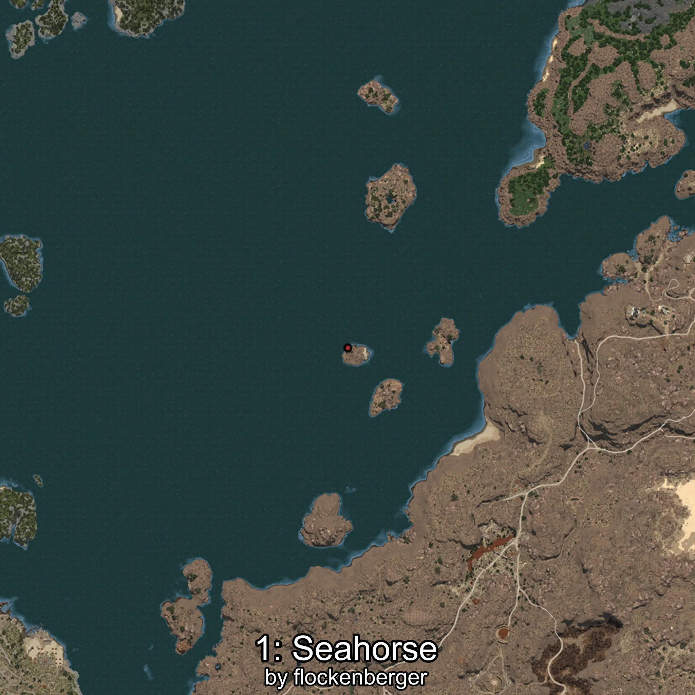
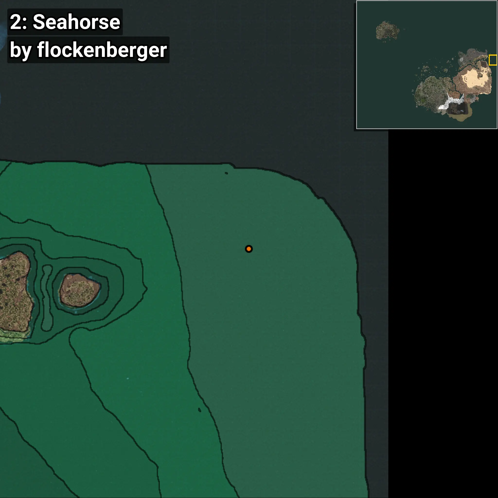

# Seahorse
```xml
<!--
    Waypoints for: Seahorse
    Created by: flockenberger
-->
<WorldmapBookMark>
    <BookMark BookMarkName="0: Seahorse" PosX="1265220.0" PosY="-7574.0" PosZ="551276.0" />
    <BookMark BookMarkName="1: Seahorse" PosX="1263098.0" PosY="-7916.0" PosZ="552216.0" />
    <BookMark BookMarkName="2: Seahorse" PosX="1364417.9" PosY="-8065.2466" PosZ="573253.25" />
    <BookMark BookMarkName="3: Seahorse" PosX="1263106.0" PosY="-7914.0" PosZ="553518.0" />
    <BookMark BookMarkName="4: Seahorse" PosX="403861.3" PosY="-7879.1245" PosZ="259349.95" />
</WorldmapBookMark>
```

## ⚠️ Disclaimer
Waypoints are generated based on the __**character’s position**__ — __not__ where the fishing float landed.
Fish are determined by where your **float** lands!
In ocean spots especially, the direction you cast your rod can place your float in a **different fishing zone**, which may result in catching the wrong type of fish.
Please pay attention to the preview images showing where each location is in relation to the outlined zones.

- You can verify your float’s position using the guide [**HERE**](https://flockenberger.github.io/bdo-fish-position/)
- Or watch the video guide [**HERE**](https://youtu.be/t-VXcRoNojk)

## Previews
      