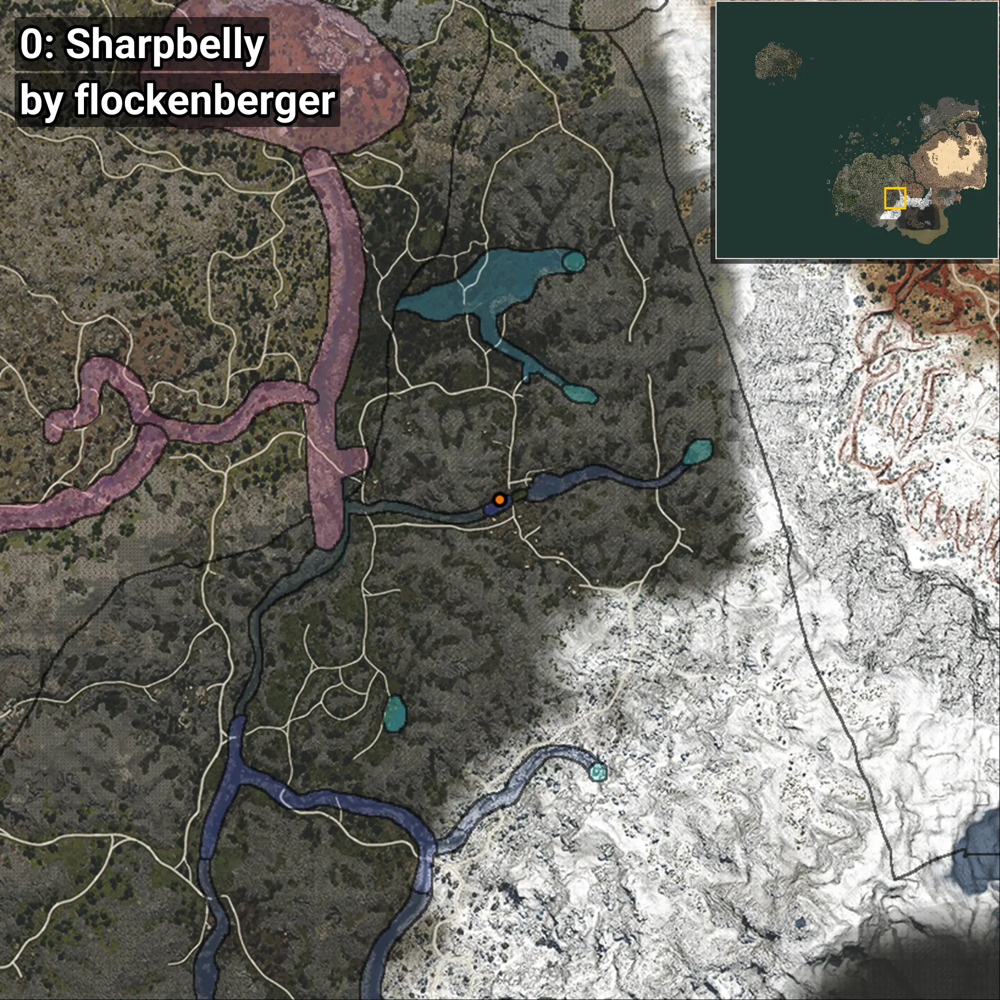
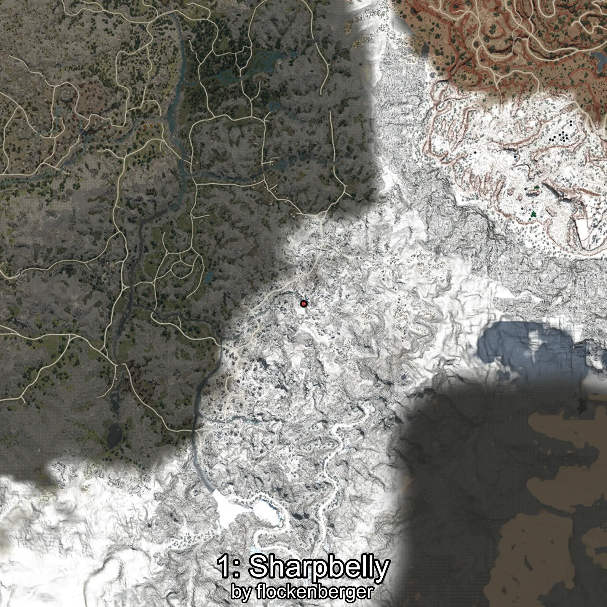
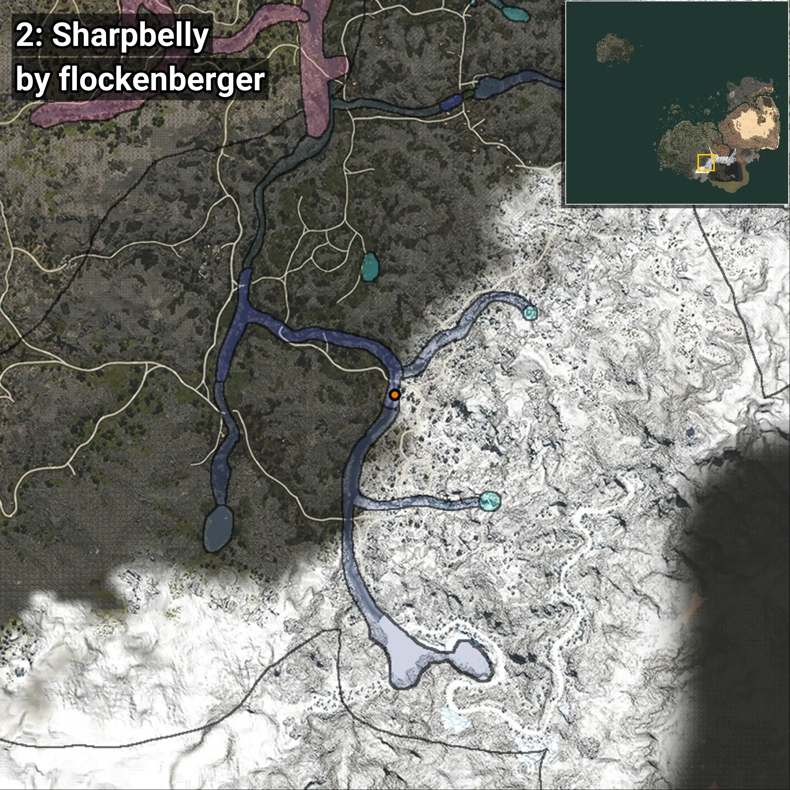
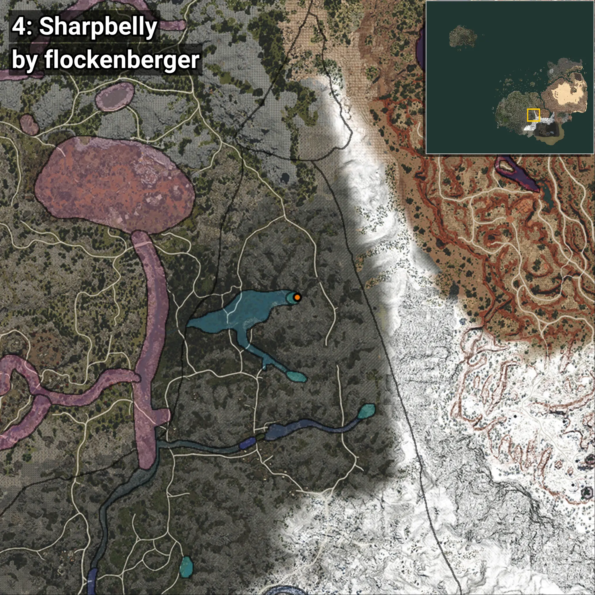

# Sharpbelly
```xml
<!--
    Waypoints for: Sharpbelly
    Created by: flockenberger
-->
<WorldmapBookMark>
    <BookMark BookMarkName="0: Sharpbelly" PosX="164534.0" PosY="16207.0" PosZ="-385649.0" />
    <BookMark BookMarkName="1: Sharpbelly" PosX="164494.0" PosY="16201.0" PosZ="-385620.0" />
    <BookMark BookMarkName="2: Sharpbelly" PosX="146529.73" PosY="14201.861" PosZ="-478343.12" />
    <BookMark BookMarkName="3: Sharpbelly" PosX="164658.0" PosY="15952.0" PosZ="-386306.0" />
    <BookMark BookMarkName="4: Sharpbelly" PosX="184837.0" PosY="15823.0" PosZ="-326478.0" />
</WorldmapBookMark>
```

## ⚠️ Disclaimer
Waypoints are generated based on the __**character’s position**__ — __not__ where the fishing float landed.
Fish are determined by where your **float** lands!
In ocean spots especially, the direction you cast your rod can place your float in a **different fishing zone**, which may result in catching the wrong type of fish.
Please pay attention to the preview images showing where each location is in relation to the outlined zones.

- You can verify your float’s position using the guide [**HERE**](https://flockenberger.github.io/bdo-fish-position/)
- Or watch the video guide [**HERE**](https://youtu.be/t-VXcRoNojk)

## Previews
      