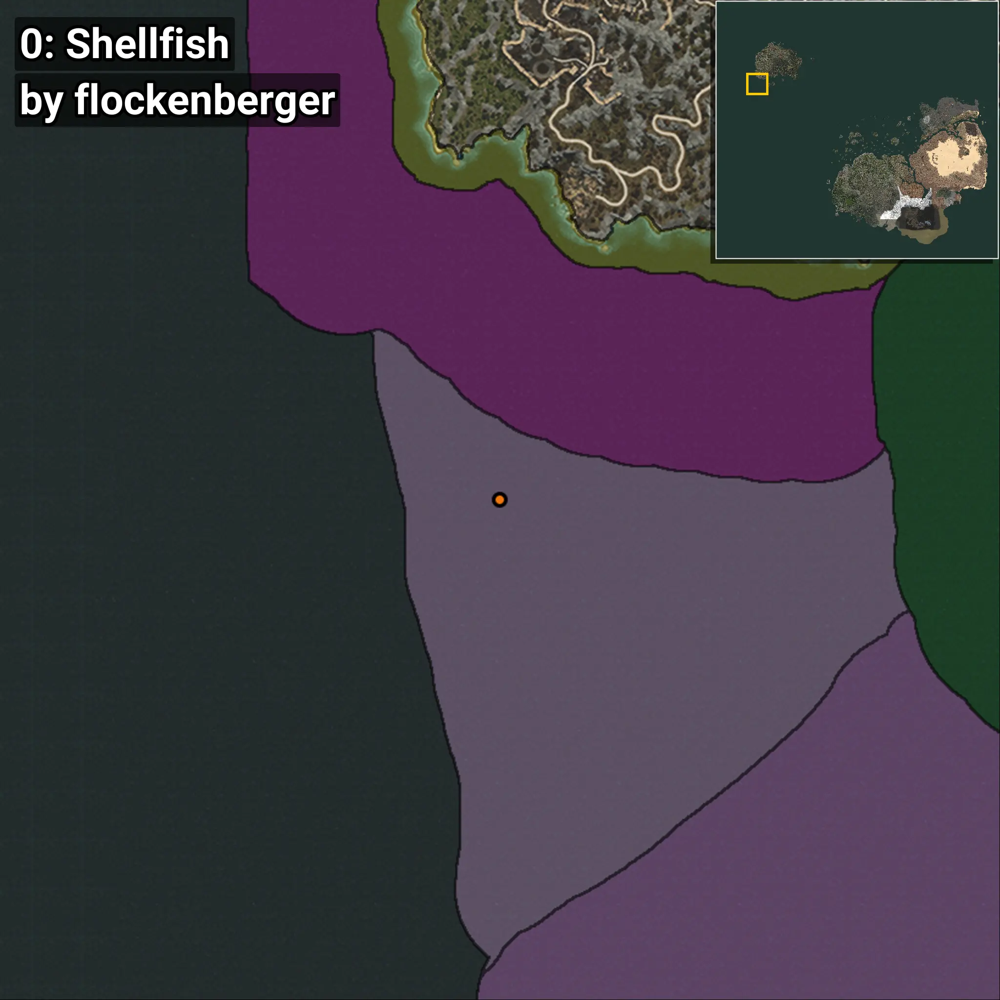
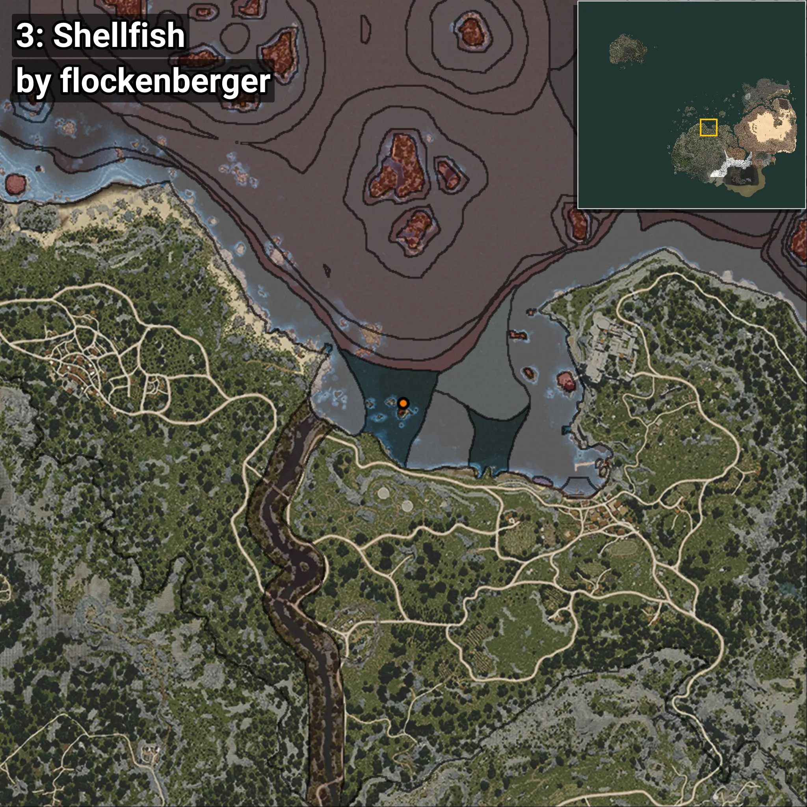
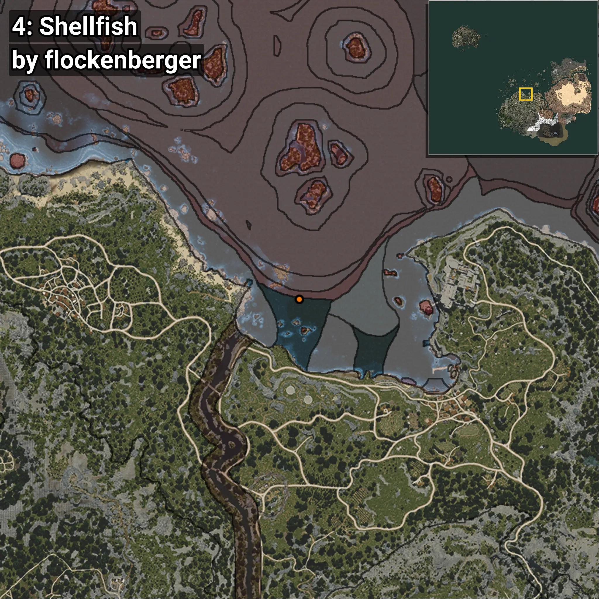

# Shellfish
```xml
<!--
    Waypoints for: Shellfish
    Created by: flockenberger
-->
<WorldmapBookMark>
    <BookMark BookMarkName="0: Shellfish" PosX="-1537406.0" PosY="-7642.0" PosZ="1023143.0" />
    <BookMark BookMarkName="1: Shellfish" PosX="-1543685.0" PosY="-7919.171" PosZ="1029717.0" />
    <BookMark BookMarkName="2: Shellfish" PosX="-46327.0" PosY="-8174.0" PosZ="112202.0" />
    <BookMark BookMarkName="3: Shellfish" PosX="-46344.523" PosY="-8160.7314" PosZ="112183.68" />
    <BookMark BookMarkName="4: Shellfish" PosX="-48525.0" PosY="-7907.0" PosZ="122030.0" />
</WorldmapBookMark>
```

## ⚠️ Disclaimer
Waypoints are generated based on the __**character’s position**__ — __not__ where the fishing float landed.
Fish are determined by where your **float** lands!
In ocean spots especially, the direction you cast your rod can place your float in a **different fishing zone**, which may result in catching the wrong type of fish.
Please pay attention to the preview images showing where each location is in relation to the outlined zones.

- You can verify your float’s position using the guide [**HERE**](https://flockenberger.github.io/bdo-fish-position/)
- Or watch the video guide [**HERE**](https://youtu.be/t-VXcRoNojk)

## Previews
      