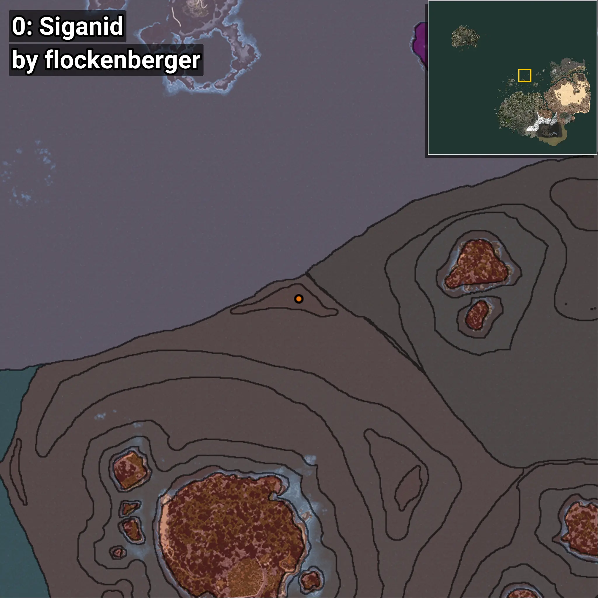
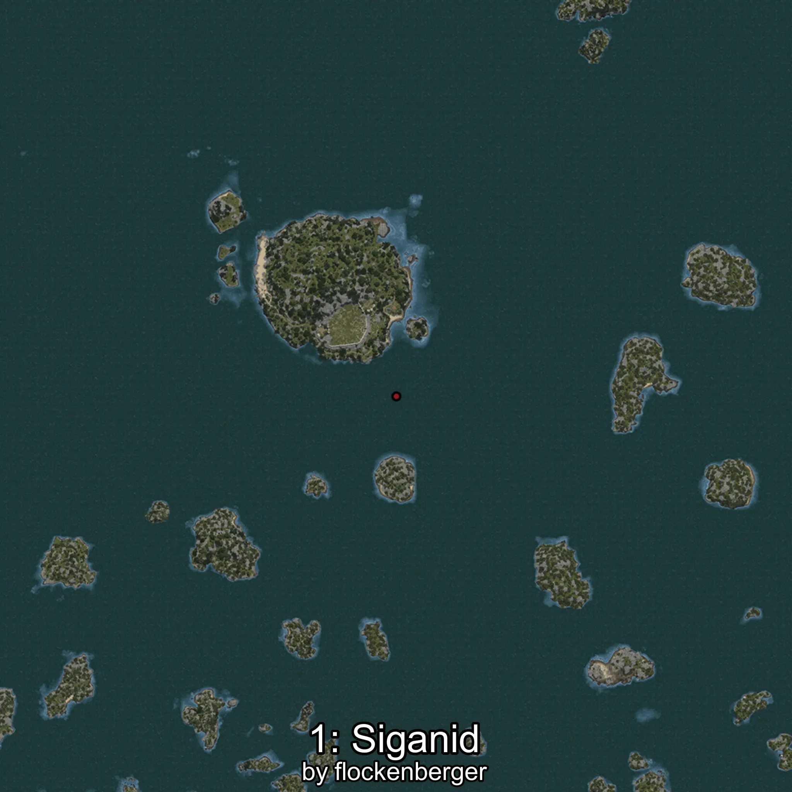
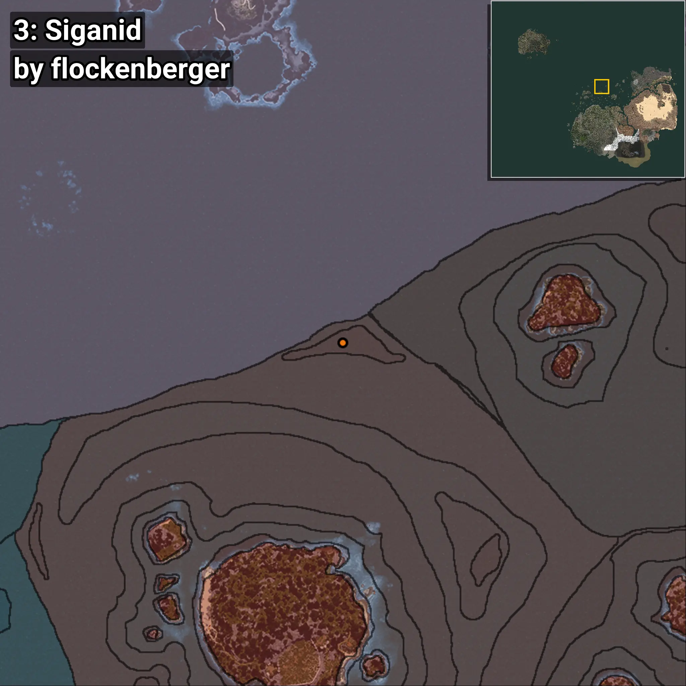
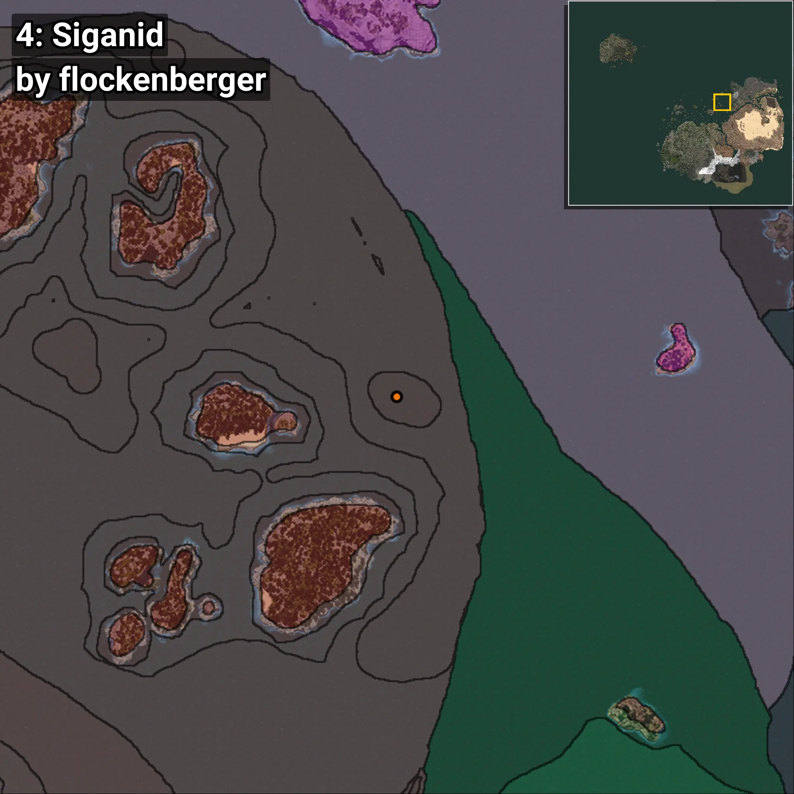

# Siganid
```xml
<!--
    Waypoints for: Siganid
    Created by: flockenberger
-->
<WorldmapBookMark>
    <BookMark BookMarkName="0: Siganid" PosX="-52218.0" PosY="-7811.0" PosZ="503807.0" />
    <BookMark BookMarkName="1: Siganid" PosX="-56268.0" PosY="-7678.0" PosZ="508055.0" />
    <BookMark BookMarkName="2: Siganid" PosX="-154577.0" PosY="-7474.0" PosZ="413081.0" />
    <BookMark BookMarkName="3: Siganid" PosX="-58604.516" PosY="-7839.491" PosZ="503764.3" />
    <BookMark BookMarkName="4: Siganid" PosX="342969.0" PosY="-7747.0" PosZ="471226.0" />
</WorldmapBookMark>
```

## ⚠️ Disclaimer
Waypoints are generated based on the __**character’s position**__ — __not__ where the fishing float landed.
Fish are determined by where your **float** lands!
In ocean spots especially, the direction you cast your rod can place your float in a **different fishing zone**, which may result in catching the wrong type of fish.
Please pay attention to the preview images showing where each location is in relation to the outlined zones.

- You can verify your float’s position using the guide [**HERE**](https://flockenberger.github.io/bdo-fish-position/)
- Or watch the video guide [**HERE**](https://youtu.be/t-VXcRoNojk)

## Previews
      