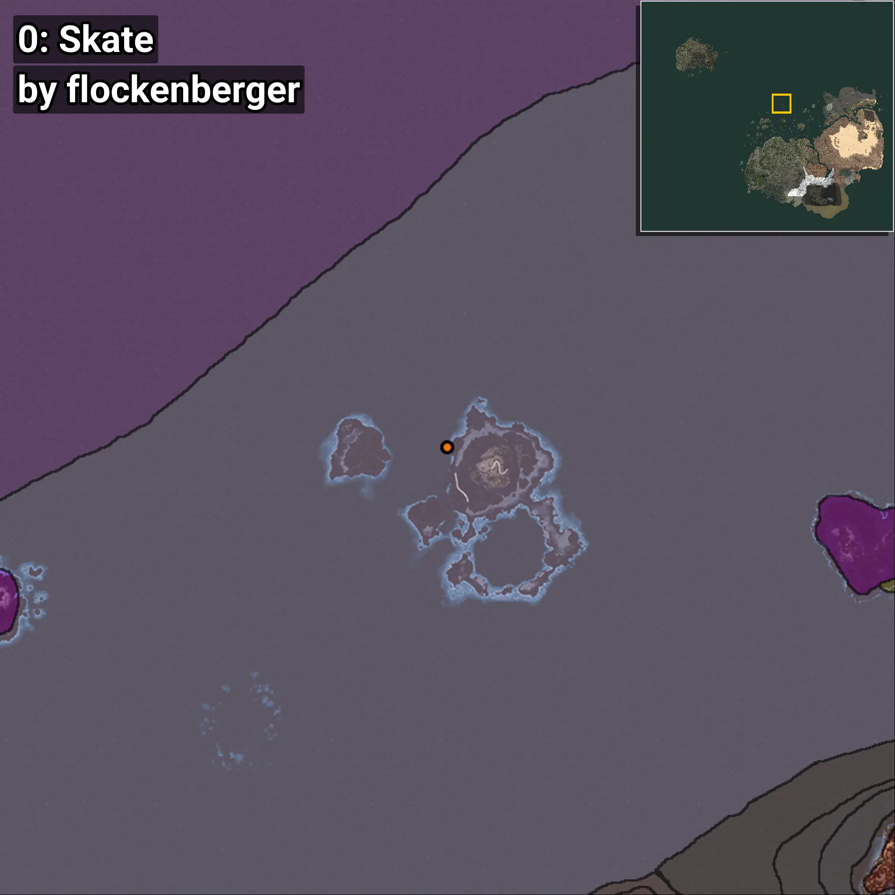
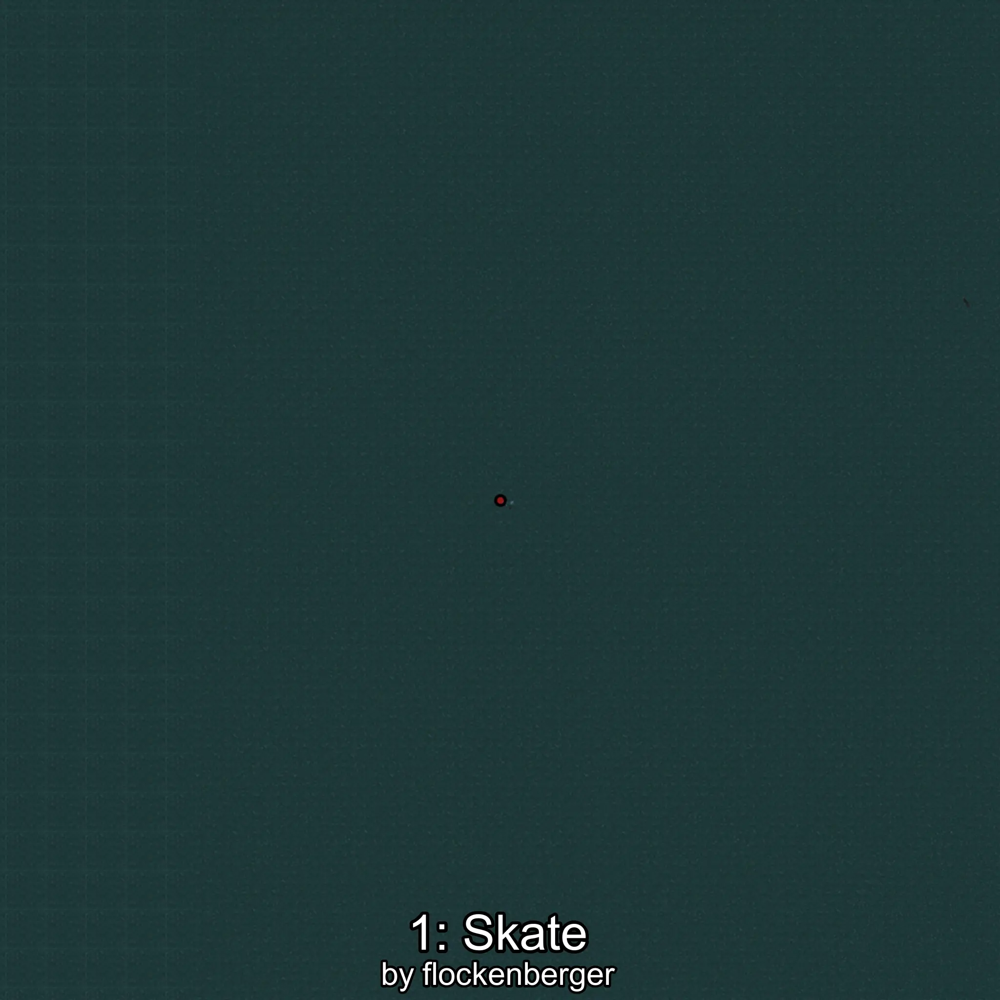
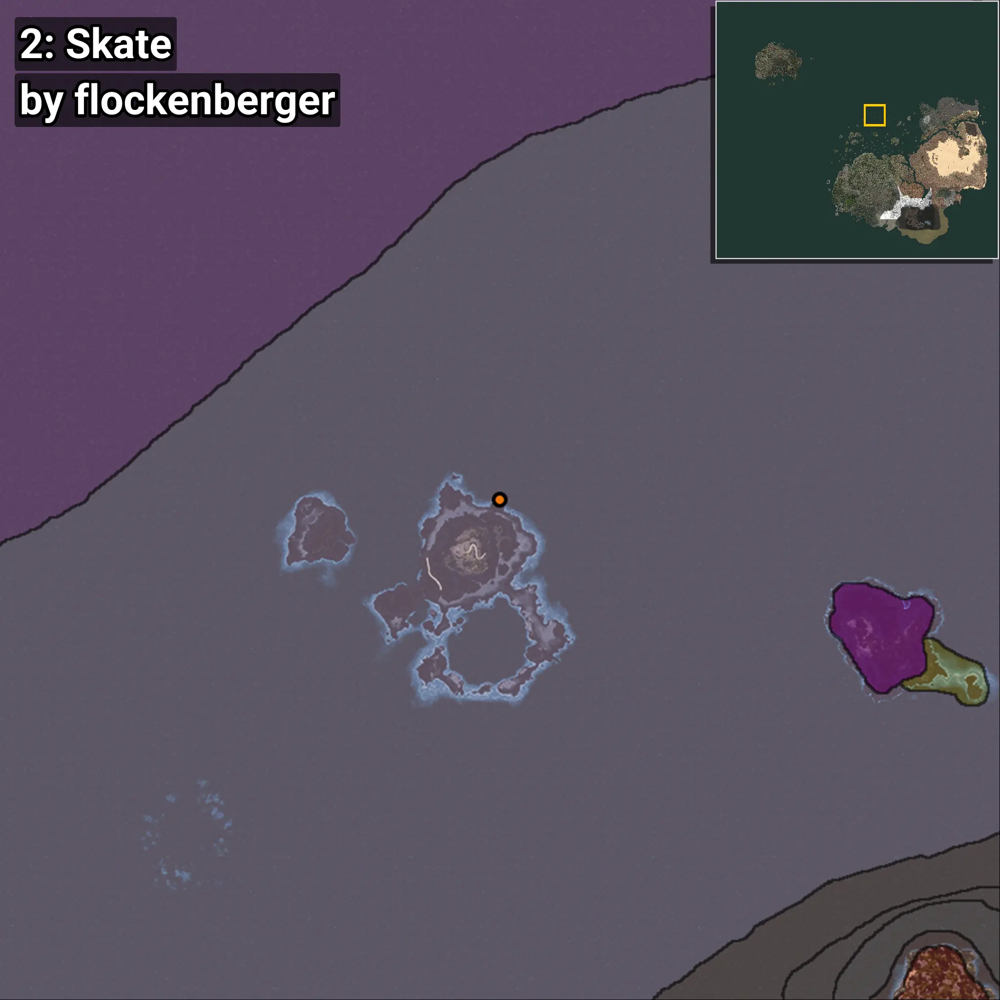
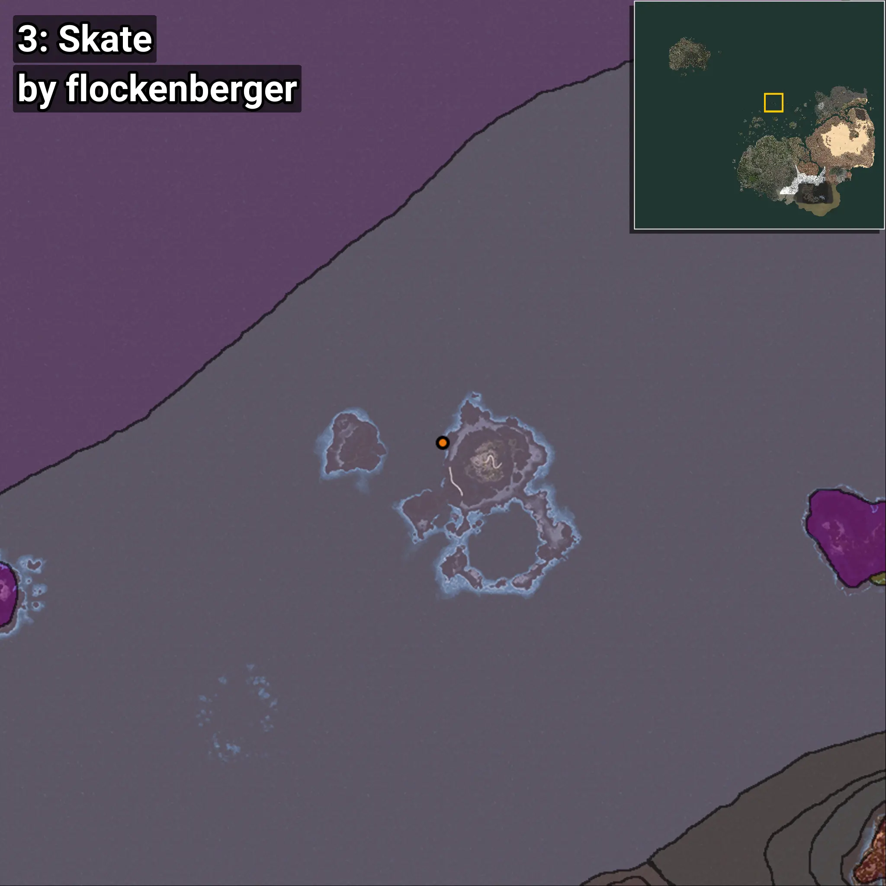
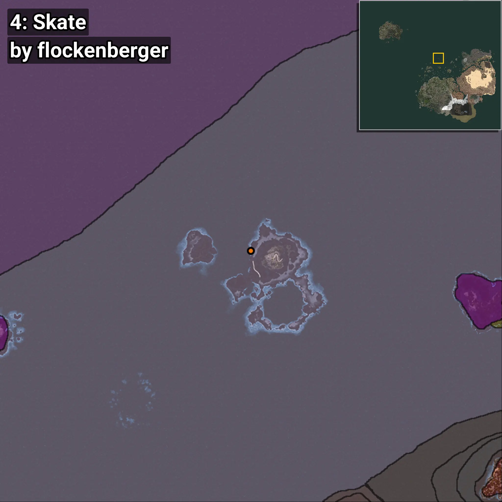
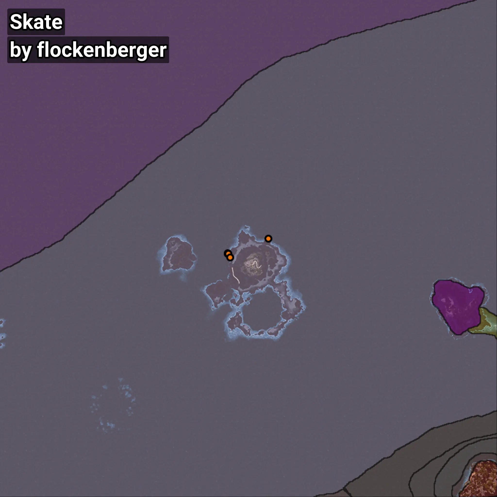

# Skate
```xml
<!--
    Waypoints for: Skate
    Created by: flockenberger
-->
<WorldmapBookMark>
    <BookMark BookMarkName="0: Skate" PosX="-106683.0" PosY="-7641.0" PosZ="630968.0" />
    <BookMark BookMarkName="1: Skate" PosX="-106631.0" PosY="-7653.0" PosZ="630929.0" />
    <BookMark BookMarkName="2: Skate" PosX="-86573.0" PosY="-8110.0" PosZ="638210.0" />
    <BookMark BookMarkName="3: Skate" PosX="-106589.95" PosY="-7660.6963" PosZ="630933.44" />
    <BookMark BookMarkName="4: Skate" PosX="-105522.0" PosY="-8147.0" PosZ="628984.0" />
</WorldmapBookMark>
```

## ⚠️ Disclaimer
Waypoints are generated based on the __**character’s position**__ — __not__ where the fishing float landed.
Fish are determined by where your **float** lands!
In ocean spots especially, the direction you cast your rod can place your float in a **different fishing zone**, which may result in catching the wrong type of fish.
Please pay attention to the preview images showing where each location is in relation to the outlined zones.

- You can verify your float’s position using the guide [**HERE**](https://flockenberger.github.io/bdo-fish-position/)
- Or watch the video guide [**HERE**](https://youtu.be/t-VXcRoNojk)

## Previews
      