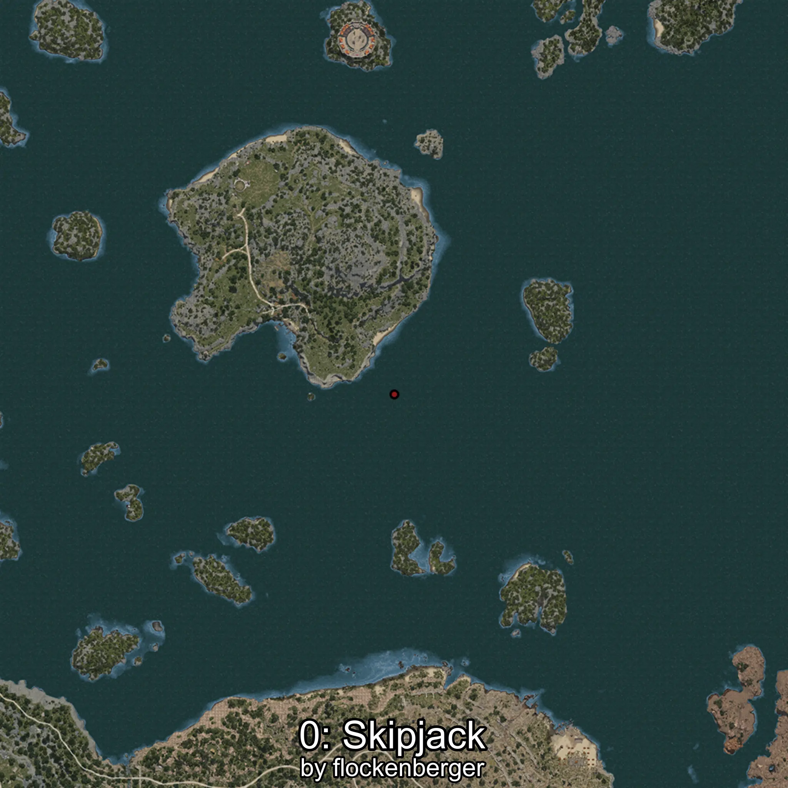
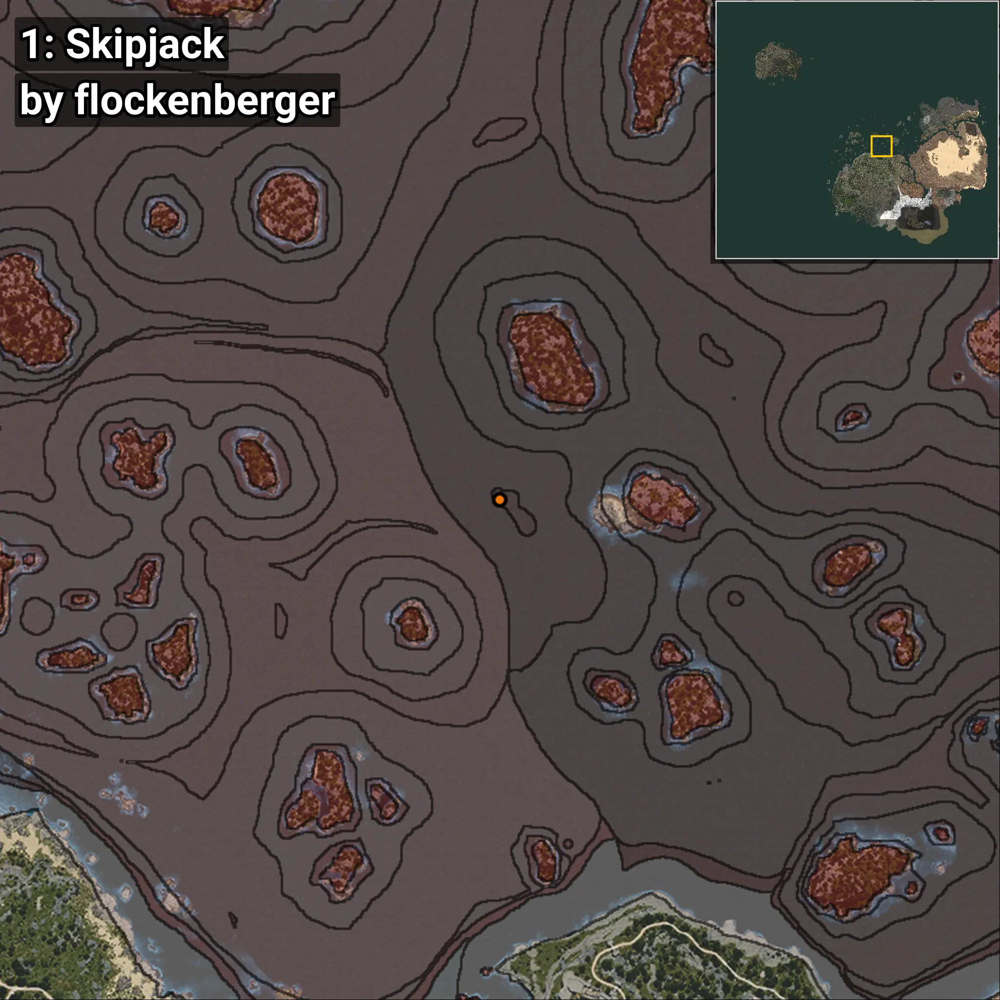
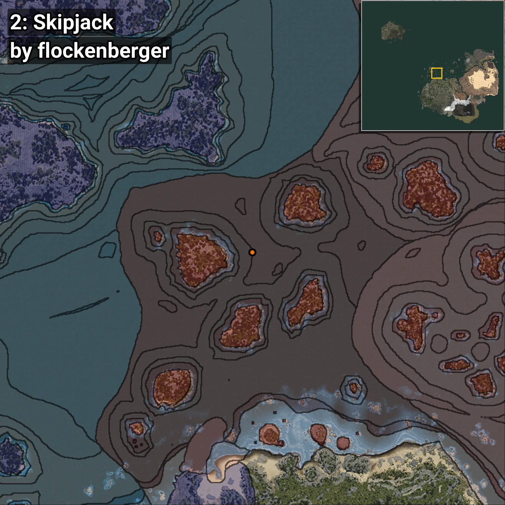
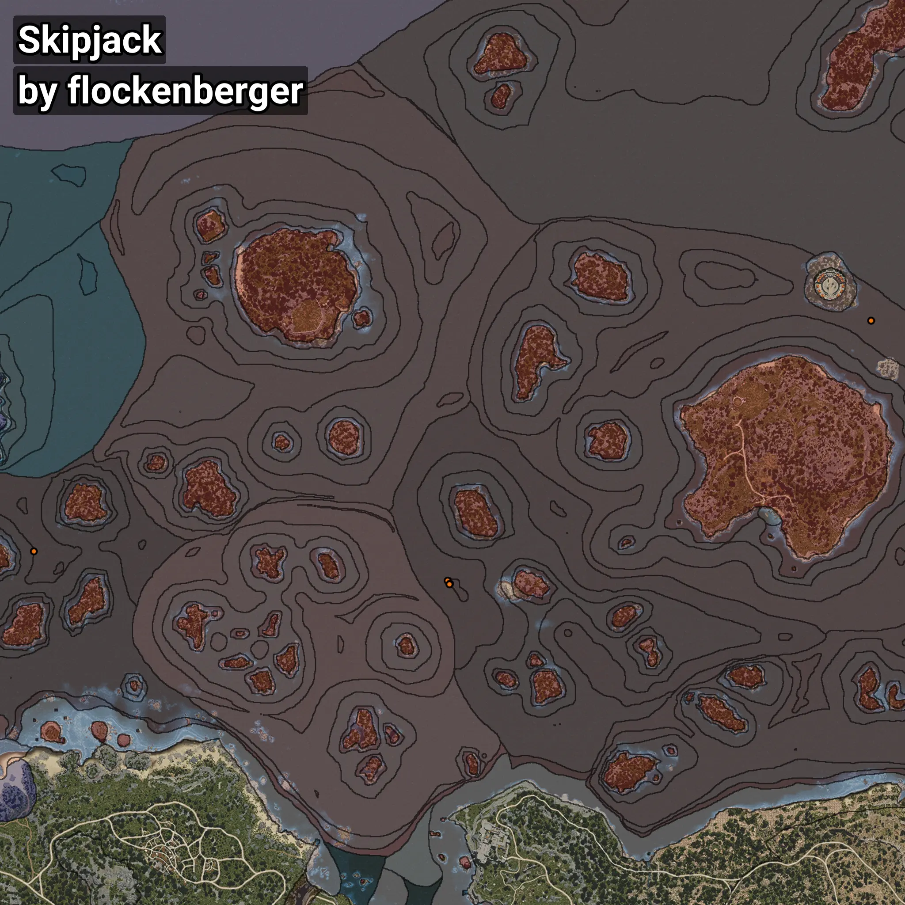

# Skipjack
```xml
<!--
    Waypoints for: Skipjack
    Created by: flockenberger
-->
<WorldmapBookMark>
    <BookMark BookMarkName="0: Skipjack" PosX="-4916.0" PosY="-7836.0" PosZ="257831.0" />
    <BookMark BookMarkName="1: Skipjack" PosX="-3673.5718" PosY="-8151.5215" PosZ="256583.23" />
    <BookMark BookMarkName="2: Skipjack" PosX="-209147.0" PosY="-7849.0" PosZ="272435.0" />
    <BookMark BookMarkName="3: Skipjack" PosX="-3917.5198" PosY="-7781.657" PosZ="256230.47" />
    <BookMark BookMarkName="4: Skipjack" PosX="204037.0" PosY="-7417.0" PosZ="386115.0" />
</WorldmapBookMark>
```

## ⚠️ Disclaimer
Waypoints are generated based on the __**character’s position**__ — __not__ where the fishing float landed.
Fish are determined by where your **float** lands!
In ocean spots especially, the direction you cast your rod can place your float in a **different fishing zone**, which may result in catching the wrong type of fish.
Please pay attention to the preview images showing where each location is in relation to the outlined zones.

- You can verify your float’s position using the guide [**HERE**](https://flockenberger.github.io/bdo-fish-position/)
- Or watch the video guide [**HERE**](https://youtu.be/t-VXcRoNojk)

## Previews
      