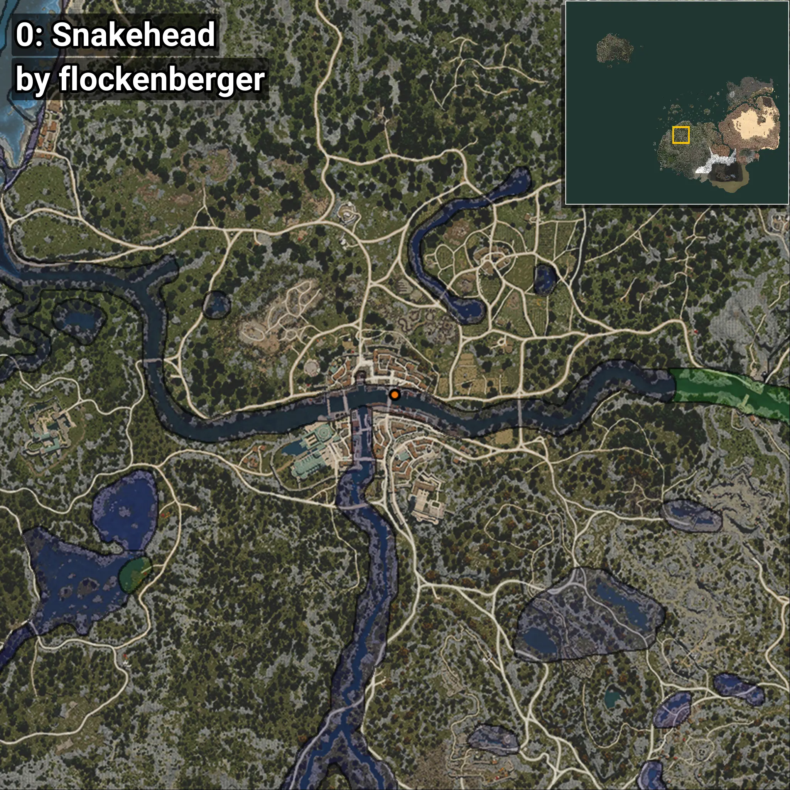
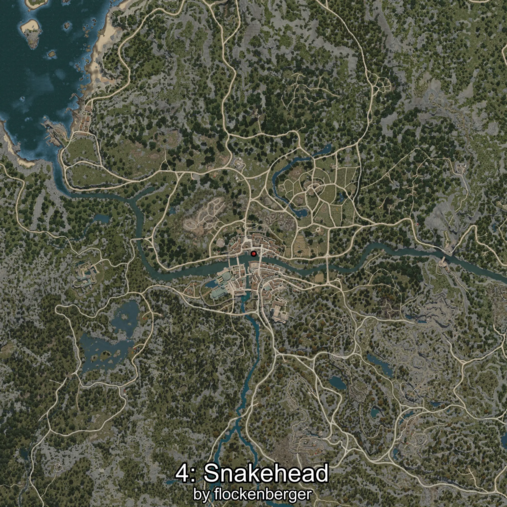
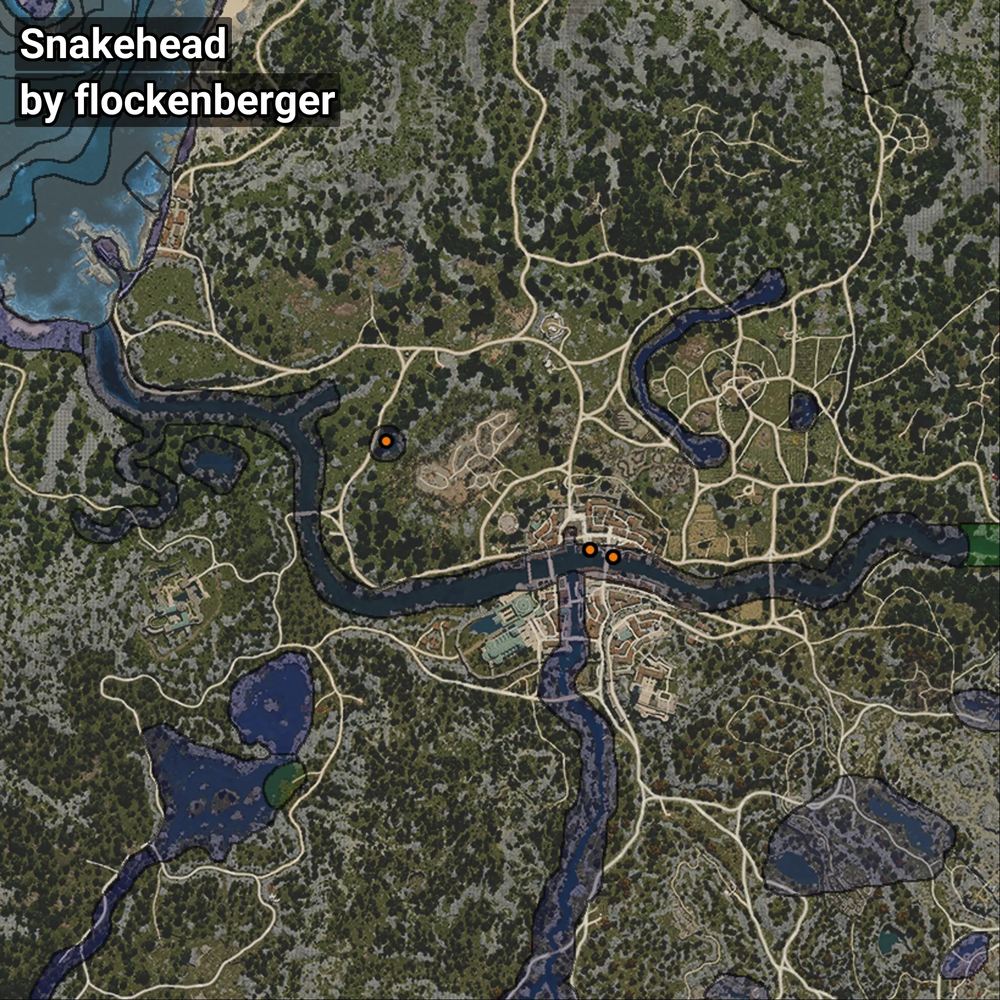

# Snakehead
```xml
<!--
    Waypoints for: Snakehead
    Created by: flockenberger
-->
<WorldmapBookMark>
    <BookMark BookMarkName="0: Snakehead" PosX="-244137.42" PosY="-4069.9814" PosZ="-48980.043" />
    <BookMark BookMarkName="1: Snakehead" PosX="-244161.0" PosY="-4069.0" PosZ="-48998.0" />
    <BookMark BookMarkName="2: Snakehead" PosX="-249874.0" PosY="-4059.0" PosZ="-47202.0" />
    <BookMark BookMarkName="3: Snakehead" PosX="-249870.12" PosY="-4059.8472" PosZ="-47213.91" />
    <BookMark BookMarkName="4: Snakehead" PosX="-300095.0" PosY="-1846.0" PosZ="-20332.0" />
</WorldmapBookMark>
```

## ⚠️ Disclaimer
Waypoints are generated based on the __**character’s position**__ — __not__ where the fishing float landed.
Fish are determined by where your **float** lands!
In ocean spots especially, the direction you cast your rod can place your float in a **different fishing zone**, which may result in catching the wrong type of fish.
Please pay attention to the preview images showing where each location is in relation to the outlined zones.

- You can verify your float’s position using the guide [**HERE**](https://flockenberger.github.io/bdo-fish-position/)
- Or watch the video guide [**HERE**](https://youtu.be/t-VXcRoNojk)

## Previews
      