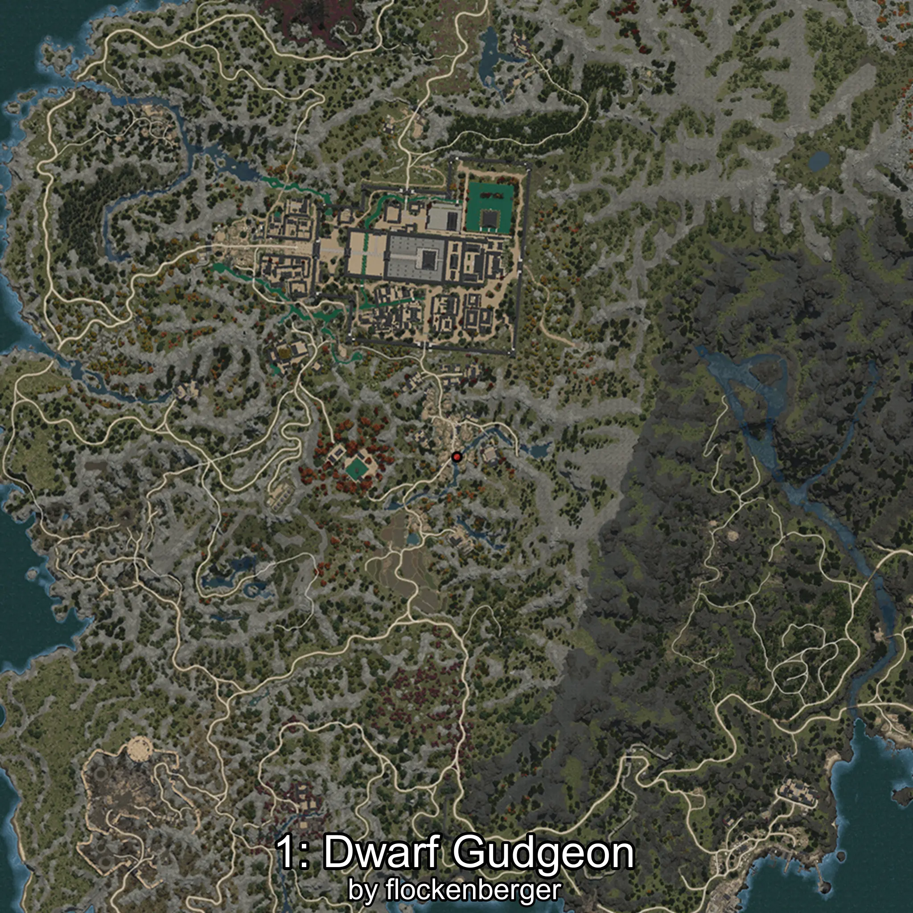

# Abbottina
Creado por **flockenberger**

## ⚠️ Advertencia:
Los puntos de pesca se generan según la __**posición de tu personaje**__ — __no__ donde cae el flotador.  
En el océano especialmente, la dirección en la que lances la caña puede colocar tu flotador en una **zona de pesca diferente**, lo que puede resultar en capturar el pez incorrecto.  
Esto solo ocurre en raros casos — cuando la posición está justo en el **borde de una zona** y lanzas hacia el lado “equivocado”.

- Para verificar la posición puedes usar la guía [AQUÍ](https://flockenberger.github.io/bdo-fish-position/)
- O ver la guía [AQUÍ](https://youtu.be/t-VXcRoNojk)

## Waypoints
```xml
<!--
    Puntos de pesca para:: Abbottina
    Creado por: flockenberger
-->
<WorldmapBookMark>
    <BookMark BookMarkName="0: Abbottina" PosX="-1441827.9" PosY="12207.713" PosZ="1301811.2" />
    <BookMark BookMarkName="1: Abbottina" PosX="-1408036.6" PosY="8354.404" PosZ="1266641.2" />
    <BookMark BookMarkName="2: Abbottina" PosX="-1486791.0" PosY="11123.0" PosZ="1332159.0" />
    <BookMark BookMarkName="3: Abbottina" PosX="-1093706.8" PosY="4490.8496" PosZ="1272555.8" />
    <BookMark BookMarkName="4: Abbottina" PosX="-1488234.0" PosY="11180.0" PosZ="1332497.0" />
</WorldmapBookMark>
```

     