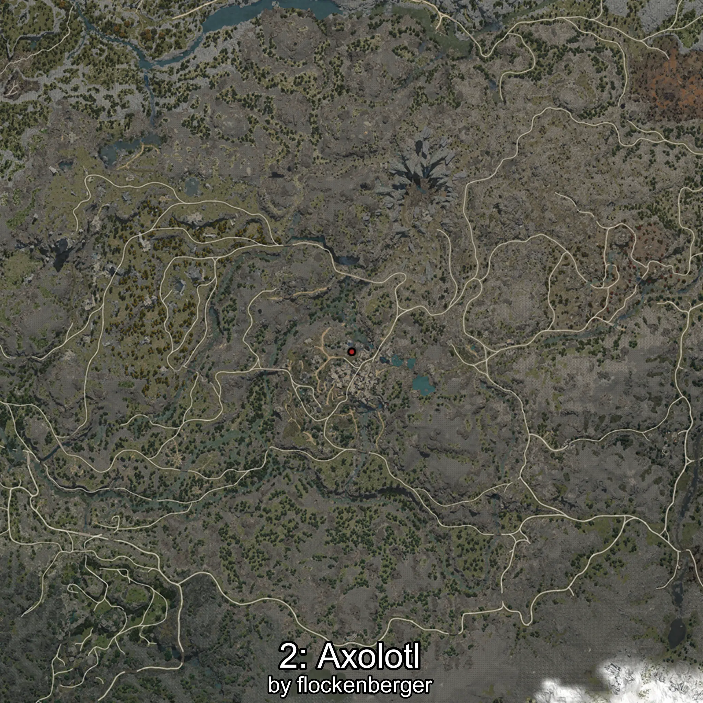

# Ajolote
Creado por **flockenberger**

## ⚠️ Advertencia:
Los puntos de pesca se generan según la __**posición de tu personaje**__ — __no__ donde cae el flotador.  
En el océano especialmente, la dirección en la que lances la caña puede colocar tu flotador en una **zona de pesca diferente**, lo que puede resultar en capturar el pez incorrecto.  
Esto solo ocurre en raros casos — cuando la posición está justo en el **borde de una zona** y lanzas hacia el lado “equivocado”.

- Para verificar la posición puedes usar la guía [AQUÍ](https://flockenberger.github.io/bdo-fish-position/)
- O ver la guía [AQUÍ](https://youtu.be/t-VXcRoNojk)

## Waypoints
```xml
<!--
    Puntos de pesca para: Ajolote
    Creado por: flockenberger
-->
<WorldmapBookMark>
    <BookMark BookMarkName="0: Ajolote" PosX="-50022.0" PosY="19853.0" PosZ="-396217.0" />
    <BookMark BookMarkName="1: Ajolote" PosX="-51131.0" PosY="20058.0" PosZ="-396594.0" />
    <BookMark BookMarkName="2: Ajolote" PosX="-50795.0" PosY="19938.0" PosZ="-396512.0" />
    <BookMark BookMarkName="3: Ajolote" PosX="-50059.0" PosY="19744.0" PosZ="-395843.0" />
    <BookMark BookMarkName="4: Ajolote" PosX="-50066.0" PosY="19853.0" PosZ="-396258.0" />
</WorldmapBookMark>
```

     