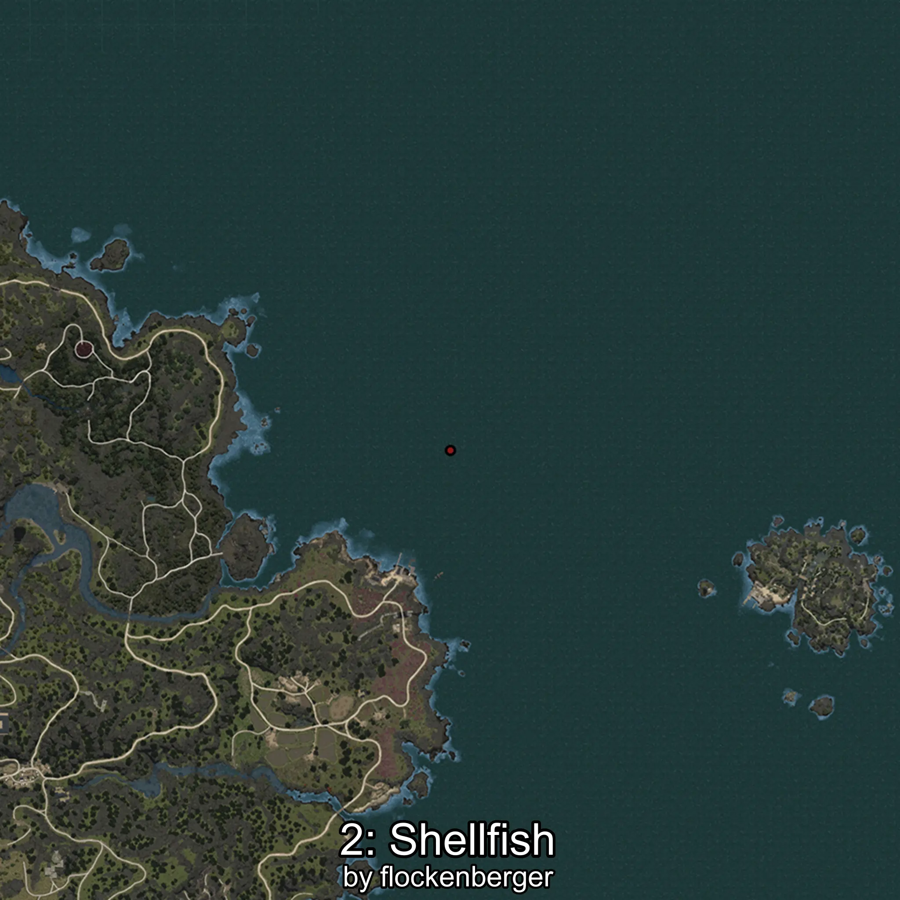

# Almeja
Creado por **flockenberger**

## ⚠️ Advertencia:
Los puntos de pesca se generan según la __**posición de tu personaje**__ — __no__ donde cae el flotador.  
En el océano especialmente, la dirección en la que lances la caña puede colocar tu flotador en una **zona de pesca diferente**, lo que puede resultar en capturar el pez incorrecto.  
Esto solo ocurre en raros casos — cuando la posición está justo en el **borde de una zona** y lanzas hacia el lado “equivocado”.

- Para verificar la posición puedes usar la guía [AQUÍ](https://flockenberger.github.io/bdo-fish-position/)
- O ver la guía [AQUÍ](https://youtu.be/t-VXcRoNojk)

## Waypoints
```xml
<!--
    Puntos de pesca para:: Almeja
    Creado por: flockenberger
-->
<WorldmapBookMark>
    <BookMark BookMarkName="0: Almeja" PosX="-51226.0" PosY="-8164.0" PosZ="99003.0" />
    <BookMark BookMarkName="1: Almeja" PosX="-42725.0" PosY="-8096.0" PosZ="110946.0" />
    <BookMark BookMarkName="2: Almeja" PosX="-977691.0" PosY="-7678.0" PosZ="1383843.0" />
    <BookMark BookMarkName="3: Almeja" PosX="-49934.0" PosY="-8172.0" PosZ="114049.0" />
    <BookMark BookMarkName="4: Almeja" PosX="-51264.0" PosY="-8126.0" PosZ="98904.0" />
</WorldmapBookMark>
```

     