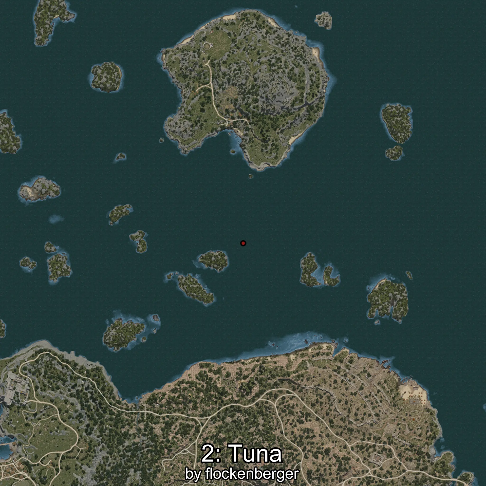

# Atún
Creado por **flockenberger**

## ⚠️ Advertencia:
Los puntos de pesca se generan según la __**posición de tu personaje**__ — __no__ donde cae el flotador.  
En el océano especialmente, la dirección en la que lances la caña puede colocar tu flotador en una **zona de pesca diferente**, lo que puede resultar en capturar el pez incorrecto.  
Esto solo ocurre en raros casos — cuando la posición está justo en el **borde de una zona** y lanzas hacia el lado “equivocado”.

- Para verificar la posición puedes usar la guía [AQUÍ](https://flockenberger.github.io/bdo-fish-position/)
- O ver la guía [AQUÍ](https://youtu.be/t-VXcRoNojk)

## Waypoints
```xml
<!--
    Puntos de pesca para: Atún
    Creado por: flockenberger
-->
<WorldmapBookMark>
    <BookMark BookMarkName="0: Atún" PosX="-105302.0" PosY="-7975.0" PosZ="634259.0" />
    <BookMark BookMarkName="1: Atún" PosX="-1314361.0" PosY="-7885.0" PosZ="960367.0" />
    <BookMark BookMarkName="2: Atún" PosX="161306.0" PosY="-7805.0" PosZ="221230.0" />
    <BookMark BookMarkName="3: Atún" PosX="-688226.0" PosY="-7676.0" PosZ="784980.0" />
    <BookMark BookMarkName="4: Atún" PosX="157344.0" PosY="-8096.0" PosZ="219551.0" />
</WorldmapBookMark>
```

     