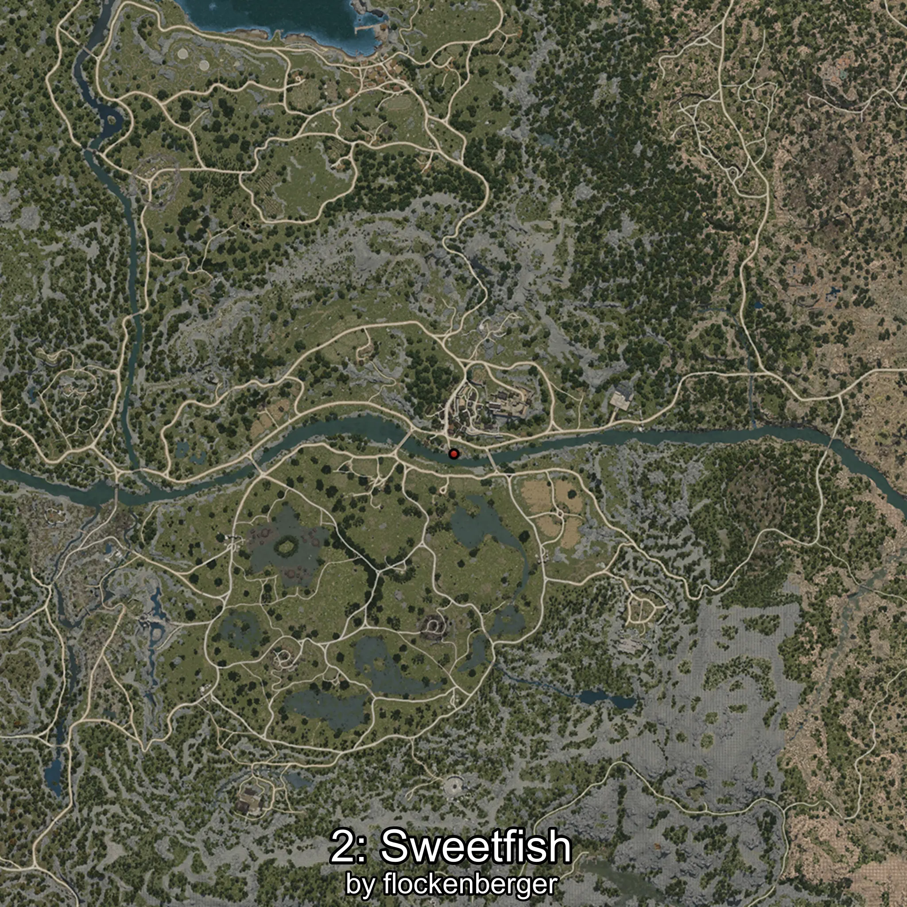

# Ayu
Creado por **flockenberger**

## ⚠️ Advertencia:
Los puntos de pesca se generan según la __**posición de tu personaje**__ — __no__ donde cae el flotador.  
En el océano especialmente, la dirección en la que lances la caña puede colocar tu flotador en una **zona de pesca diferente**, lo que puede resultar en capturar el pez incorrecto.  
Esto solo ocurre en raros casos — cuando la posición está justo en el **borde de una zona** y lanzas hacia el lado “equivocado”.

- Para verificar la posición puedes usar la guía [AQUÍ](https://flockenberger.github.io/bdo-fish-position/)
- O ver la guía [AQUÍ](https://youtu.be/t-VXcRoNojk)

## Waypoints
```xml
<!--
    Puntos de pesca para:: Ayu
    Creado por: flockenberger
-->
<WorldmapBookMark>
    <BookMark BookMarkName="0: Ayu" PosX="-506304.34" PosY="5876.7446" PosZ="-473716.12" />
    <BookMark BookMarkName="1: Ayu" PosX="-478933.6" PosY="-4920.791" PosZ="-414426.84" />
    <BookMark BookMarkName="2: Ayu" PosX="39825.0" PosY="-3983.0" PosZ="-51349.0" />
    <BookMark BookMarkName="3: Ayu" PosX="38807.0" PosY="-4029.0" PosZ="-50899.0" />
    <BookMark BookMarkName="4: Ayu" PosX="38640.0" PosY="-4017.0" PosZ="-50838.0" />
</WorldmapBookMark>
```

     