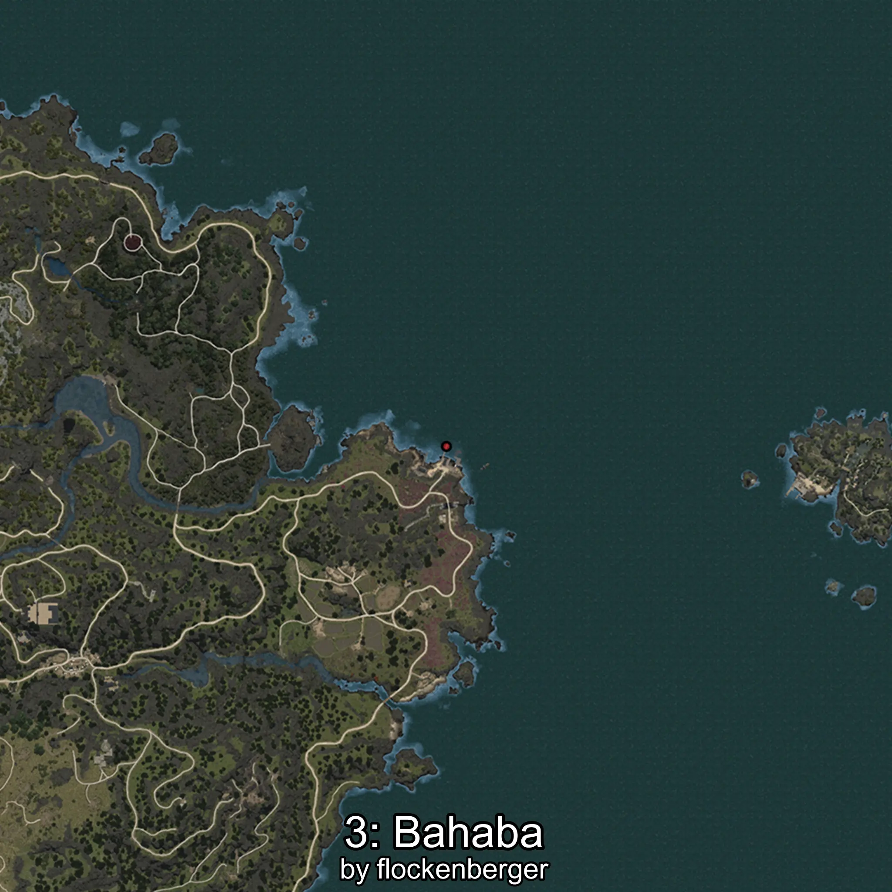

# Bahaba
Creado por **flockenberger**

## ⚠️ Advertencia:
Los puntos de pesca se generan según la __**posición de tu personaje**__ — __no__ donde cae el flotador.  
En el océano especialmente, la dirección en la que lances la caña puede colocar tu flotador en una **zona de pesca diferente**, lo que puede resultar en capturar el pez incorrecto.  
Esto solo ocurre en raros casos — cuando la posición está justo en el **borde de una zona** y lanzas hacia el lado “equivocado”.

- Para verificar la posición puedes usar la guía [AQUÍ](https://flockenberger.github.io/bdo-fish-position/)
- O ver la guía [AQUÍ](https://youtu.be/t-VXcRoNojk)

## Waypoints
```xml
<!--
    Puntos de pesca para: Bahaba
    Creado por: flockenberger
-->
<WorldmapBookMark>
    <BookMark BookMarkName="0: Bahaba" PosX="-1214506.4" PosY="-8111.0215" PosZ="1111759.5" />
    <BookMark BookMarkName="1: Bahaba" PosX="-1306503.2" PosY="-7755.036" PosZ="1126710.0" />
    <BookMark BookMarkName="2: Bahaba" PosX="-1306556.4" PosY="-8138.8857" PosZ="1126325.1" />
    <BookMark BookMarkName="3: Bahaba" PosX="-994975.0" PosY="-7883.0" PosZ="1347790.0" />
    <BookMark BookMarkName="4: Bahaba" PosX="-1306542.0" PosY="-8130.0" PosZ="1126380.0" />
</WorldmapBookMark>
```

     