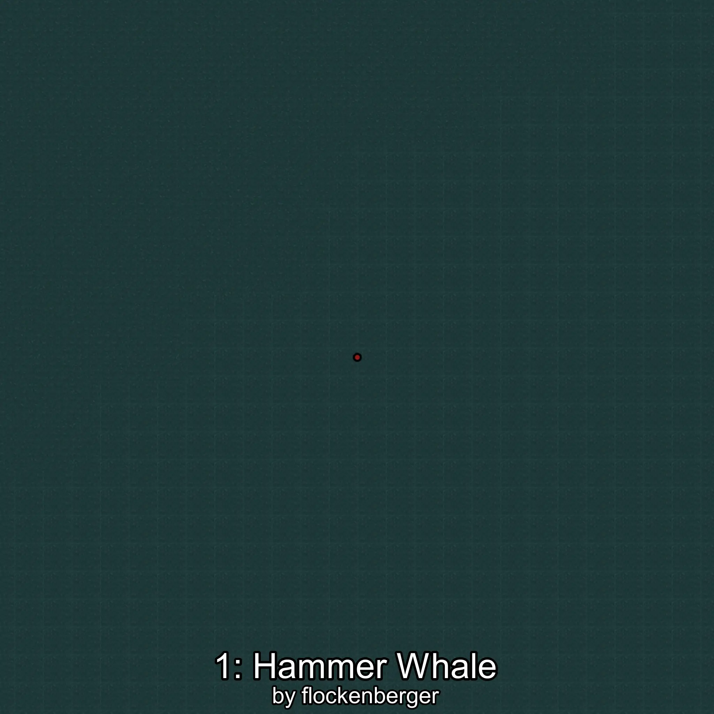
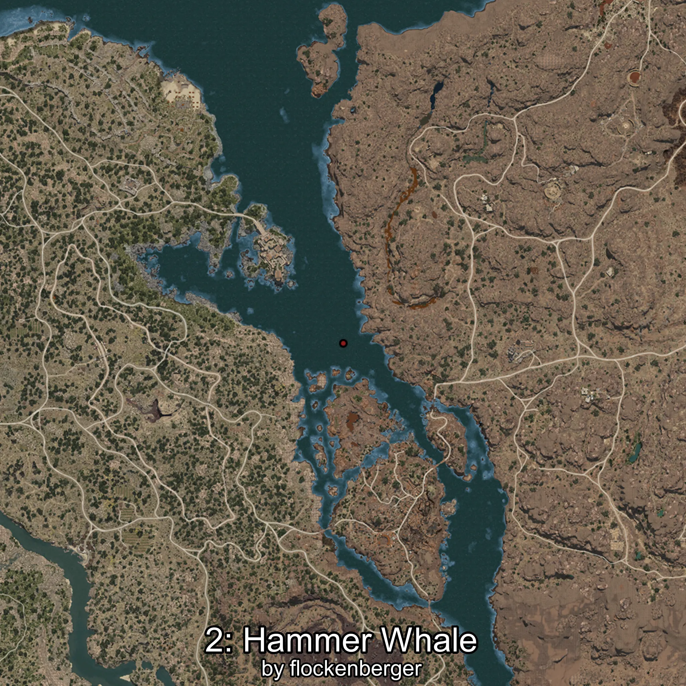

# Berardius
Creado por **flockenberger**

## ⚠️ Advertencia:
Los puntos de pesca se generan según la __**posición de tu personaje**__ — __no__ donde cae el flotador.  
En el océano especialmente, la dirección en la que lances la caña puede colocar tu flotador en una **zona de pesca diferente**, lo que puede resultar en capturar el pez incorrecto.  
Esto solo ocurre en raros casos — cuando la posición está justo en el **borde de una zona** y lanzas hacia el lado “equivocado”.

- Para verificar la posición puedes usar la guía [AQUÍ](https://flockenberger.github.io/bdo-fish-position/)
- O ver la guía [AQUÍ](https://youtu.be/t-VXcRoNojk)

## Waypoints
```xml
<!--
    Puntos de pesca para: Berardius
    Creado por: flockenberger
-->
<WorldmapBookMark>
    <BookMark BookMarkName="0: Berardius" PosX="-1194295.0" PosY="-8090.0" PosZ="762061.0" />
    <BookMark BookMarkName="1: Berardius" PosX="-1257897.0" PosY="-7757.0" PosZ="778575.0" />
    <BookMark BookMarkName="2: Berardius" PosX="342107.0" PosY="-7914.0" PosZ="13544.0" />
    <BookMark BookMarkName="3: Berardius" PosX="-1258321.0" PosY="-7671.0" PosZ="741706.0" />
    <BookMark BookMarkName="4: Berardius" PosX="-1245868.0" PosY="-7510.0" PosZ="749547.0" />
</WorldmapBookMark>
```

     