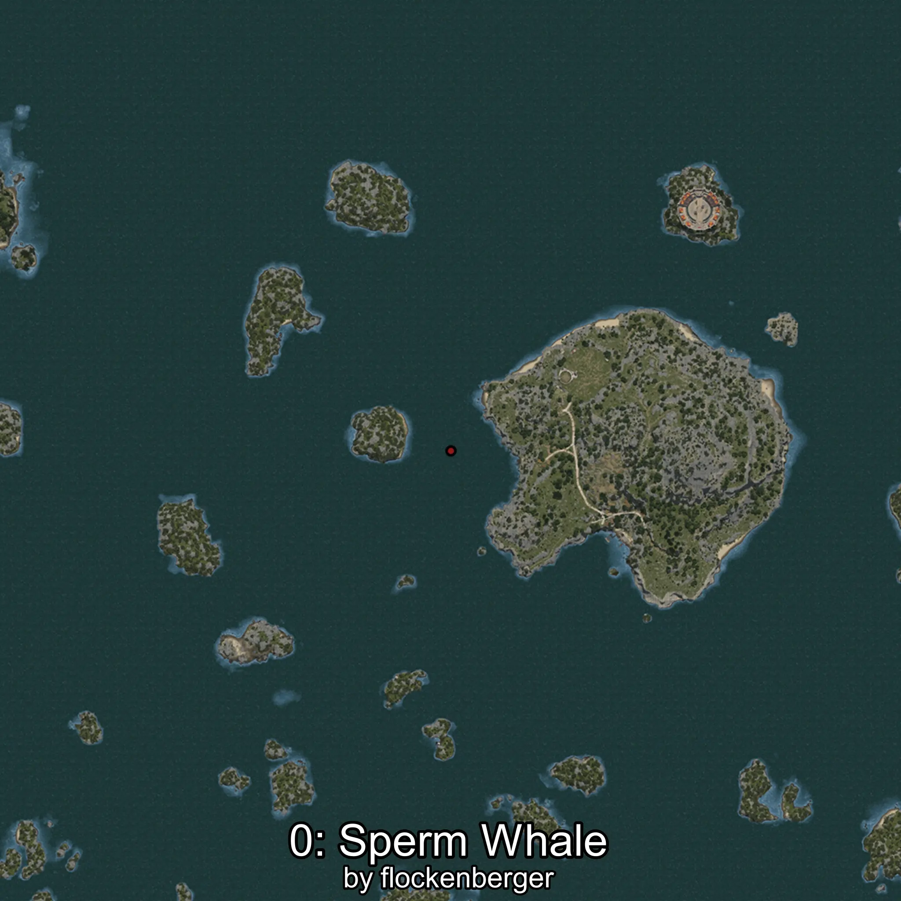
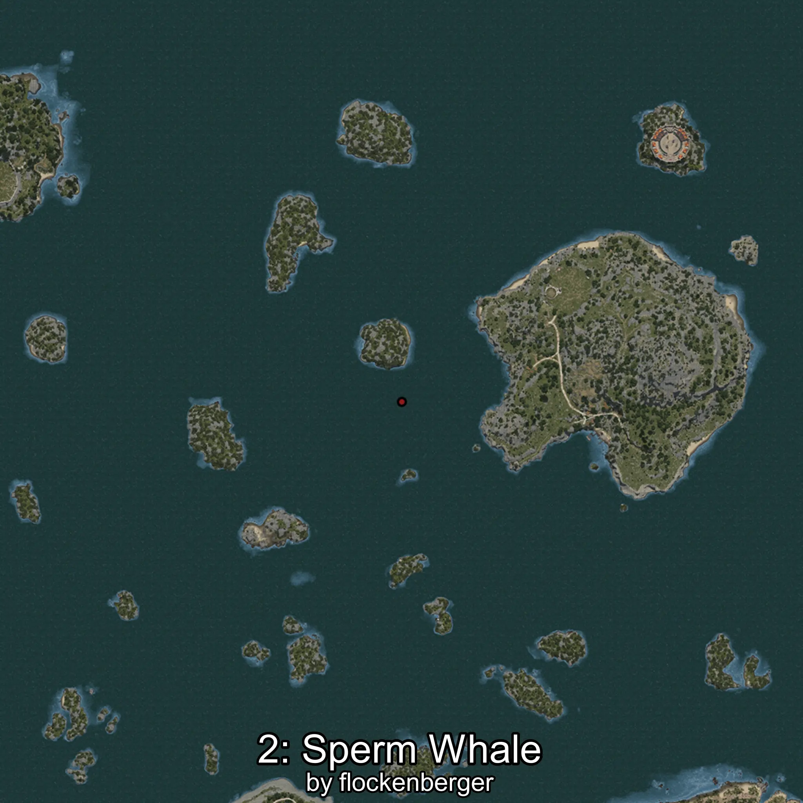

# Cachalote
Creado por **flockenberger**

## ⚠️ Advertencia:
Los puntos de pesca se generan según la __**posición de tu personaje**__ — __no__ donde cae el flotador.  
En el océano especialmente, la dirección en la que lances la caña puede colocar tu flotador en una **zona de pesca diferente**, lo que puede resultar en capturar el pez incorrecto.  
Esto solo ocurre en raros casos — cuando la posición está justo en el **borde de una zona** y lanzas hacia el lado “equivocado”.

- Para verificar la posición puedes usar la guía [AQUÍ](https://flockenberger.github.io/bdo-fish-position/)
- O ver la guía [AQUÍ](https://youtu.be/t-VXcRoNojk)

## Waypoints
```xml
<!--
    Puntos de pesca para: Cachalote
    Creado por: flockenberger
-->
<WorldmapBookMark>
    <BookMark BookMarkName="0: Cachalote" PosX="99055.0" PosY="-8166.0" PosZ="321001.0" />
    <BookMark BookMarkName="1: Cachalote" PosX="78522.0" PosY="-8056.0" PosZ="381167.0" />
    <BookMark BookMarkName="2: Cachalote" PosX="80889.0" PosY="-7917.0" PosZ="304239.0" />
    <BookMark BookMarkName="3: Cachalote" PosX="403658.0" PosY="-8192.0" PosZ="272748.0" />
    <BookMark BookMarkName="4: Cachalote" PosX="247238.0" PosY="-8196.0" PosZ="157572.0" />
</WorldmapBookMark>
```

     