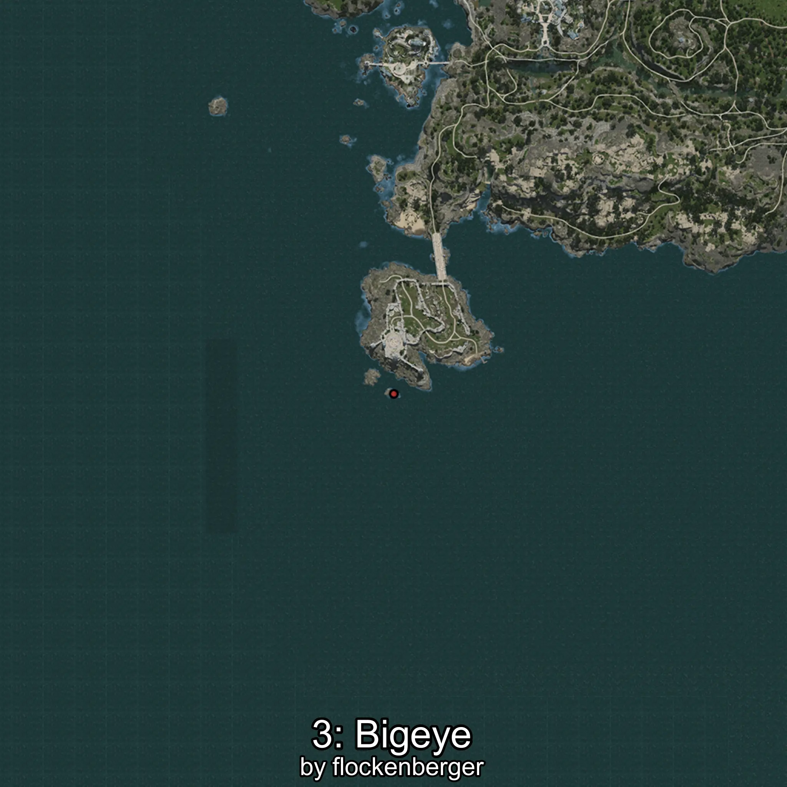

# Catalufa
Creado por **flockenberger**

## ⚠️ Advertencia:
Los puntos de pesca se generan según la __**posición de tu personaje**__ — __no__ donde cae el flotador.  
En el océano especialmente, la dirección en la que lances la caña puede colocar tu flotador en una **zona de pesca diferente**, lo que puede resultar en capturar el pez incorrecto.  
Esto solo ocurre en raros casos — cuando la posición está justo en el **borde de una zona** y lanzas hacia el lado “equivocado”.

- Para verificar la posición puedes usar la guía [AQUÍ](https://flockenberger.github.io/bdo-fish-position/)
- O ver la guía [AQUÍ](https://youtu.be/t-VXcRoNojk)

## Waypoints
```xml
<!--
    Puntos de pesca para: Catalufa
    Creado por: flockenberger
-->
<WorldmapBookMark>
    <BookMark BookMarkName="0: Catalufa" PosX="-359423.0" PosY="-7665.0" PosZ="217424.0" />
    <BookMark BookMarkName="1: Catalufa" PosX="-404619.88" PosY="-7617.2266" PosZ="160406.3" />
    <BookMark BookMarkName="2: Catalufa" PosX="-564803.0" PosY="-7695.0" PosZ="-494675.0" />
    <BookMark BookMarkName="3: Catalufa" PosX="-564594.8" PosY="-8119.7954" PosZ="-610261.7" />
    <BookMark BookMarkName="4: Catalufa" PosX="-408690.0" PosY="-7989.0" PosZ="68069.0" />
</WorldmapBookMark>
```

     