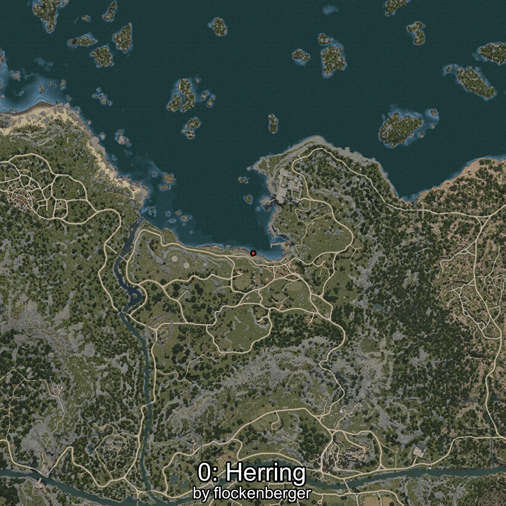
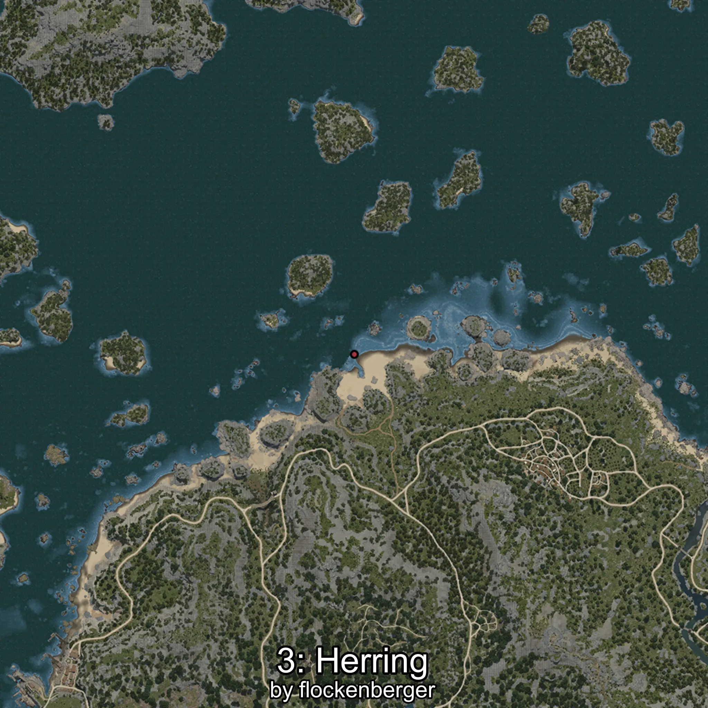
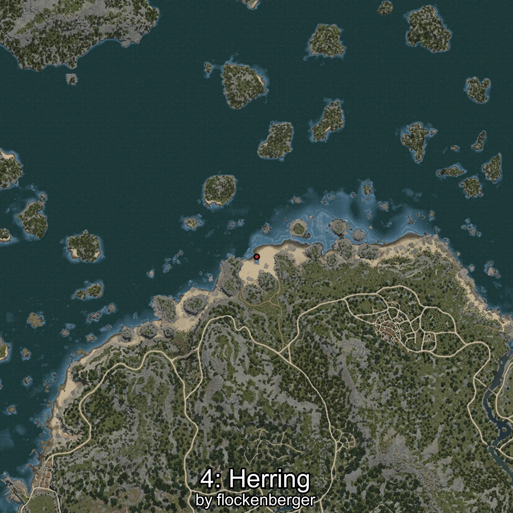

# Clupea
Creado por **flockenberger**

## ⚠️ Advertencia:
Los puntos de pesca se generan según la __**posición de tu personaje**__ — __no__ donde cae el flotador.  
En el océano especialmente, la dirección en la que lances la caña puede colocar tu flotador en una **zona de pesca diferente**, lo que puede resultar en capturar el pez incorrecto.  
Esto solo ocurre en raros casos — cuando la posición está justo en el **borde de una zona** y lanzas hacia el lado “equivocado”.

- Para verificar la posición puedes usar la guía [AQUÍ](https://flockenberger.github.io/bdo-fish-position/)
- O ver la guía [AQUÍ](https://youtu.be/t-VXcRoNojk)

## Waypoints
```xml
<!--
    Puntos de pesca para:: Clupea
    Creado por: flockenberger
-->
<WorldmapBookMark>
    <BookMark BookMarkName="0: Clupea" PosX="-4350.0" PosY="-8217.0" PosZ="88244.0" />
    <BookMark BookMarkName="1: Clupea" PosX="-282972.0" PosY="-7909.0" PosZ="348534.0" />
    <BookMark BookMarkName="2: Clupea" PosX="995.0" PosY="-8106.0" PosZ="87109.0" />
    <BookMark BookMarkName="3: Clupea" PosX="-228534.0" PosY="-8108.0" PosZ="171824.0" />
    <BookMark BookMarkName="4: Clupea" PosX="-225572.0" PosY="-7903.0" PosZ="166022.0" />
</WorldmapBookMark>
```

     