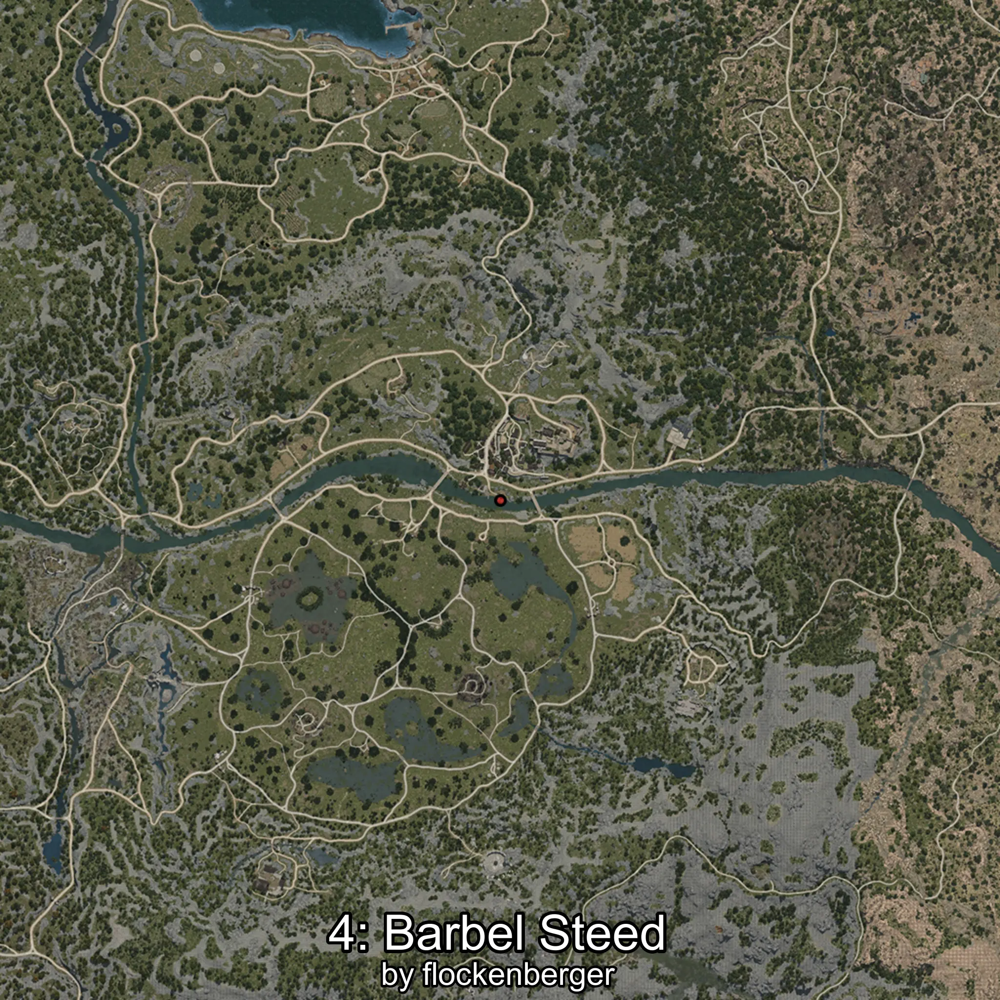

# Corcel
Creado por **flockenberger**

## ⚠️ Advertencia:
Los puntos de pesca se generan según la __**posición de tu personaje**__ — __no__ donde cae el flotador.  
En el océano especialmente, la dirección en la que lances la caña puede colocar tu flotador en una **zona de pesca diferente**, lo que puede resultar en capturar el pez incorrecto.  
Esto solo ocurre en raros casos — cuando la posición está justo en el **borde de una zona** y lanzas hacia el lado “equivocado”.

- Para verificar la posición puedes usar la guía [AQUÍ](https://flockenberger.github.io/bdo-fish-position/)
- O ver la guía [AQUÍ](https://youtu.be/t-VXcRoNojk)

## Waypoints
```xml
<!--
    Puntos de pesca para:: Corcel
    Creado por: flockenberger
-->
<WorldmapBookMark>
    <BookMark BookMarkName="0: Corcel" PosX="37256.18" PosY="-3816.312" PosZ="-50815.58" />
    <BookMark BookMarkName="1: Corcel" PosX="39018.953" PosY="-4063.6243" PosZ="-51080.125" />
    <BookMark BookMarkName="2: Corcel" PosX="38928.0" PosY="-3983.0" PosZ="-50782.0" />
    <BookMark BookMarkName="3: Corcel" PosX="37336.0" PosY="-3956.0" PosZ="-51575.0" />
    <BookMark BookMarkName="4: Corcel" PosX="41739.0" PosY="-3689.0" PosZ="-52606.0" />
</WorldmapBookMark>
```

     