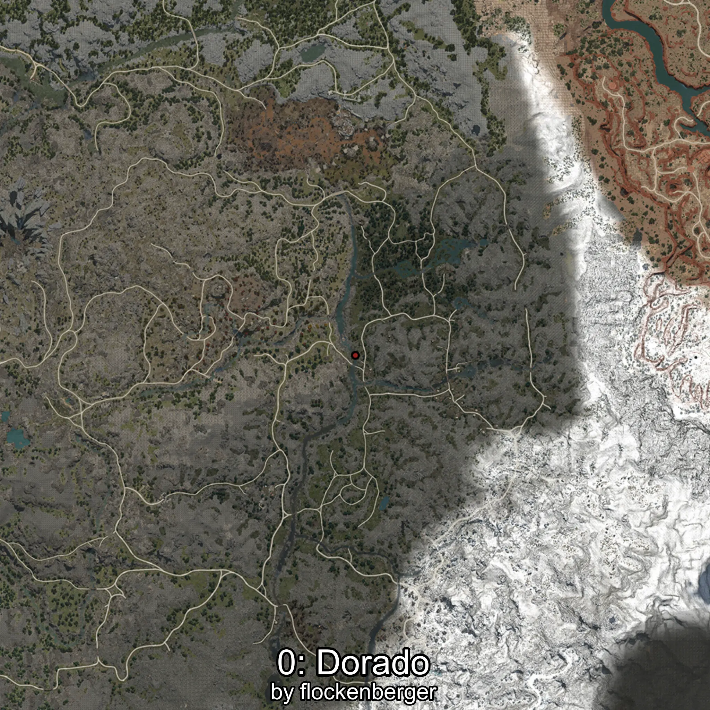

# Dorado
Creado por **flockenberger**

## ⚠️ Advertencia:
Los puntos de pesca se generan según la __**posición de tu personaje**__ — __no__ donde cae el flotador.  
En el océano especialmente, la dirección en la que lances la caña puede colocar tu flotador en una **zona de pesca diferente**, lo que puede resultar en capturar el pez incorrecto.  
Esto solo ocurre en raros casos — cuando la posición está justo en el **borde de una zona** y lanzas hacia el lado “equivocado”.

- Para verificar la posición puedes usar la guía [AQUÍ](https://flockenberger.github.io/bdo-fish-position/)
- O ver la guía [AQUÍ](https://youtu.be/t-VXcRoNojk)

## Waypoints
```xml
<!--
    Puntos de pesca para:: Dorado
    Creado por: flockenberger
-->
<WorldmapBookMark>
    <BookMark BookMarkName="0: Dorado" PosX="127327.0" PosY="12262.0" PosZ="-374967.0" />
    <BookMark BookMarkName="1: Dorado" PosX="-113378.0" PosY="8103.811" PosZ="-381268.0" />
    <BookMark BookMarkName="2: Dorado" PosX="127536.0" PosY="9284.0" PosZ="-332504.0" />
    <BookMark BookMarkName="3: Dorado" PosX="105647.0" PosY="6318.0" PosZ="-242591.0" />
    <BookMark BookMarkName="4: Dorado" PosX="102391.0" PosY="2762.0" PosZ="-276017.0" />
</WorldmapBookMark>
```

     