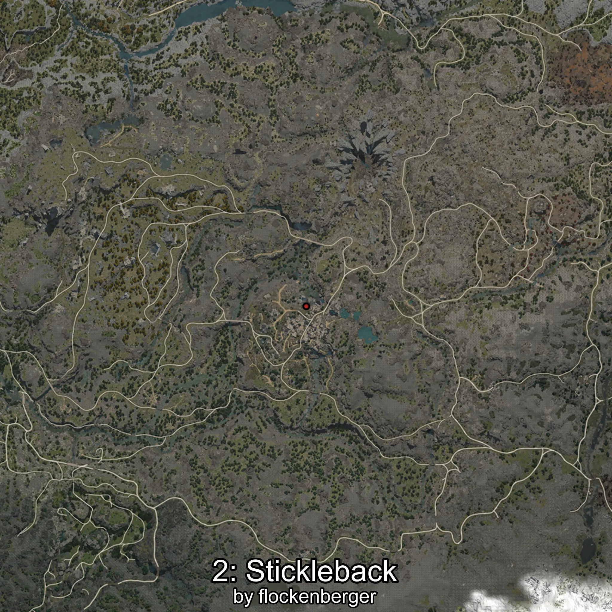
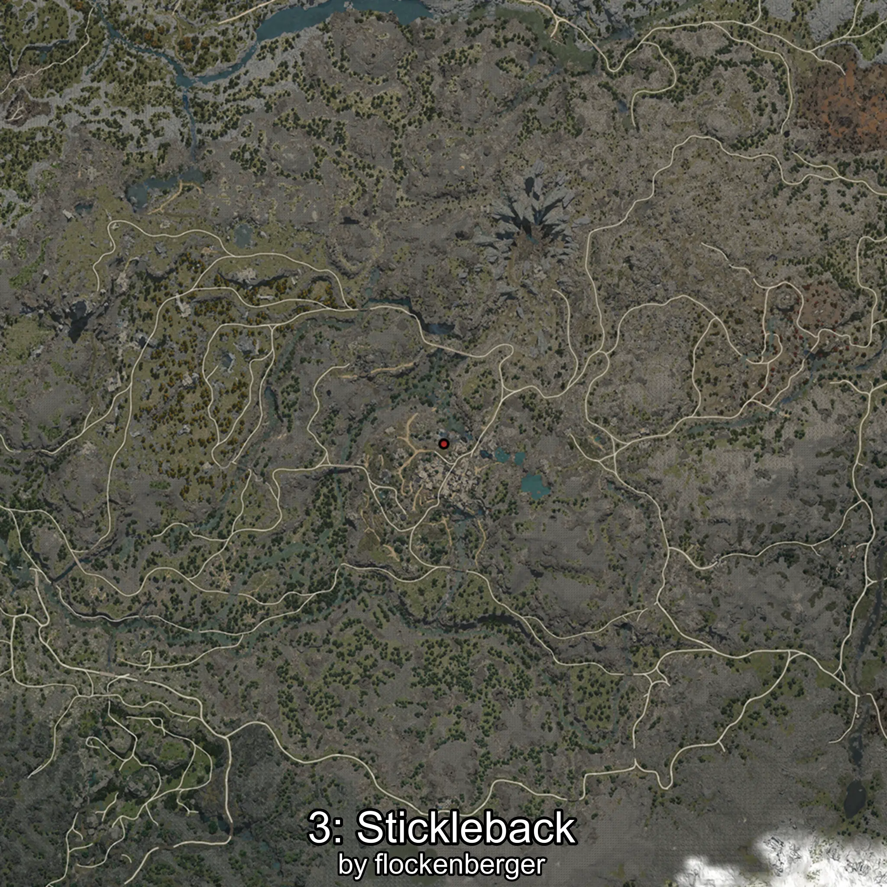

# Espinoso
Creado por **flockenberger**

## ⚠️ Advertencia:
Los puntos de pesca se generan según la __**posición de tu personaje**__ — __no__ donde cae el flotador.  
En el océano especialmente, la dirección en la que lances la caña puede colocar tu flotador en una **zona de pesca diferente**, lo que puede resultar en capturar el pez incorrecto.  
Esto solo ocurre en raros casos — cuando la posición está justo en el **borde de una zona** y lanzas hacia el lado “equivocado”.

- Para verificar la posición puedes usar la guía [AQUÍ](https://flockenberger.github.io/bdo-fish-position/)
- O ver la guía [AQUÍ](https://youtu.be/t-VXcRoNojk)

## Waypoints
```xml
<!--
    Puntos de pesca para: Espinoso
    Creado por: flockenberger
-->
<WorldmapBookMark>
    <BookMark BookMarkName="0: Espinoso" PosX="-49885.0" PosY="19746.0" PosZ="-395959.0" />
    <BookMark BookMarkName="1: Espinoso" PosX="-51472.547" PosY="19832.459" PosZ="-396178.06" />
    <BookMark BookMarkName="2: Espinoso" PosX="-50160.0" PosY="20264.0" PosZ="-396694.0" />
    <BookMark BookMarkName="3: Espinoso" PosX="-51178.0" PosY="20058.0" PosZ="-396562.0" />
    <BookMark BookMarkName="4: Espinoso" PosX="-51456.0" PosY="19835.0" PosZ="-396166.0" />
</WorldmapBookMark>
```

     