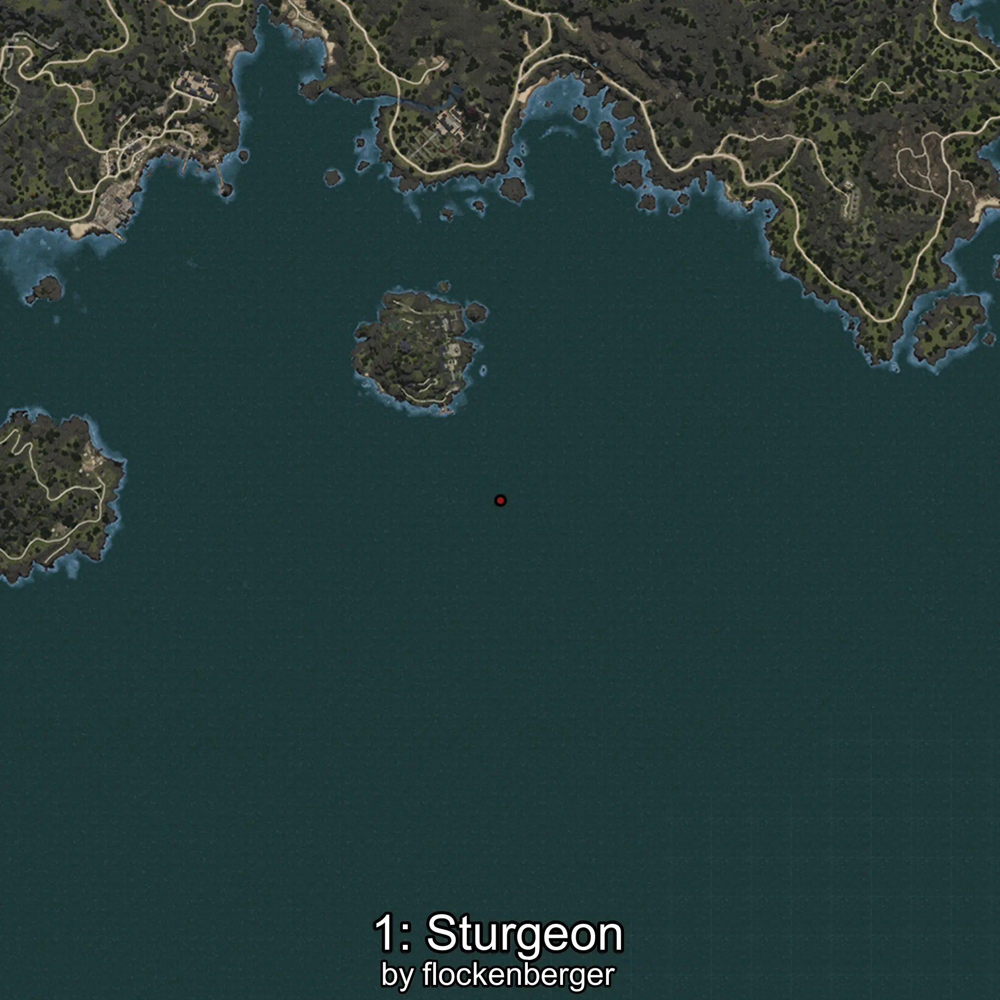

# Esturión
Creado por **flockenberger**

## ⚠️ Advertencia:
Los puntos de pesca se generan según la __**posición de tu personaje**__ — __no__ donde cae el flotador.  
En el océano especialmente, la dirección en la que lances la caña puede colocar tu flotador en una **zona de pesca diferente**, lo que puede resultar en capturar el pez incorrecto.  
Esto solo ocurre en raros casos — cuando la posición está justo en el **borde de una zona** y lanzas hacia el lado “equivocado”.

- Para verificar la posición puedes usar la guía [AQUÍ](https://flockenberger.github.io/bdo-fish-position/)
- O ver la guía [AQUÍ](https://youtu.be/t-VXcRoNojk)

## Waypoints
```xml
<!--
    Puntos de pesca para:: Esturión
    Creado por: flockenberger
-->
<WorldmapBookMark>
    <BookMark BookMarkName="0: Esturión" PosX="-1456357.0" PosY="-7916.0" PosZ="1019284.0" />
    <BookMark BookMarkName="1: Esturión" PosX="-1199139.0" PosY="-8182.0" PosZ="1025478.0" />
    <BookMark BookMarkName="2: Esturión" PosX="-813644.0" PosY="-8100.0" PosZ="1369061.0" />
    <BookMark BookMarkName="3: Esturión" PosX="-946964.0" PosY="-8191.0" PosZ="1311064.0" />
    <BookMark BookMarkName="4: Esturión" PosX="-1280232.1" PosY="-7688.9907" PosZ="979389.25" />
</WorldmapBookMark>
```

     