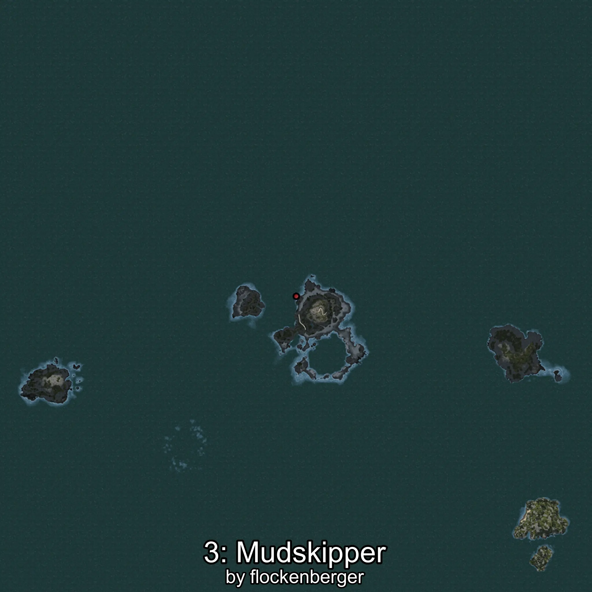

# Gobido
Creado por **flockenberger**

## ⚠️ Advertencia:
Los puntos de pesca se generan según la __**posición de tu personaje**__ — __no__ donde cae el flotador.  
En el océano especialmente, la dirección en la que lances la caña puede colocar tu flotador en una **zona de pesca diferente**, lo que puede resultar en capturar el pez incorrecto.  
Esto solo ocurre en raros casos — cuando la posición está justo en el **borde de una zona** y lanzas hacia el lado “equivocado”.

- Para verificar la posición puedes usar la guía [AQUÍ](https://flockenberger.github.io/bdo-fish-position/)
- O ver la guía [AQUÍ](https://youtu.be/t-VXcRoNojk)

## Waypoints
```xml
<!--
    Puntos de pesca para:: Gobido
    Creado por: flockenberger
-->
<WorldmapBookMark>
    <BookMark BookMarkName="0: Gobido" PosX="-225079.0" PosY="-7737.0" PosZ="164253.0" />
    <BookMark BookMarkName="1: Gobido" PosX="-2974.0" PosY="-8190.0" PosZ="87958.0" />
    <BookMark BookMarkName="2: Gobido" PosX="-2509.0" PosY="-8187.0" PosZ="87952.0" />
    <BookMark BookMarkName="3: Gobido" PosX="-105765.0" PosY="-7795.0" PosZ="633581.0" />
    <BookMark BookMarkName="4: Gobido" PosX="-227553.0" PosY="-8289.0" PosZ="167057.0" />
</WorldmapBookMark>
```

     