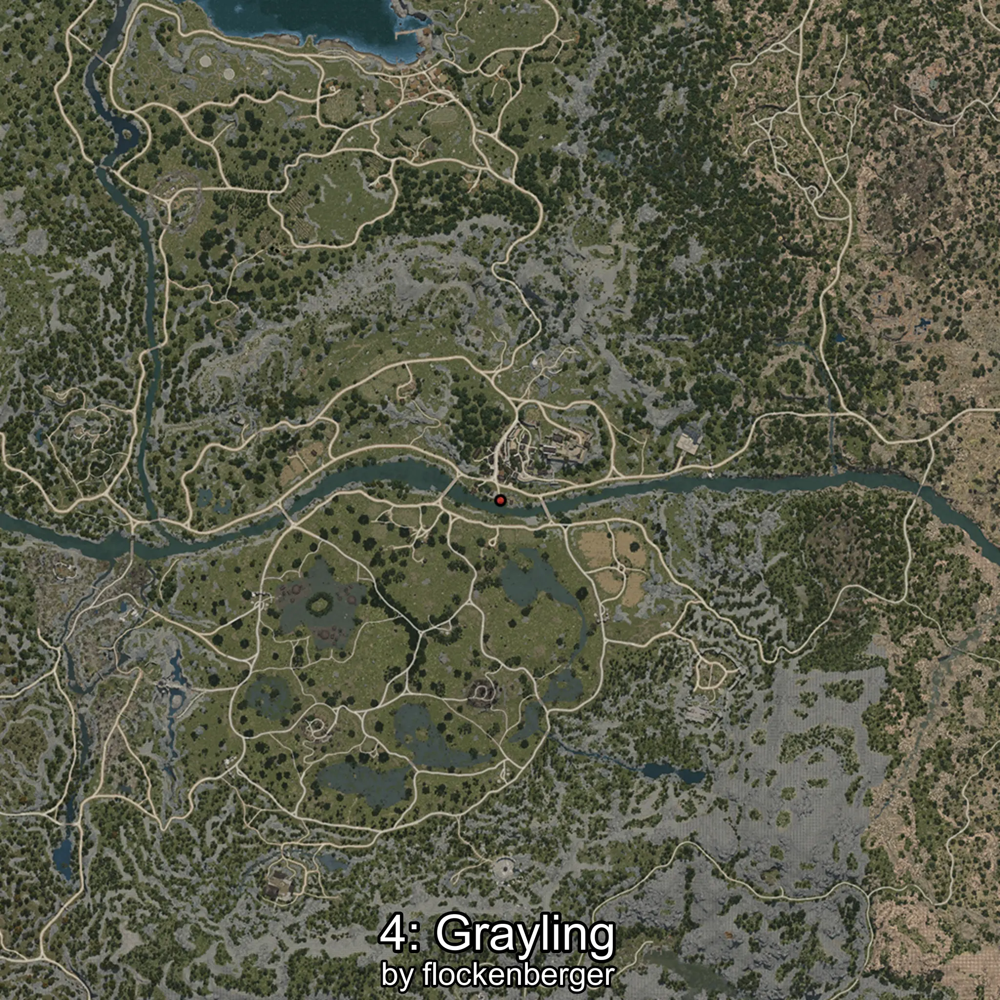

# Grayling
Creado por **flockenberger**

## ⚠️ Advertencia:
Los puntos de pesca se generan según la __**posición de tu personaje**__ — __no__ donde cae el flotador.  
En el océano especialmente, la dirección en la que lances la caña puede colocar tu flotador en una **zona de pesca diferente**, lo que puede resultar en capturar el pez incorrecto.  
Esto solo ocurre en raros casos — cuando la posición está justo en el **borde de una zona** y lanzas hacia el lado “equivocado”.

- Para verificar la posición puedes usar la guía [AQUÍ](https://flockenberger.github.io/bdo-fish-position/)
- O ver la guía [AQUÍ](https://youtu.be/t-VXcRoNojk)

## Waypoints
```xml
<!--
    Puntos de pesca para: Grayling
    Creado por: flockenberger
-->
<WorldmapBookMark>
    <BookMark BookMarkName="0: Grayling" PosX="39210.0" PosY="-3990.0" PosZ="-50947.0" />
    <BookMark BookMarkName="1: Grayling" PosX="40803.0" PosY="-3830.0" PosZ="-52423.0" />
    <BookMark BookMarkName="2: Grayling" PosX="37428.0" PosY="-3956.0" PosZ="-51647.0" />
    <BookMark BookMarkName="3: Grayling" PosX="38187.0" PosY="-4012.0" PosZ="-50720.0" />
    <BookMark BookMarkName="4: Grayling" PosX="38641.0" PosY="-4024.0" PosZ="-50877.0" />
</WorldmapBookMark>
```

     